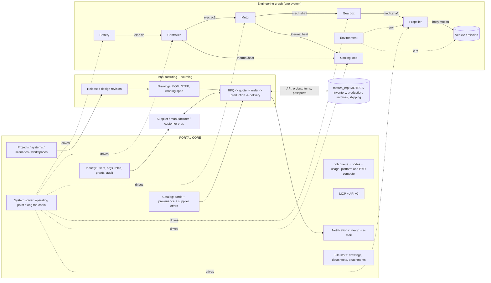

# Engineering portal: core + contracted modules (v4.1, 2026-09-29)

Base: `motor_ai_sim`, branch `origin/pre-migration-freeze-2026-09-15` (production, 3d914fc), plus the open PRs #40 (licence: AGPL-3.0-or-later + DCO), #41 (private split), #44 (bring-your-own compute, `docs/BYO_COMPUTE.md`) and the MCP stages (`docs/MCP_2026-09-28.md`). The separate ERP project `motres_erp` was read (not changed) to draw the integration boundary. This is a document; no code was changed.

v4 is one consistency pass over v3 (PR #37, commit 5053809) after two technical reviews that the owner accepted in full: `docs/project-structure-review-2026-09-29-codex.md` (cited as **SR**) and `docs/portal-v3-docx-review-2026-09-29-codex.md` (cited as **DR**, finding ids F01–F09, R01–R04, S01–S04, A01–A07). Old text was rewritten in place, not appended to; every concept has one definition and other sections refer to it. The v1–v3 change logs are in git history.

## Changes in v4

| # | What changed | Where | Why (review point) |
|---|---|---|---|
| C1 | Battery terminal law with inward-positive current: **V = OCV + I·R** (I < 0 when discharging); gearbox written with signed port torques, motoring and back-driven quadrants, forward and backward efficiency; inverter balance in signed port powers | 2.6, 2.7.4, 2.7.5, 2.7.7, D107 | DR F01 |
| C2 | Worked example closes at module, node and system level: the load is a declared **boundary sink**, heat leaves through a cold plate into a coolant boundary; numbers recomputed from OCV, R and I | 2.7.2, 2.7.7, D108 | DR F02 |
| C3 | Coolant: enthalpy flow ṁ·h only (h already contains p/ρ); across = pressure only; enthalpy is a **stream** variable with inStream mixing; pump work on the pump's own port | 2.1, 2.7.3, 2.7.6, D109 | DR F03, SR contracts 2 |
| C4 | Electromagnetic field energy is motor/inductor/DC-link storage; the energy-balance requirement depends on analysis mode (periodic steady vs transient/switching-resolved) | 2.7.2, 2.7.4, D110 | DR F04 |
| C5 | Tolerances with absolute + relative parts per module; event-resolving time-step rule; time-step and mesh convergence studies; energy closure ≠ validation; all numbers marked **proposal** | 2.7.3, 2.7.8, 2.7.9, 4.3 missions, D111 (restates D60) | DR F06 |
| C6 | System solver v1 = fixed catalogue of schemes with explicit refusal; unknowns, states, initial conditions, algebraic loops; FMI 3.0 causal mapping; SSP only after FMU export | new 3.5, 3.2, 10B.2, D112 (restates D63) | DR F07 |
| C7 | Machine topology × analysis-mode support table; symmetry rule covers winding, excitation, materials and machine state; N-phase port | new 4A.6, 4A.2, 4A.3, 2.1, D113 (**supersedes D22**) | DR F08, SR contracts 5 |
| C8 | Prices: no payments or commissions between parties; structured quotes with currency normalisation, tooling allocation and landed-cost estimate as **comparison aids**; MOTRES sells only its own compute at cost | 8.1, 8.5, 8.9, 10, 10C, D114 (**supersedes D33**), D73 | DR R01 |
| C9 | Standards licensing: ECLASS optional until licence terms are checked; ISO 2768-2 withdrawn → ISO 22081:2021 in the ISO 8015 GPS frame, ISO 2768-1 kept; exact edition recorded per drawing; licence column for every "open" standard | 7.6, 8.9.2, 10B, D115, D116, D27/D64/D66/D79 restated | DR S01, S02 |
| C10 | Human confirmation bound to an immutable **pending-action version** (payload hash of files, recipients, permissions, document versions); any change invalidates; enforced server-side for REST and MCP | 9A.4, 6.5A, D117 (restates D85) | DR A01, A02 |
| C11 | BYO nodes: permission to compute ≠ permission to receive geometry; signatures prove origin only; verification levels of results | 5.3, 10, 10A.8, D118 | DR A03, SR compute |
| C12 | Immutable **quotation package (not for production)** before release; production orders only on released revisions; watermark renditions, never manufacturing geometry | 7.3, 8.4, 8.9.1, 8.9.3, D119 (restates D34) | DR A07 |
| C13 | Consistency: Argon2id hashes are stored (no "stores no passwords"); one deprecation policy; one units rule (m, rad/s at the boundary, legacy adapters); one quote schema and state machine (8.9.8/8.9.9); roadmap durations reconciled (M10 ~9 wk); independent data-policy attributes and honest erasure; manual invites cannot override access rules; FMU rights; semantic conformance; module acceptance rules; J as parameter | 1.1, 2.1, 4.1, 4A.2, 5.1–5.3, 8.3, 8.4, 8.9.2, 9A.3, 10A.1, 10A.4–10A.6, 10B.6, 10B.9, 11.3, D120–D121 | DR R02, R03, R04, A04, A05, A06, S03, S04, F05, F09; SR storage |
| C14 (v4.1) | Transient shaft: no port-torque sum equals J·dω/dt at an ideal node; acceleration comes from each module's own torque balance or an explicit `inertia`/`shaft` module that owns ω | 2.7.5, 2.7.7, 3.5 | Codex re-review v4, top issue 1 |
| C15 (v4.1) | P1 publication protocol made normative (PR #48): private frozen export, hashed manifest, hash-bound approval, durable journal before any remote effect, private-first push, exactly the snapshot, resume/rollback, fail-closed validation, `owner_org` boundary | new 10A.12, 9A.2, 9A.6, 11.3 P1 | Codex re-review v4, top issue 2 |
| C16 (v4.1) | P2 catalog source binding: one source per ID, clash = error unless an override record, results record ID + source + content hash; layers testable without local files; open item on local config/dies | new 10A.13, 11.3 P2 | Codex re-review v4, top issue 3 |
| C17 (v4.1) | Managed-pool rate: exact allocable core-hours, 50 % floor formula, dedicated and burst nodes, storage, refunds, first charged month, currency, rounding, worked AX42 example | 10C.3 | Codex re-review v4, top issue 4 |
| C18 (v4.1) | D73 limited to marketplace fees/commissions between customers and suppliers; compute pass-through billing (10C/10D) explicitly separate and allowed | D73, 10C.3 | Codex re-review v4, wording conflict |
| C19 (v4.1) | One data boundary: foreign/vendor modules get port values only; platform solvers (also on the data owner's BYO node) get machine descriptions only where the object's export right allows, checked per object before bundle creation | 5.3, 10A.8, D118 | Codex re-review v4, top issue 5 |
| C20 (v4.1) | Six-phase / independent coils narrowed to what is demonstrated per solver (two-set 0° six-phase in the EM solver, PR #21); the rest planned | 4A.6, D113 | Codex re-review v4, capability row |
| C21 (v4.1) | M4 org schema foundation and M8 org features are one migration path | 11.3, D24 | Codex re-review v4, roadmap |
| C22 (v4.1) | Public CI runs synthetic public conservation/golden tests; absent private gates fail release CI (skip only in developer runs) | 11.3 P2/P4, 10B.9 | Codex re-review v4, public CI |

v4.1 (same day) applies the independent re-review `codex_rereview_architecture_v4_2026-09-29.md` in place (rows C14–C22); decision ids stay stable.

Decision ids D1–D106 are unchanged. Changed decisions are marked **(restated v4)**; replaced ones are marked **superseded by Dxxx** and kept for traceability; new decisions are D107–D121.

## Goal

The owner's goal: a portal to which modules from other makers are later attached (gears and gearboxes, CFD, propellers, batteries, drones). The foundation is laid now on motors and controllers so that the system does not have to be broken later.

**End goal** (owner, 2026-09-29): assemble a *whole system* (a drone, a boat or AUV, a wheeled robot or vehicle, a robot joint, a generator), simulate it **in motion / over its duty cycle** with every block taken into account (energy, drives, heat, limits), and then take it **all the way to manufacturing documents and orders**: drawings, BOM, RFQs to suppliers, purchase and production orders, order tracking. Flight is one example, not a special case hard-wired into code.

Main idea: a **core** (who, where, on what compute, what is in the catalog, who may see what) plus **modules** that talk to the core and to each other only through a **contract**: typed ports, catalog cards and declared calculations. A system is a graph of modules connected by ports. The core finds the operating point along the chain. Today's hard-wired motor ↔ controller ↔ thermal coupling becomes the first special case of that graph. On top of the engineering graph sit **parties** (organizations and their roles), **released design revisions** that generate **manufacturing documents**, and a **sourcing layer** (RFQ → quote → order → production → delivery) that links to MOTRES's own ERP instead of duplicating it.

---

## 1. What exists and what becomes the core

### 1.1 Map "file → core service"

| Core service | Exists today | Readiness | Missing |
|---|---|---|---|
| **Identity** | `users.py` (users.json with **Argon2id password hashes**, never plaintext; 30-day tokens), `auth.py`, `oauth.py` (Google) | good | **No organizations.** The legacy plan names `free/pro/team` are retired: only roles `user` and `admin` remain (non-commercial). Organizations with member roles are needed (section 6). |
| **Permissions** | `motor_access.py`: die visibility `private/public/selected` + personal grants (`die_access.json`); `auth._GATED_PREFIX` | works for dies | Permissions are tied to a *die*. Needed: permissions on an object of *any kind* (card, module, system, project, design revision, document, RFQ). |
| **Workspaces** | `workspace.py`: layers `workspace / published / shared`, tombstones of deleted shared dies, `MAX_WORKSPACES=32` | good | Workspace = user. Needed: organization workspace and projects inside it. |
| **Job queue** | `jobs.py`: `Priority`, `register_handler(kind, fn)`, per-user limit, `SB_FIELD_MAX_CONCURRENT`, cancel, owner | good, already generic | Jobs run inside the API process. Third-party modules need an **isolated executor** (container / node). |
| **Compute nodes** | `cluster_monitor.py` (admin metrics tokens `mnode_`); **PR #44 BYO compute**: user-owned nodes, tokens `mcnode_`, pull model (heartbeat → lease → signed bundle → progress → complete), owner-only leasing, org sharing planned for its stage 3 | monitoring + BYO stage 1 | Platform nodes still only *observed*; the lease protocol of #44 becomes the one dispatch path for all nodes. |
| **Usage accounting** | `job_usage.py` (CPU·h and RSS per job, node, user, client; SQLite), `usage_stats.py` (events, storage, monthly report) | good | Row lacks `module / module_version / vendor_org / own_node` → needed for fair-use limits, capacity planning and per-module audit, **not** for billing. The monthly euro basis becomes an internal cost report only. |
| **Catalog** | `catalog/envelope.py` (stage 1: `id, kind, status draft/active/validated/deprecated, sources, per-field prov (datasheet/measured/estimate/derived), validation, revision`), adapters `bearings.py`, `devices.py`, `used_by.py`; `docs/CATALOG_STAGE1_2026-09-28.md` | **right foundation** | `KINDS = bearing, lubricant, device`. Materials, wire, battery, motors not in the envelope yet. No `owner_org`, `license`, `supplier_offers`. |
| **Units** | file-level `catalog_units:`; in code units live in field names (`_kn`, `_mm`, `_c`) | partial | One unit registry for ports (SI inside, engineering units in the UI). |
| **Versions and provenance** | config history (`/api/family/history`), card `revision`, geometry fingerprint + solver commit in run records, `contracts.Provenance` | good for our runs | Module version in every result; immutable published versions; **released design revisions** that documents and orders pin. |
| **Module contract** | **Skeleton exists:** `modules/base.py` (`ModuleManifest`: `capability`, `depends_on`, IR-typed `inputs/outputs`, `contracts_version`, `UIContribution`), `modules/registry.py`, `modules/kernel.py`, `contracts/` (`GeometryIR, MeshIR, MaterialIR, ResultIR, Excitation/ControlSignal/MachineState`, `CONTRACTS_VERSION="0.1.0"`, conformance tests), routes `/api/modules`, `/api/kernel` | **skeleton, barely used in production** (only `_call_filtered` is used from `coupled.py`) | This is the contract *inside* the motor (geometry → mesh → solver). Missing: the **system** level (physical ports: shaft, bus, heat) and declared calculations. |
| **Coupled calculation** | `routes/coupled.py` (7.7 k lines): EM ↔ thermal, `DEFAULT_TOL_K=2`, bearing seat `BEARING_TOL_K=5`, `DEFAULT_MAX_ITER=6`, drive `current / pwm / inverter`; `inverter/coupling.py` (`fit_device_drop`, `InverterVoltageSource`) | mature physics | Coupling is hard-wired: motor, controller and thermal know each other directly. |
| **Controller** | `inverter/` (devices, coil→bridge topology, losses, T_j, waveforms, spice), `routes/controller.py`, `docs/CONTROLLER_MODULE_2026-09-22.md` | good | Lives inside the motor configuration (`PATCH …/controller`), not as a separate system node. |
| **Data model** | `routes/family.py`: die → configuration (cfg) → duty; battery, controller and bearings stored *inside* cfg | works | No **project** or **system**; battery embedded in cfg instead of referencing a card. |
| **MCP** | `mcp_app.py` (streamable HTTP, `McpGate`: key `emk_`, scopes, quotas, audit), `mcp_tools.py` (field whitelist, `GEOMETRY_DENYLIST`), `agent_designs.py` (drafts, sandbox, `simulate`) | good, **already the IP-protection pattern** | Tools are motor-bound; no `build_system` / `simulate_system`, no catalog-sourcing or RFQ-draft tools. |
| **Notifications** | newsletter + in-app notices (PR #36), admin tab | works | Needed: per-event notifications for approvals, RFQs, quotes, order status (section 8.7). |
| **Fusion 360 sync** | `/api/fusion` six-column parameter CSV, in-Fusion script `scripts/fusion360_sync_params/` | works | Becomes one of the CAD sources for manufacturing documents (section 7.4). |
| **Licence and repo split** | PR #40: AGPL-3.0-or-later + DCO; PR #41: ANSYS cross-checks and approved company reference fixtures moved to a private repo | open PRs | Portal code is public AGPL. Customer runtime data never goes to any git repository (public or private); storage boundaries are defined once in 10A.2. |

### 1.2 Conclusion

By a rough planning estimate (not measured readiness, SR) much of the core already exists. It must be **renamed in our heads**, not rewritten. The real gaps:

1. **Organizations and projects** (today: user → die), including cross-org grants.
2. **Physical ports and the system graph** (today: coupling hard-wired in `coupled.py`).
3. **Isolated execution of foreign code + per-module accounting** (today: everything in the API process), dispatched through the BYO-compute lease protocol.
4. **Released design revisions → manufacturing documents → sourcing and orders** (today: none in the portal; MOTRES's internal side exists in `motres_erp`).

The `modules/` + `contracts/` skeleton is kept: it becomes the "inner" contract level (how a module is built inside). The system level (ports between products) is added above it.

---

## 2. Module contract

Module = **manifest** (what I can do) + **cards** (concrete products) + **calculations** (what to compute for a card and the port values).

### 2.1 Ports

A port is a typed connection point. Everything is SI inside; engineering units in the UI.

| Port type | Variables (SI) | Sign | Effort / flow pair |
|---|---|---|---|
| `mech.shaft` | τ [N·m], ω [rad/s] (rpm in the UI), P = τ·ω; inertia J is a module **parameter**, ω (and φ) the module **state** (2.7.5) | τ acts on the module; P > 0: power **enters** the module | ω / τ |
| `elec.dc` | V [V], I [A], R_src [Ω] (property); C_link is state of the owning module | I > 0: current **enters** the module | V / I |
| `elec.acN` (`elec.ac3` = the N = 3 case) | per-phase or per-coil v_k [V], i_k [A] (`series`) or fundamental phasors + harmonic power (`scalar`); V_ll_rms, I_rms, cos φ, THD informational only (2.7.4). Six-phase and independent-coil drives use N > 3 and are never silently reduced to three phases | as DC; star/delta/open windings are a property | v / i |
| `thermal.heat` | Q [W], T [K] (°C in the UI) | Q > 0: heat **enters** the module | T / Q |
| `thermal.coolant` | p [Pa] (across), ṁ [kg/s] (through), h_outflow [J/kg] (stream), `fluid` (card reference) | ṁ > 0 into the module (2.7.6) | p / ṁ, plus stream h |
| `mech.linear` | F [N], v [m/s], m_eff [kg] (property): propeller thrust, wheel rim force, track, waterjet, linear actuator | F·v > 0: power enters | F / v |
| `body.motion` (vehicle body) | 6 DOF: force F⃗ [N] and moment M⃗ [N·m] at the mount point + body state (position, velocity, attitude, angular rate) | body frame; mount point is a link property | F⃗,M⃗ / v⃗,ω⃗ |
| `env` (environment, non-energetic) | medium `air/water/ground`; ρ, T, p, viscosity; wind/current/waves (vector, gusts); slope, rolling coefficient, grip, surface | — | set by the Environment module, read by all |
| `energy.store` (property + state of the source on `elec.dc`) | SoC [–], stored energy [J], H₂/fuel [kg], T [K], SoH | — | battery, fuel cell, supercap, engine-generator deliver it on `elec.dc` |
| `envelope` | outline (OD, L [m]; mm in the UI), mass [kg], J, centre of mass, attachment (flange/shaft: interface card) | — | non-energetic: compatibility check, not solve |
| `signal.cmd` | setpoint (torque/speed/current), limits | — | — |

**Sign rule:** defined once in 2.7.1 (positive = **into** the module, D2). Node rules are in 2.7 (opening), module energy balance in 2.7.2. Efficiency = |output| / |input| of the current mode, without "if generator" special cases.

**Three value forms per port** (a port declares which forms it accepts and delivers):

| Form | Example | When |
|---|---|---|
| `scalar` | T = 120 N·m at 3000 rpm | operating point |
| `map` | η(T, n), P_loss(T, n, V_dc), thrust C_T(J) | fast system solve, vendor black box |
| `series` | i_abc(t), T(t), mission profile | transients, cycles, co-simulation |

**State** is separate from form: a module with memory (thermal network temperatures, battery SoC, shaft angle/speed, body position/velocity, magnet Br ratchet) declares its state variables with units and initial values; physical constants such as J, C_th or R are **parameters**, not states. The core stores state between steps and passes it back. A stateless module is a pure function of its ports. This is the precondition for missions (section 3A).

### 2.2 Card kinds

Extend `catalog/envelope.py` without changing the format (`KINDS` + fields `owner_org`, `license`, `module`, and in section 8 `supplier_offers`):

| kind | Owner | Body | Default ports |
|---|---|---|---|
| `motor` (= published cfg) | MOTRES / customer | geometry (hidden), winding, materials, passport | `mech.shaft`, `elec.acN`, `thermal.*`, `envelope` |
| `controller` | MOTRES | topology, `device` references, cooling | `elec.dc`, `elec.acN`, `thermal.*`, `envelope` |
| `device`, `bearing`, `lubricant` | as today | as today | — (parts inside a module) |
| `battery_cell` / `battery_pack` | vendor / MOTRES | chemistry, NS/NP, OCV(SoC, T), R(SoC, T) | `elec.dc`, `thermal.heat`, `envelope` |
| `propeller` | vendor | D, pitch, C_T(J), C_P(J), tables by Re | `mech.shaft`, `mech.linear`, `env`, `envelope` |
| `gearbox` | vendor | i, η(T, n, T_oil), J, backlash | 2× `mech.shaft`, `thermal.heat`, `envelope` |
| `wheel` / `track` / `waterjet` / `joint` | vendor | radius, rolling resistance, grip(slip); waterjet efficiency; joint stiffness/backlash | `mech.shaft`, `mech.linear` (or 2× `mech.shaft`), `env`, `envelope` |
| `fuel_cell`, `supercap`, `genset` | vendor | V(I), η, H₂/fuel store; C, ESR | `elec.dc`, `thermal.heat`, `energy.store` |
| `vehicle` (object dynamics) | MOTRES / vendor / user | mass, J, drive mount geometry; aero/hydro/road coefficients (C_x·S, added masses, f_r) | N× `body.motion`, `env`, energy summary |
| `environment` | MOTRES | ISA atmosphere, water (salinity, T), ground/surfaces, wind/wave models | `env` |
| `controller_logic` (flight controller, thrust allocation, ABS, robot trajectory) | MOTRES / vendor | algorithm "demand → drive commands" | `signal.cmd` ×N |
| `material`, `wire`, `coolant` | as in the catalog proposal | — | — |
| `map` (result card) | producing org | L0 map + provenance of the runs that built it | as the source module |

### 2.3 Calculations (declared in the manifest)

| Calculation | Input | Output | Who must support it |
|---|---|---|---|
| `operating_point` | values on some ports (e.g. ω and T on the shaft, V on the bus) | remaining port values + losses + temperatures | every **energetic** module (minimum); signal and environment modules declare their own minimum |
| `efficiency_map` | grid (T, n) or (J), V | `map` on ports | motor, controller, gearbox, propeller |
| `transient` | `series` in | `series` out | optional (FMU, our FEM) |
| `thermal_steady` / `duty_cycle` | heat on ports, cooling, S1/S2/S3 cycle | temperatures, time to limit | motor, controller, battery |
| `envelope_check` | neighbouring `envelope` | compatibility (fit, flange, mass) | modules with a physical envelope |
| `manufacturing_docs` (new, optional) | released design revision | drawing set, BOM, STEP (section 7) | motor, controller; later any module that is manufactured |

### 2.4 Manifest (capability declaration)

```yaml
module: aerostator.motor              # unique name (org.module)
version: 2.3.0                        # semver; major = contract break
contract: portal/1.0                  # core contract version
vendor_org: motres
license: AGPL-3.0-or-later            # code licence; card data licence is per card
card_kinds: [motor]
ports:
  shaft:   {type: mech.shaft,  forms: [scalar, map, series]}
  phases:  {type: elec.ac3,    forms: [scalar, series]}
  heat:    {type: thermal.heat, forms: [scalar]}
  coolant: {type: thermal.coolant, forms: [scalar], optional: true}
  body:    {type: envelope}
parameters: [{name: J_rotor, unit: kg*m^2}, {name: C_winding, unit: J/K, model: "C(T) table"}]
state: [{name: T_winding, unit: K, init: env, energy: "integral C(T) dT"}, {name: T_magnet, unit: K, init: env, energy: "integral C(T) dT"},
        {name: omega_rotor, unit: rad/s, init: 0, energy: 0.5*J_rotor*omega^2},
        {name: W_field, unit: J, energy: "flux-linkage integral, resolved only in transient / switching_resolved"}]
limits: [{name: T_winding_max, unit: K, value: 453.15, source: insulation_class_H}]
calculations:
  operating_point:    {cost: "FEM 20-200 s", fidelity: fem_2d}
  efficiency_map:     {cost: "minutes", fidelity: fem_2d}
  duty_cycle:         {fidelity: lumped}
  manufacturing_docs: {outputs: [lamination_dxf, bom, winding_spec]}
execution: {kind: native}             # native | map | fmu | remote
exposes: [ratings, losses, temperatures, od_m, length_m, mass_kg]  # whitelist (as in MCP)
validation: [{ref: ANSYS, case: L200, torque_delta_pct: 0.12}]
```

`cost` is compute time for scheduling and fair use, never a price.

### 2.5 Versions and provenance

- A published module version and card revision is **immutable**. An edit = new `revision` (card) or new `version` (module).
- Every result carries `{module@version, card@revision, contract, solver_commit, geometry_hash, mesh, materials, convergence}`. Our run records already do this; only `module@version` is added.
- A system pins versions (like a lock file). A vendor update does not change old results: the user sees "v2.4 available" and re-runs himself.
- A **released design revision** (section 7.3) pins the system lock plus the machine description hash; every drawing, BOM, RFQ and order references that revision.

### 2.6 Contract examples

| Module | Ports | Required minimum | Execution |
|---|---|---|---|
| **Motor** (ours) | shaft, phases, heat/coolant, body | operating_point (FEM), efficiency_map, duty_cycle | native (our FEM) |
| **Controller** (ours) | dc_in, phases, heat/coldplate, body, cmd | operating_point: from V_dc and I/f on phases → losses, T_j, η; series: PWM voltage `InverterVoltageSource` | native |
| **Propeller** | shaft, thrust, air, body | operating_point: ω, V_inflow, ρ → T_shaft, F; map C_T(J), C_P(J) | map (vendor table) |
| **Gearbox** | shaft_a, shaft_b, heat, body | signed port law of 2.7.5 (ratio i, forward η_f, backward η_b); η(τ, ω, T_oil) | map → later FMU |
| **Battery** | dc, heat, body | terminal law of 2.7.4: V = OCV(SoC, T) + I·R(SoC, T), I positive **into** the battery (I < 0 discharging); I²R to the heat port; SoC(t) for missions | map / equivalent circuit (`simulation/battery.py` exists; adapter maps its discharge-positive current, I_port = −I_discharge) |

### 2.7 Physical port contract (fixed before M0 is implemented)

Owner decision 2026-09-29 after the structure review (SR, "Contracts to fix before M0 freezes"), corrected in v4 after the DOCX review (DR F01–F07). This section is the **single definition** of signs, units, ports, energy balance and consistency checks; every other section refers to it.

The contract follows acausal physical connectors (Modelica). Effort/flow ports (`elec.*`, `mech.*`, `thermal.heat`, `body.motion`) carry one **across** and one **through** variable: at a connection node the across variables are **equal** and the through variables **sum to zero**. **Fluid stream ports** (`thermal.coolant`) are different: pressure is the across variable, mass flow the through variable, and specific enthalpy is a **stream** variable with the mixing rule of 2.7.6 (it is *not* equated at a node). Connections (links) are ideal: no storage, no loss. Anything that stores or dissipates energy is a module; anything where energy crosses the modelled system is a declared **boundary** (2.7.2).

#### 2.7.1 Sign convention and units

- **Positive through variable = into the module** (Modelica convention). Port power `P_k` is positive when energy flows **into** the module (D2).
- A source (battery discharging, motor shaft driving a load) therefore shows **negative** power on its delivering port. Efficiency is computed from the magnitudes of the input and output ports of the current operating mode, never from signs.
- **Canonical units at the new boundary are pure SI:** K (not °C), m (not mm), rad/s (not rpm), N·m, W, J, kg, Pa, s (D3). °C, mm, rpm and kW stay in the UI, reports, legacy files and **legacy API adapters** (today's MCP tools and `/api/*` routes); every adapter converts explicitly with a unit-tested `legacy_units` table and is versioned with the contract. Old solver arithmetic is not changed just to rename units.
- Every port value is a typed quantity `{value, unit, form, basis}`; the core rejects an unknown or dimensionally wrong unit (2.7.8).
- Where a formula uses a positive "transfer magnitude" (e.g. |P_shaft| delivered by a motor), the text says so explicitly; all balances below are written in **signed port quantities**.

#### 2.7.2 Energy balance per module and system boundary

For every module, with `P_k` the power on energetic port k (positive in, W), `Q_th` the heat on its thermal ports (positive in), `Σ ṁ_j·h_j` the enthalpy flow on its fluid ports (2.7.6) and `P_bnd` the power leaving through a declared boundary term:

    sum_k P_k + Q_th + sum_j (ṁ_j · h_j) − P_bnd = dE_stored/dt

- `E_stored` is the sum of the module's declared **storage states** (table below). Irreversible states (magnet Br ratchet, SoH) have no energy term and are committed only on an accepted time step, never on a trial evaluation (SR contracts 6).
- **Boundary terms** are the only way energy may leave or enter the modelled system without a port to another module. A module declares them in its manifest: `boundary: {kind: external_mech_sink | ambient_heat | external_source, variable: ...}` (e.g. an ideal dynamometer load, a housing losing heat to ambient air without a modelled air module, a fixed-temperature coolant supply). Every boundary term is reported in the balance resource with its value; an undeclared residual is an error.
- A loss is never counted twice: electrical and mechanical losses leave on the thermal port **or** raise the module's own thermal state, never both.
- Storage is always **module state**, declared with unit, initial value and energy function. Connectors carry no storage. Constant heat capacity is an assumption that must be declared; otherwise the energy function is ∫C(T)dT.

| Module | Storage state | E_stored |
|---|---|---|
| Motor | thermal network nodes (winding, stator iron, magnet, rotor); rotor speed ω; **electromagnetic field energy** W_field (flux linkages ψ) | Σ ∫C_i(T)dT ; ½·J·ω² ; W_field = ∫ i·dψ (co-energy form declared) |
| Controller | junction / case / heatsink temperatures; DC-link capacitor voltage (if the capacitor belongs to the controller); filter/choke inductor currents if modelled | Σ ∫C_i dT ; ½·C·V² ; ½·L·i² |
| Battery | SoC, cell thermal mass, optional RC polarisation voltages | E_chem with dE_chem/dt = OCV(SoC, T)·I ; ∫C_th dT ; ½·C_RC·V_RC² |
| Gearbox | oil/housing temperature; optional shaft twist (compliance) | ∫C_th dT ; ½·k·Δθ² |
| Load / vehicle | inertia, or body kinetic + potential energy | ½·J·ω², or ½·m·v² + m·g·h |
| DC link (explicit `dc_link` module) | capacitor voltage | ½·C·V² |

**What the balance requires depends on the analysis mode** (DR F04, D110):

| Mode | Basis of port values | Storage terms that must appear |
|---|---|---|
| `steady_periodic` (settled operating point, e.g. today's coupled loop) | `mean@T` over an integer number of electrical periods of a settled solution | thermal and kinetic dE/dt = 0 by definition of steady state; **ΔW_field over the averaging window = 0 only because the window is an integer number of periods of a settled periodic solution** (checked: flux linkages at window start and end must agree within tolerance, otherwise the result is marked not settled) |
| `quasi_static` (maps in missions) | `mean@T` per step | thermal and kinetic storage integrated; field energy neglected (declared: electrical time constants ≪ step) |
| `transient` (start, acceleration, load step, fault) and `switching_resolved` (PWM) | `instant` series | **all** storage including dW_field/dt, ½·C·V² of DC links and ½·L·i² of chokes; the check integrates over each accepted step (2.7.8) |

#### 2.7.3 Port types: variables, units, forms

| Port | Across | Through (+ into the module) | Energy flow into the module | Notes |
|---|---|---|---|---|
| `elec.dc` | V [V] | I [A] | P = V·I | instantaneous in `series`; period mean in `scalar`, basis stated |
| `elec.acN` | phase/coil voltages v_k [V] | phase/coil currents i_k [A] | p(t) = Σ v_k·i_k | which power is carried: 2.7.4 |
| `mech.shaft` | φ [rad] / ω [rad/s] | τ [N·m] acting on the module | P = τ·ω | ω positive in the shaft's declared positive direction |
| `mech.linear` | x [m] / v [m/s] | F [N] on the module | P = F·v | |
| `thermal.heat` | T [K] | Q [W] | Q (already W) | T·Q is **not** power |
| `thermal.coolant` | p [Pa] | ṁ [kg/s] | ṁ·h, with h = inStream(h) if ṁ > 0 and h_outflow of this port if ṁ < 0 (2.7.6) | h already contains the flow work p/ρ; kinetic and potential terms neglected unless declared |
| `body.motion` | v⃗ [m/s], ω⃗ [rad/s] | F⃗ [N], M⃗ [N·m] on the module | F⃗·v⃗ + M⃗·ω⃗ | body frame; mount point is a link property |
| `signal.cmd`, `env`, `envelope`, `energy.store` | non-energetic | — | — | never enter the energy balance |

**Value forms and time basis.** Each port value declares a form and a basis:

| Form | Basis (mandatory) | Use |
|---|---|---|
| `scalar` | `instant`; `mean@T` (averaged over a stated period: electrical period, PWM period, mechanical revolution); `rms@T`; `fundamental` (complex phasor of the 1st harmonic, or dq in a stated frame) | operating point |
| `map` | basis of the tabulated value + the validated domain (box **and** a mask of unsolved/infeasible points inside it) | η(τ, ω, V), P_loss(τ, ω, V, T) |
| `series` | sample times t_i [s] from the scenario start, uniform `dt` or explicit, plus an explicit **event list** (switching instants, dead-time edges, backlash contact) | transients, cycles |

Series rules:

- A module states its maximum usable `dt`, whether it needs aligned samples, and its **representation** of each quantity: piecewise constant (zero-order hold, e.g. switched voltages), piecewise linear, or continuous state.
- **Time-step rule (proposal, D111):** dt must resolve the shortest event that changes the energy flow, not just the carrier: dt ≤ min(T_pwm/20, t_dead/4, t_pulse,min/4, τ_el,min/10), where t_dead is the dead time, t_pulse,min the shortest PWM pulse after minimum-pulse clamping and τ_el,min the smallest electrical time constant; switching instants are located as **events** (step aligned or split at the edge), never interpolated across. The factors are proposals until the time-step convergence study of 2.7.9 confirms them per module.
- Energies are integrated consistently with the representation: exactly per segment for zero-order-held quantities, trapezoid for piecewise-linear ones; the core resamples only with the declared method and never across an event.
- Mixing bases at one node (e.g. an `rms` current into a `mean` power balance) is a validation error.
- Maps never extrapolate silently: a query outside the validated domain (box or mask) returns `out_of_domain`, and the solve fails loudly or falls back to a declared higher-fidelity calculation (SR contracts 6).

#### 2.7.4 Electrical: battery terminal, inverter and PWM

**Battery terminal law (DR F01, D107).** With the port current I positive **into** the battery:

    V = OCV(SoC, T) + I · R(SoC, T)          (I < 0 when discharging)
    P_dc = V · I ;   dE_chem/dt = OCV · I ;   heat to the thermal port = I² · R ≥ 0

Example: OCV = 400 V, R = 0.1 Ω, I = −10 A (discharging at 10 A) → V = 400 + (−10)(0.1) = **399 V**; P_dc = 399 × (−10) = −3 990 W (delivered); dE_chem/dt = 400 × (−10) = −4 000 W; heat 10 W; balance P_dc + Q_th = −3 990 − 10 = −4 000 = dE_chem/dt ✓. A legacy model with a discharge-positive current writes V = OCV − I_dis·R with I_dis = −I; the adapter converts and the contract never mixes the two.

**Inverter.** The inverter is where representations change, so the contract fixes what each side carries.

- **DC side:** `elec.dc`, `scalar` with basis `mean@T_pwm` or `mean@T_el`, or instantaneous `series`. With resolved ripple P_dc is the mean of the product V·I, not the product of the means.
- **AC side:** instantaneous phase quantities (`series`) or, in `scalar`, **fundamental phasors** per phase (or dq in a stated frame) plus a declared harmonic-power term. RMS + cos φ is an informational field only; it is **not** a valid power representation for PWM or unbalanced operation.
- **Controller balance in signed port powers** (2.7.2): P_dc + P_ac + Q_th = dE_C/dt + dE_L/dt + dE_th/dt. In motoring P_dc > 0 and P_ac < 0; in generating both signs flip. Only as positive transfer magnitudes, motoring, `steady_periodic`: |P_dc| = |P_ac,1| + |P_ac,h| + P_loss,inv.
- **Harmonic power** P_ac,h is carried into the motor, where in `steady_periodic` mode it appears as harmonic loss (AC copper, iron, magnet eddy) on the motor's heat port. This is a steady-periodic statement, not an instantaneous identity: in `transient` / `switching_resolved` mode the instantaneous p(t) also exchanges field energy (2.7.2).
- **Fidelity levels** (declared per calculation):

| Level | AC representation | Ripple / harmonic losses | Today's code |
|---|---|---|---|
| `avg_fundamental` | fundamental phasor, ideal averaged switch | none; device losses from mean/RMS currents | `drive: sine` + `inverter/losses.py` |
| `pwm_averaged` | fundamental + carrier-harmonic loss **maps** built from switching-resolved runs | harmonic loss as a declared term | PWM loss map in the thermal coupling |
| `switching_resolved` | instantaneous PWM phase voltages, `series` with the time-step rule of 2.7.3 and switching events | explicit in the FEM | `drive: pwm`, `InverterVoltageSource` |

- **DC bus with capacitor:** the DC-link capacitance is a storage state (½·C·V²) owned by exactly one module (the controller by default, or an explicit `dc_link` module); the battery–bus connection is an ideal node. Capacitor ripple current and ESR loss go to that module's heat port. In `steady_periodic` mode ΔE_C over the window = 0; in `transient` mode it is integrated.

#### 2.7.5 Mechanical

- Across ω [rad/s] (angle φ in `series` when compliance is modelled), through τ [N·m] acting on the module. Each shaft port declares its positive rotation direction; a link checks that both ends agree (or carries an explicit orientation factor s = ±1).
- **Motoring:** electrical port power > 0 (in), shaft power < 0 (out). **Generating:** signs flip. No "if generator" branch: the mode is the sign pattern, efficiency = |out| / |in|.
- **Inertia** J [kg·m²] is a module **parameter**; ω (and φ) are states with energy ½·J·ω². Each module that carries inertia integrates its **own** balance J_k·dω/dt = Σ(its port torques) + its internal torques (electromagnetic, friction, load law); a load or shaft whose only physics is inertia is an explicit `inertia` (or `shaft`) module with state ω. An **ideal shaft node has no inertia**: at every instant and in every mode it enforces equal ω (with orientation factors) and Σ port torques = 0. The core may reduce rigidly coupled inertias to one ω state as an internal numerical step to avoid an algebraic loop, but that reduction is derived from the module balances, never replaces the node law, and the core still reports each module's own ½·J_k·ω² and its port torques separately. Across a gearbox the inertia of side b reflected to side a is J_b / i², not a plain sum (DR F05).
- **Gearbox (DR F01, D107).** Ports a and b, ratio i with ω_b = ω_a / i (in the declared directions). Port torques τ_a, τ_b act on the gearbox (positive in). P_a = τ_a·ω_a, P_b = τ_b·ω_b; the loss P_loss = P_a + P_b ≥ 0 goes to the heat port.
  - **Forward (power a → b, P_a > 0):** P_b = −η_f · P_a, hence τ_b = −i · η_f · τ_a.
  - **Backward / back-driven (power b → a, P_b > 0, e.g. regenerative braking through the gearbox):** P_a = −η_b · P_b, hence τ_a = −(η_b / i) · τ_b.
  - η_f and η_b are separate maps (η(τ, ω, T_oil)); η_b may be much lower (self-locking worm: η_b → 0, then back-driving is refused as an event). The magnitude form |τ_b| = i·η_f·|τ_a| is valid only in the forward quadrant.
  - Example: i = 5, η_f = 0.97, η_b = 0.95, ω_a = 500 rad/s. Forward with τ_a = +20 N·m: P_a = +10 000 W, τ_b = −5 × 0.97 × 20 = −97 N·m, ω_b = 100 rad/s, P_b = −9 700 W, loss 300 W. Backward with τ_b = +100 N·m: P_b = +10 000 W, τ_a = −(0.95/5) × 100 = −19 N·m, P_a = −9 500 W, loss 500 W.
  - **Optional states:** torsional compliance k [N·m/rad] with damping d (state Δθ, energy ½·k·Δθ²) and backlash b [rad] (dead zone on Δθ, handled as an event in `series`). Without them the gearbox is rigid and algebraic-lossy.

#### 2.7.6 Thermal and coolant

- `thermal.heat`: across T [K], through Q [W] into the module; connection = equal T, ΣQ = 0. Conductances and capacities live in modules, never in links.
- `thermal.coolant` (DR F03, D109): across **p** [Pa]; through **ṁ** [kg/s] into the module; **stream variable h_outflow** [J/kg] = the specific enthalpy the fluid has if it flows **out** of the module through this port.
  - **Junction (ideal connection of n ports):** pressures equal; Σ ṁ = 0; the enthalpy offered to port j is the **mixing enthalpy of the other ports' outflows into the junction**: inStream(h)_j = Σ_{k≠j} max(−ṁ_k, 0)·h_outflow,k / Σ_{k≠j} max(−ṁ_k, 0) (Modelica `inStream` semantics, with the standard regularisation near ṁ → 0). Enthalpies are **not** equated at a junction.
  - **Energy flow on a port** = ṁ·h with h = inStream(h) when ṁ > 0 and h = h_outflow when ṁ < 0. Specific enthalpy already contains the flow work (h = u + p/ρ), so **no separate ṁ·p/ρ term is added**; kinetic (v²/2) and potential (g·z) terms are neglected, declared per fluid module.
  - Reverse flow is allowed only in modules that declare it; otherwise ṁ < 0 into an inlet is a validation error.
  - **Pump work** enters only through the pump module's own shaft or electrical port; a pump raises p and (through its losses) h. A module with pressure drop needs no separate term: the dissipated flow work appears as a rise of h at constant total energy.
  - Each coolant module reports T_in, T_out [K] (from h via the `fluid` card), Δp = p_in − p_out [Pa] and the heat taken Q = ṁ·(h_out − h_in).
- A **coolant boundary** (fixed supply T and p, return to a reservoir) is a declared boundary term (2.7.2).

#### 2.7.7 Worked example: battery → controller → motor → load

Steady operating point in `steady_periodic` mode (basis `mean@T_el`, settled; every storage change over the window is zero except chemical energy). Numbers are illustrative (L155 class) and recomputed from the battery law of 2.7.4, so every balance closes exactly.

**System and boundaries.** Battery (OCV = 750 V, R = 0.1 Ω) → DC node → controller → AC node → motor → shaft node → **load**. The load is an ideal dynamometer declared as a boundary sink (`boundary: external_mech_sink`): the 97 500 W it absorbs leave the modelled system there. Battery, controller and motor heat ports connect to one **cold plate** module (three `thermal.heat` ports + coolant inlet/outlet), fed by a **coolant boundary** with ṁ = 0.30 kg/s of coolant taken as c_p = 4 180 J/(kg·K). Pump work is outside the boundary (fixed supply).

Battery current I = −140 A (140 A discharge): V = 750 + (−140)(0.1) = **736 V**; P_dc = 736 × (−140) = **−103 040 W**; dE_chem/dt = 750 × (−140) = **−105 000 W**; heat I²·R = 140² × 0.1 = **1 960 W**.

| Module | Port / boundary flows into the module [W] | dE/dt [W] | Module residual |
|---|---|---|---|
| Battery | dc −103 040; heat −1 960 | dE_chem/dt = −105 000 | −103 040 − 1 960 + 105 000 = 0 |
| Controller | dc +103 040; ac3 −101 000; heat −2 040 | 0 | 103 040 − 101 000 − 2 040 = 0 |
| Motor | ac3 +101 000; shaft −97 500; heat −3 500 (Cu + Fe + magnet + mechanical, incl. P_ac,h) | 0 (ΔW_field over the window = 0, 2.7.2) | 101 000 − 97 500 − 3 500 = 0 |
| Load (boundary sink) | shaft +97 500; P_bnd = 97 500 leaves the system | 0 (ω constant) | 97 500 − 97 500 = 0 |
| Cold plate | heat +1 960 + 2 040 + 3 500 = +7 500; coolant 0.30·h_in − 0.30·h_out | 0 | 7 500 − 0.30·(h_out − h_in) = 0 → h_out − h_in = 25 000 J/kg → ΔT = 25 000 / 4 180 ≈ **5.98 K** |

Checks the core performs:

1. **Nodes:** DC −103 040 + 103 040 = 0; AC −101 000 + 101 000 = 0; shaft −97 500 + 97 500 = 0; heat links −1 960 + 1 960 = 0, −2 040 + 2 040 = 0, −3 500 + 3 500 = 0; coolant: ṁ conserved (0.30 kg/s) and pressure equal at each link.
2. **Modules:** every row above has residual 0.
3. **System:** energy released by storage = energy leaving through boundaries: −dE_chem/dt = P_bnd,load + ṁ·(h_out − h_in) → 105 000 = 97 500 + 7 500 ✓.

In a transient (acceleration, `transient` mode) the same equations hold with dE/dt ≠ 0. The shaft node stays ideal (equal ω; τ_motor,port + τ_load,port = 0). Acceleration comes from the module balances of 2.7.5: the motor integrates J_rotor·dω/dt = τ_em − τ_mech,loss + τ_motor,port, and the load, now an explicit `inertia` module (or a load module with its own J and load law) instead of the boundary sink, integrates J_load·dω/dt = τ_load,port − τ_brake(ω); both ½·J·ω² are reported as storage. SoC and every thermal node are integrated, the DC-link ½·C·V² and the motor field energy W_field are included, and the check runs on energies integrated over each accepted step.

#### 2.7.8 Consistency checks on every system solve

Tolerance values below are **proposals** until the convergence studies of 2.7.9 confirm them per module; they are stored with every result (D111).

| Check | Rule | Tolerance (proposal) |
|---|---|---|
| Units | every port value has a known SI unit matching its port type; basis consistent per node | exact (error, no solve) |
| Node conservation | Σ through = 0 and across equal (effort/flow ports); Σ ṁ = 0 and p equal (fluid ports) | |Σ| ≤ atol + rtol·Σ|terms|, atol = 1e-6 in the port's unit, rtol = 1e-9 for algebraic nodes; the loop tolerance for iterated nodes |
| Module energy residual | r = Σ P_k + Q_th + Σ ṁ·h − P_bnd − dE/dt, **per module** | |r| ≤ atol_P + rtol·S with S = Σ|port and boundary flows| + |dE/dt| of that module; FEM modules atol_P = 1 W, rtol = 1e-3; maps/analytic atol_P = 1e-3 W, rtol = 1e-6. Transient: on energies integrated over the step, atol_E = atol_P·Δt |
| System residual | each module individually (no cancellation between modules) **and** the sum | same form with S summed over all modules; max-norm over modules reported |
| Convergence | residuals on **all** coupled quantities (V, I, τ, ω, T, Q, ṁ), each with its own atol + rtol, not voltage only | declared per loop; failure = no result |
| Periodicity (`steady_periodic`) | flux linkages, currents and temperatures agree at window start and end | declared per module; failure = "not settled" |
| Map domain | query inside the validated domain (box and mask) | exact (`out_of_domain` = error or fidelity fallback) |
| State commit | trial evaluation separate from committed step; irreversible states only on accept | exact |

The absolute part keeps every check meaningful near zero power (idle, standstill, zero current), where a relative-only threshold is undefined or unreachably strict. Residuals, tolerances and reference scales are stored in the result provenance (2.5); a result with a failed check is not stored as valid.

**Energy closure is consistency evidence, not accuracy evidence.** A model with wrong torque or wrong losses can still close its balance. Torque, losses and temperatures are validated only by track B (2.7.9) against reference solutions and measurements.

#### 2.7.9 Two independent validation tracks

| Track | What changes | Acceptance |
|---|---|---|
| **A. Adapters (restructure, M0–M3)** | code moves behind the contract; same legacy call, inputs and runtime | **bit-identical** (`repr` of numerical fields) on L155 motor, L180 generator, L13; timestamps, timings and job ids excluded |
| **B. Numerical changes** (mesher triangle → gmsh, a new solver runtime, new time-step rules) | numbers change by design | (1) **mesh convergence** on a systematic refinement family (same topology, constant refinement ratio ≥ 1.3, at least 3 levels; Richardson extrapolation only if the observed order shows asymptotic behaviour, otherwise the spread is reported); (2) **time-step convergence** for `transient` / `switching_resolved` (halve dt with aligned events until switching and dead-time losses change less than the tolerance); (3) comparison with the ANSYS cases (40, 150, 200 mm) and bench measurements where they exist; (4) full provenance. Acceptance tolerances (e.g. torque ±0.5 %, losses ±2 %, temperatures ±2 K) are **proposals** until (1)–(3) show what the method reaches |

The tracks never share a PR: a restructure PR changes no number, a numerical PR moves no code across the contract.

---

## 3. System graph and solve

### 3.1 Architecture diagram



ASCII fallback (for readers without Mermaid):

```
 users + orgs (roles, grants, NDA policies, audit)
        |
 project -> system (graph of cards@rev) -> scenarios -> results (+provenance)
        |                                     |
        |                         jobs -> platform nodes / BYO nodes / isolated FMU nodes
        v
 released design revision --> drawings + BOM + STEP (+ approvals)
        v
 RFQ --> quotes --> PO / production order --> production --> delivery
   ^  suppliers, manufacturers, customers (other orgs)      |
   |                                                         v
 catalog cards + supplier offers          motres_erp (MOTRES system of record) via API
```

### 3.2 How the operating point is solved

1. **Demand** at one end (propeller thrust at flight speed, or shaft torque, or a mission profile).
2. **Pass "load → source"** on maps: propeller → (T, ω) on the shaft → gearbox → (T, ω) on the motor → motor → (I, V, f) on phases → controller → (I, V) on the bus → battery → V_bus(I, SoC). Cheap: milliseconds per point.
3. **Voltage check:** if V_bus after sag is insufficient for the required ω → field weakening / limiting. Another pass until V_bus and the other coupled quantities converge (convergence rule of 2.7.8; typically 2–4 iterations).
4. **Refinement with exact models:** only at the converged point is the motor FEM and the controller loss model run (today's coupled loop); the result replaces the maps at that point.
5. **Thermal pass:** heat of all modules → cooling loop → temperatures → re-evaluated losses (copper resistance, Br, R_DS(on)(T_j)). Convergence as today: 2 K on winding and magnet, 5 K on the bearing seat, up to 6 iterations.

This is **Gauss–Seidel over the graph** (successive substitution): exactly how `coupled.py` already works, only with three fixed participants. It is applied only to the supported schemes of 3.5; any other topology is refused, not attempted. A Newton solve over a general graph is not planned before stiff loops (e.g. two batteries in parallel) become a supported scheme.

### 3.3 Maps or co-simulation

| Mode | When | Cost | Gives |
|---|---|---|---|
| **Maps** (quasi-static) | selection, drone mission, variant comparison | ms/point | efficiency, consumption, mass, endurance |
| **Point refinement** (today's loop) | passport, report | minutes | FEM accuracy at chosen points |
| **Co-simulation** (FMI 3.0 co-simulation, core step) | PWM ripple, transients, start-up, short circuit | hours | `series` on ports |

FMI co-simulation is not needed for the first two roadmap steps. It is only reserved in the contract (`forms: [series]`, `execution: fmu`); its causal mapping is fixed in 3.5.

### 3.4 Where today's passes go

| Today's mechanism | In the new scheme |
|---|---|
| `drive: current` | motor solved from a current setpoint; controller absent (port `phases` ideal) |
| `drive: pwm` | ideal bridge as the "built-in default controller" |
| `drive: inverter` (`InverterVoltageSource`, `fit_device_drop`) | `elec.acN` link between controller and motor in `series` form: controller delivers voltage with dead time and switch drops |
| EM ↔ thermal loop, bearing seat | thermal pass (step 5) |
| Modes and critical speeds | `mechanical_check` of the motor module; the shaft passes J and stiffness to the gearbox |

### 3.5 Solver scope v1: supported schemes, unknowns and FMI mapping

Naming FMI or SSP does not provide an acausal graph solver (DR F07). Version 1 of the system solver therefore supports a **fixed catalogue of schemes**; each scheme has a hand-verified causalization, a structural check (equations = unknowns) run at `build_system`, and its own tests (D112).

| Scheme | Graph | Modes |
|---|---|---|
| **S-A** | battery → controller → motor → load (boundary sink, or an explicit `inertia` module with state ω, 2.7.5) | `steady_periodic`, `quasi_static`, `transient` |
| **S-B** | S-A with a gearbox between motor and load | as S-A |
| **S-C** | S-A or S-B plus a thermal network: heat ports → cold plate(s) → coolant boundary, or lumped ambient boundaries | as S-A |
| **S-0** | today's single motor with current drive (no battery, ideal source) or with the built-in controller | as today (`coupled.py`) |

**Refusal.** Any other topology (parallel batteries, several motors on one bus, closed mechanical loops, coolant loops with branches, a controller without a motor) is rejected at `build_system` / `connect_ports` with `E_TOPOLOGY_UNSUPPORTED`, the list of supported schemes and the nearest match. Nothing is solved "best effort". New schemes are added one at a time with their own causalization and tests.

**Unknowns, states and initial conditions (S-A to S-C).**

| Item | Content |
|---|---|
| Inputs (scenario) | demand on the load (ω, or τ, or a profile), battery SoC₀ and T₀, coolant supply T and ṁ (boundary), ambient T, controller command (current or torque setpoint, f_sw, modulation) |
| Algebraic unknowns | V_bus, I_bus, phase quantities (phasors or series), motor torque, controller and motor losses, gearbox torques, heat flows, coolant outlet enthalpy |
| States | SoC, polarisation voltages, all thermal node temperatures, ω (and φ with compliance) in `transient`, owned by the modules with inertia (motor, `inertia`/`shaft` module), never by an ideal node; DC-link V_C and field quantities only in `transient` / `switching_resolved` (inside the FEM or the averaged model) |
| Initial conditions | from the scenario; unspecified temperatures = ambient; DC-link V_C₀ = OCV (no-load); ω₀ as given; a consistent initialization pass solves the algebraic unknowns before the first step and fails loudly if it does not converge |
| Algebraic loops | battery V depends on I, I on the motor demand, the demand on V (field weakening): solved as one **fixed-point loop on V_bus** with under-relaxation, secant fallback, iteration cap and the all-quantity convergence rule of 2.7.8; the thermal loop is the outer loop as today; rigid inertias merged (2.7.5). Non-convergence = no result |
| Events | limits (current, voltage, temperatures, SoC_min), backlash contact, back-driving refusal: located in time, the step is repeated to the event |

**FMI 3.0 causal mapping (for export, and for imported FMUs in these schemes).** FMUs expose causal inputs and outputs, so each supported scheme fixes one causalization per module:

| Module | Inputs | Outputs | Parameters / states |
|---|---|---|---|
| Battery | I_port [A] | V [V], Q_heat [W], SoC | OCV/R tables as parameters; SoC, T as continuous states |
| Controller | V_dc [V], phase currents (or I_d, I_q), command | I_dc [A], phase voltages (or V_d, V_q), Q_heat [W] | device data as parameters; T_j nodes as states |
| Motor | phase voltages (or V_d, V_q), ω [rad/s], T_coolant/T_housing | phase currents, τ [N·m], Q_heat by type [W] | L0 map or reduced model; thermal nodes as states |
| Gearbox | ω_a, τ_b | ω_b, τ_a, Q_heat | ratio, η_f, η_b maps |
| Load / inertia | τ at the port | ω | J as parameter, ω as state |

An FMU is accepted in a scheme only if its declared variables match this mapping (names, units, causality) and it has the capabilities the scheme needs (`canGetAndSetFMUState` for step repetition, `providesDirectionalDerivatives` where the loop uses them); otherwise it is refused with the missing capability. SSP export (10B.2) packages only supported schemes and only after the FMU exporters of step 3b exist.

---

## 3A. Mission and motion simulation (end goal)

### 3A.1 One scheme for air, water, ground and stationary

A mission = **the system graph run in time** under a demand. No aerodynamics "in the core": everything that depends on the medium and the object is a module of kind `environment`, `vehicle`, propulsor/wheel and `controller_logic`, with the same port contract.

```
 Mission profile --> controller_logic --signal.cmd--> controllers --elec.ac3--> motors
 (speed/altitude/      (thrust allocation,           ^ elec.dc                 | mech.shaft
  depth/slope/          trajectory)                  |                         v
  force/S1-S9 cycle)          ^                 energy.store              gearbox / shaft
                              | body state      (battery, fuel cell,           |
                              |                  supercap)                     v
                         vehicle (1..6 DOF) <--body.motion-- propulsor: propeller in air/water,
                              ^                              wheel, track, waterjet, link
                              +------------- env (environment: ISA, water, ground, wind, waves)
 Heat of all blocks --thermal.heat--> cooling loop (transient thermal networks)
```

**Mission profile** is universal: a demand over time or path of any quantity (speed, altitude, depth, slope, force/torque, point trajectory), plus external conditions (wind/current/waves, medium T and ρ, payload) and events (payload drop, rotor failure). Ready libraries: flight segments (take-off, climb, hover, cruise, manoeuvre, landing), drive cycles WLTP/NEDC/UDDS, sea states, duty cycles S1–S9 per IEC 60034-1, robot trajectories.

### 3A.2 Examples: one contract for all

| Object | Graph | Environment / demand | Output |
|---|---|---|---|
| **Quadcopter** | battery → 4× (controller → motor → propeller) → `vehicle` 3-DOF (point mass), then 6-DOF; `controller_logic` = thrust allocation | ISA + wind/gusts; take-off–hover–cruise–landing; payload | endurance/range, power(t), T of winding/magnet/T_j/battery(t), margins, which block limits |
| **E-boat / AUV** | battery → controller → motor → (gearbox) → marine propeller in **water** (same `propeller` card, `env.medium=water`, K_T/K_Q) → `vehicle` with hull drag and added masses | water, current, waves; speed/depth profile | range, speed, cavitation margin, heat with sea-water cooling |
| **Wheeled robot / car / AGV / e-bike** | battery (+supercap) → controllers → motors → gearbox → wheel (`wheel`: radius, f_r, grip) → `vehicle` (longitudinal dynamics 1-DOF, then 3-DOF) | slope, surface, wind; WLTP or AGV route | range, regeneration, overheating on climbs, wheel slip |
| **Robot joint** | controller → motor → gearbox (strain-wave/planetary) → `joint` → link (`vehicle` = manipulator, 1…6 DOF) | trajectory, payload, S3/S6 | peak/RMS torque, winding T over the cycle, demagnetization at peak |
| **Generator / pump** (stationary) | prime mover/load (`mech.shaft`) → motor-generator → controller → bus/battery | load cycle S1–S9 | cycle efficiency, thermal margin, run-up/load rejection |

Ports cover rotation (`mech.shaft`), translation (`mech.linear`), medium loads (`env` + `body.motion` via propulsor/hull), energy storage (`energy.store` on `elec.dc`: battery, fuel cell, supercap, generator) and heat (`thermal.*`).

### 3A.3 What a mission computes

- **Object dynamics:** start with a point mass (1-DOF for a car/joint, 3-DOF for a drone and boat), 6-DOF later; same `body.motion` port, only the `vehicle` module changes.
- **Medium loads:** propulsor maps (C_T/C_P, K_T/K_Q), hull/airframe coefficients (C_x·S); later coefficients from CFD modules (CFD computes tables ahead, the mission consumes the table).
- **Control:** `controller_logic` turns the demand (thrust, speed, trajectory) into drive commands; later a vendor flight controller as an FMU.
- **Energy:** SoC, voltage sag through R_int(SoC, T), battery temperature; fuel cell V(I) and H₂ consumption.
- **Thermal transients** of motors, controllers, batteries along the mission (thermal networks, not steady state).
- **Limits and failures** (checked every step; the first violation is recorded with time and block): winding/insulation T, magnet T and demagnetization (our worst-element rule), switch T_j, current/voltage, SoC_min, rotor stresses (SF on averaged stresses), speed limit.
- **Results:** run time / range; power, current, temperature, SoC plots; margins for every limit; **which block limits** and when.

### 3A.4 Fidelity ladder

Each module offers several fidelity levels of the same calculation:

| Level | Motor (ours) | Controller (ours) | Propulsor / object | Speed |
|---|---|---|---|---|
| L0: maps | η(T, n, V_dc, **T_winding, T_magnet**), P_loss by type, T_max(n) | P_loss(I, V, f_sw, T_j) | C_T/C_P, f_r, C_x·S | µs/point |
| L1: reduced model | thermal network (lumped, as `thermal_duty_cycle.py`, `coupled_duty_cycle.py`), d-q model with L_d/L_q(I) | switch Z_th(t) | 3-DOF | ms/step |
| L2: full | coupled EM ↔ thermal FEM (`coupled.py`), PWM through `InverterVoltageSource` | SPICE (`inverter/spice`) | 6-DOF, CFD | minutes–hours |

**Missions always run on L0/L1.** L2 is used to **build and check** L0/L1:

- our coupled FEM is run over a grid of points (T, n, V_dc, temperature), which our sweeps and `continuous_rating` already do → a map with **provenance** (`module@version`, geometry_hash, solver_commit, mesh, point grid);
- the map is stored as a result card in the catalog (`kind: map`, referencing its source runs);
- **accuracy is tracked:** for each map, control points re-computed by FEM off the grid (interpolation error, %), and comparison with ANSYS/bench where available (L200 +0.12 % torque, L40 +3.6 %). The error goes into `validation` and is shown next to the mission result ("±2 % on motor losses, ±5 % on propeller: datasheet");
- at the end of a mission the core can **re-check the most stressed points on L2** (usually 3–5 points: thermal peak, current peak, V minimum) and show the difference; if it exceeds tolerance the map is refined in that region.

### 3A.5 Time integration and co-simulation

- **Stiffness:** electrical processes (µs–ms) and mechanics (ms–s) versus heat (s–hours). In a mission, electrics are **quasi-static** (L0 map every step); mechanics and heat are integrated. PWM ripple is not part of a mission; its contribution is already inside the loss maps (PWM pass).
- **Steps:** mechanics 1–10 ms (drone) / 10–100 ms (car, boat); heat 0.1–1 s: **multirate** integration (heat updated less often). Our own modules: variable step (BDF/Radau from SciPy for thermal networks); exchange with foreign modules: fixed macro step.
- **Co-simulation master (FMI 3.0):** the core steps with macro step Δt, passes port inputs to each FMU, `doStep(Δt)`, collects outputs; for stiff couplings (heat ↔ losses) the step is repeated with state rollback if the module supports `getFMUState/setFMUState`, otherwise extrapolation and a smaller Δt. Model-exchange FMUs are integrated directly by our integrator.
- **Fast on our cluster and on BYO nodes:** one map-based mission = one process, seconds; **batch/parametric missions** (motor × propeller × battery × mass sweeps, Monte Carlo on wind) and **optimization** ("choose motor+propeller+battery for maximum endurance") run as `jobs.py` kinds `mission_batch` / `mission_opt`, leased to platform or user-owned nodes through the BYO-compute protocol, and accounted in `job_usage` (CPU·h, module@version, node owner) for fair use. Our two-stage optimization (free search → local refinement) moves to system level; L2 re-checks only for finalists.

### 3A.6 What this means for the contract NOW

To avoid breaking things later:

1. **State in the contract from day one** (M0): motor and controller thermal state, battery SoC/T, body state: declared variables with units; the core stores and returns them. Stateless modules remain allowed.
2. **Every energy port admits the `series` form** already in `portal/1.0`, even if the first implementation only delivers `scalar`.
3. **Time and environment are explicit inputs**: `t`, `Δt`, an `env` reference. Today's ambient/coolant T from the Thermal tab becomes a value of the `env` / `thermal.coolant` port, not a constant.
4. **The motor must deliver** (by milestone 4.1, built by night runs per D17; step 1 only reserves the ports, schema and map card format): efficiency and loss-by-type maps (copper DC/AC, iron, magnets, mechanical) **dependent on winding and magnet temperature and on V_dc**; torque limit T_max(n, V_dc, T); an L1 thermal network (nodes: winding, magnet, stator, rotor, housing, bearing) with C and R from our `thermal_capacities.py` / `thermal_heat_paths.py`; demagnetization thresholds by T; rotor J.
5. **The controller must deliver:** P_loss(I, V_dc, f_sw, T_j), Z_th(t) switch → cold plate, I and T_j limits.
6. **The battery** (today `simulation/battery.py`) becomes a module with SoC and T state right away.
7. **Limits are part of the manifest** (`limits:` with name, unit, value and source) so the core checks them the same way for any module.

---

## 4. Moving motor and controller without breakage (full restructure)

Owner decision (2026-09-29): **the whole project is restructured onto the portal architecture**, step by step, without breaking results. Principle: **wrap first, then move.** The new path calls the old code and must produce **bit-identical** numbers. Old URLs live until they are no longer used.

### 4.1 Stages

| Stage | What | Acceptance |
|---|---|---|
| **M0. Contract** (`contracts/ports.py`, `portal/1.0`) | Pydantic port types, units, signs, forms, state, limits; manifest v2 (extend `ModuleManifest`: `ports`, `calculations`, `execution`, `exposes`, `state`, `limits`). Types + conformance tests only | schema tests; `CONTRACTS_VERSION` not broken |
| **M1. Motor adapter** | `modules/motor_adapter.py`: `operating_point(ports) →` calls the same code as `/api/coupled/run`; `machine/1.0` schema + IPM yaml → machine description converter | **L155 motor, L180 gen, L13**: adapter results == `/api/coupled/run` bit-identical (`repr` comparison, as in `tests/fixtures/catalog_golden/`); golden files captured before work starts; geometry hash unchanged |
| **M2. Controller adapter** | `modules/controller_adapter.py` over `inverter/losses.py`, `coupling.py` | losses, T_j, η on L155 + IMCQ120R004M2H == `/api/controller/*` bit-identical |
| **M3. System solver** (`portal/system_solver.py`) | two-node graph (controller → motor) + heat; successive substitution **calls** the existing loop, does not copy it | system "L155 + controller" == `drive: inverter` on L155/L180/L13 bit-identical; same iteration count |
| **M4. Data model** | `org`, `project` and `system` **beside** dies: system = `{nodes: [card@revision], links: [port → port]}`. Every existing cfg gets an **implicit system** "battery(cfg.battery) → controller(cfg.controller) → motor(cfg)" without rewriting files; every user gets a personal org | `family.tree()` unchanged; implicit system computes the same as cfg |
| **M5. Battery as a card** | `cfg.battery` → reference to a `battery_pack` card (adapter reads the old field if no reference) | GF Myriad 200S3P 750 V on CILN28: same V_min/nom/max |
| **M6. New routes** | `/api/v2/systems/*`, `/api/v2/modules/*`, `/api/v2/orgs/*`. Old `/api/family/*`, `/api/coupled/*`, `/api/controller/*` stay as thin wrappers | old web tests green; web untouched until M7 |
| **M7. Retire the old** | old routes get a `Deprecation` header and follow the single deprecation policy of 9A.3; MCP tools are never removed without a version bump (`list_machines` stays) | conditions of 9A.3 met (window elapsed and 0 calls in the last 30 days in `usage_stats.note_request`) |

Stages M8–M12 (parties, documents, sourcing) follow in section 11.3.

### 4.2 What we do NOT change

- Files `config/dies/<die>/<cfg>.yaml`, die keys, `?mat=` URLs for duties.
- MCP tool names and their output whitelist (`GEOMETRY_DENYLIST`).
- Cards `device/bearing/lubricant` (catalog stage 1 bodies are already immutable).
- No `git stash` in `motor_ai_sim`, no "while we are at it" refactor of the 7.7 k lines of `coupled.py`.

### 4.3 Old → new model

| Today | Later |
|---|---|
| user | user ∈ organization (everyone has a personal default org) |
| die | family card `motor_family` (lamination, stamping die) |
| configuration (cfg) | `motor` card (product) |
| duty | system **scenario** (operating point / cycle) |
| cfg.controller / cfg.battery | system nodes referencing cards |
| die_access grants | object grants (any kind, any org) |
| saved cfg "for production" | **released design revision** (section 7.3) |

---

## 4A. Motor geometry: sources and machine types

Owner decision (2026-09-29): offer geometry import, material assignment and simulation (the simplest variant) now in the structure but not as the main priority; later a step-by-step motor editor; the key thing now is to lay all these capabilities into the structure. A customer must be able to build **their own** motor geometry, not only use ours.

Today: one parametric family (IPM, radial flux, 33 parameters) + parameter import from a Fusion CSV; users already create their own dies (one customer already has).

### 4A.1 One contract, many geometry sources

The motor module is one from the outside (section 2 ports). Inside are **geometry sources**, each producing the same **machine description** (4A.2); solvers and ports read only that.

| Source | What | When |
|---|---|---|
| **1. Parametric families (generator plugins)** | IPM today; later SPM, outer rotor (outrunner), axial flux, induction, synchronous reluctance, wound field (EESM); distributed and concentrated windings. Each family is a plugin `generate(params) → machine description`; a geometry plugin alone does **not** make a type solvable: the solver capability in 4A.6 decides | IPM exists; new ones one at a time, on demand, each with its solver status |
| **2. 2-D section import** | DXF (STEP/sketch later) → region recognition (stator/rotor steel, magnets with magnetization direction, slots/coils, shaft, air) → the user assigns catalog materials and winding (phases/coils, turns, parallel paths) → symmetry/periodicity detection → loud validation → the same solvers | early simple milestone after M0/M1 |
| **3. Step-by-step editor** | wizard: topology → dimensions → winding → materials → cooling → validation → solve; writes the same machine description (calls a family generator or edits an imported section) | later |

### 4A.2 Machine description (`machine/1.x`): the common format

| Field | Content |
|---|---|
| `schema` | `machine/1.0`; minor = fields added only, major = parallel support + migrator |
| `topology` | `radial_inner`, `radial_outer`, `axial`; type `ipm/spm/im/synrm/eesm`; poles, slots, stack length [m]; dimensionality of the model (`2d_section`, `2d_multislice`, `3d`) |
| `regions[]` | closed contours (m, section plane; legacy mm yaml converted by the IPM adapter) with a role: `stator_steel`, `rotor_steel`, `magnet`, `coil_side`, `shaft`, `sleeve`, `air`, `airgap` |
| `materials{}` | role/region → catalog card@revision (steel, magnet `<grade>_<T>C`, copper, insulation) |
| `magnets[]` | region → magnetization direction (angle or parallel/radial), polarity |
| `winding` | phases (N ≥ 3, or independent coils), coils → slot sides (+/−), turns, parallel paths, Y/Δ/open, pitch, slot fill, strand model (strip/strand) |
| `symmetry` | period (poles/slots in the model), boundary conditions (periodic/anti-periodic), `verified` with the list of checks passed (4A.3) |
| `mesh_hints` | airgap element size, skin depth ("mesh follows physical scales") |
| `mechanical` (v3) | axial data needed for drawings: stack length, lamination thickness and count, skew, shaft/housing/bearing seats with nominal sizes and tolerance classes (section 7) |
| `provenance` | source (`generator:ipm@ver` + parameters / `import:dxf` + file hash / `editor`), author, date, geometry hash |
| `owner`, `visibility` | owner org; `private` by default; grants |

Link to today's data: die = family `motor_family` + common lamination (steel regions, slots, pockets); cfg = product (length, magnets, winding, materials). For IPM the machine description is **computed** from yaml by the generator; files do not change; the geometry hash stays bit-identical ("geometry built carefully").

### 4A.3 Validation (one for all sources)

Closed contours; overlaps and gaps; slivers and thin features relative to mesh size; every region has a material; every magnet a direction; ampere-turns balanced over phases; the requested topology × analysis mode is supported (4A.6).

**Symmetry rule (DR F08).** A reduced model period is accepted only if **all** of the following repeat with that period (with consistent sign for anti-periodic boundaries): (1) geometry (poles/slots, pockets, skew slices); (2) **winding** layout, including phase belts, coil pitch and parallel-path connections; (3) **excitation**: phase currents and their harmonics, unbalance, fault or open-phase states, six-phase / independent-coil current sets; (4) **materials**: grade and orientation of every magnet and steel region; (5) **machine state**: per-magnet demagnetization, temperature distribution, eccentricity. If any check fails or is unknown, the full model is used. `symmetry.verified` lists the checks passed.

Errors are loud and name the region; an impossible machine is never solved (client-facing validation rule).

### 4A.4 Ownership and access

| Rule | How |
|---|---|
| Customer geometry | `private` by default, visible only to the owner org; shared by grant (like die_access) |
| MCP | never returns lamination geometry of someone else's machine (`GEOMETRY_DENYLIST`); own geometry only to the owner |
| Export of own geometry | the owner may download their own (DXF / machine description); for our families only results and parameters, not lamination contours, unless granted |
| Other module vendors | receive port values only, never geometry |
| Suppliers / manufacturers | receive only the **document package** released to them in an RFQ or order (section 8), never the live model |

### 4A.5 What to lay into the structure NOW

1. Schema `machine/1.0` + converter "IPM yaml → machine description" with bit-identical check on L155/L180/L13 (in M1).
2. Generator plugin interface: `manifest` (parameters, limits, topology) + `generate(params)`; IPM is the first plugin.
3. Solvers read only the machine description (through the adapter), never IPM parameters directly: new path, old code untouched.
4. One validation pipeline (4A.3) used by generator, import and editor.
5. One material/winding assignment UI component for every source (reused from the Motors tab).
6. `owner/visibility/provenance` in the machine description from day one.

### 4A.6 Solver capability by topology and analysis mode

A geometry source can describe a machine that no solver can yet compute correctly (DR F08). This table is the capability declaration of the motor module; `simulate` refuses any combination not marked supported with `E_CAPABILITY` (D113). Status as of the v4 base; "planned" = same governing formulation, needs generator + validation; "new formulation" = different physics or dimensionality needed.

| Topology / winding | Static (magnetostatic: flux, torque, L_d/L_q) | Periodic steady (rotating, losses) | Transient (start, load step, fault) | Eddy (magnets, sleeve, strands) | Thermal coupling |
|---|---|---|---|---|---|
| IPM radial inner, distributed or concentrated | **supported** | **supported** (coupled loop) | **supported** for voltage-source/PWM windows; start-up and faults **planned** | **supported** (2-D) | **supported** |
| SPM radial inner | planned | planned | planned | planned | planned |
| Outrunner (radial outer rotor) | planned | planned | planned | planned | planned (new heat paths) |
| Axial flux | new formulation (3-D or 2-D multislice) | new formulation | new formulation | new formulation | planned after EM |
| Induction (cage) | new formulation (rotor bar currents, slip) | new formulation (time-harmonic / motional eddy) | new formulation | part of the formulation | planned after EM |
| SynRM | planned (no magnets, saturation maps) | planned | planned | not applicable to magnets; steel eddy planned | planned |
| EESM (wound field) | planned (field winding as a second excitation) | new formulation (field circuit, exciter/brushes) | new formulation | planned | planned (rotor copper heat) |
| Six-phase, two three-phase sets with 0° shift (IPM radial inner) | **supported** in the EM solver (PR #21) | **supported** in the EM solver (PR #21) | planned | as IPM radial inner | as IPM radial inner |
| Six-phase with 30° shift, other N-phase, independent coils, open-phase/fault current sets | planned (the controller study `elec.acN` exists; the EM solver winding/excitation is not yet demonstrated) | planned | planned | planned | planned |

A winding row is marked supported only for the solver whose winding and excitation implementation has been demonstrated on a test case; every other solver in that row stays planned until it is.

---

## 5. Third-party modules (non-commercial)

### 5.1 Onboarding a module vendor

1. **Vendor organization** (role `module_vendor`, section 6) accepts the contributor terms: module **code** contributed to the platform is AGPL-3.0-or-later with a DCO sign-off; **data** (cards, maps, FMUs) carries per-card **rights declared separately** (DR S04): `run` (use in a simulation), `cache` (keep derived results), `export_results`, `download` (receive the card/map/FMU itself), `run_on_byo` (may be executed on user-owned nodes). `view_only` / `download` are access presets over these rights, not a data licence; the vendor also names the licence text. No contract with money, no revenue share.
2. **Cards** in the catalog envelope with status `draft`. A source is mandatory: datasheet (PDF in the file store), table/figure number, `basis: table|figure`, as already done for MOSFET cards.
3. **Validation against the datasheet:** the core recomputes 3–5 published points (e.g. propeller C_T at 3 J values, gearbox efficiency at rated point) and records `validation` with the deviation. Threshold → status `active`.
4. **Manifest check:** contract conformance tests (DR F09): ports, units, signs; the **full energy balance** of 2.7.2 including storage ("output ≤ input" is wrong for a discharging storage element); **quantity-specific physical constraints** instead of global monotonicity (e.g. losses ≥ 0, 0 ≤ η ≤ 1 in the declared quadrant, C_T(J) data within the tested advance-ratio range) with stated uncertainty; the declared validity domain including its mask of unsolved/infeasible points (2.7.3); minimum calculations as declared for the module kind (2.3).
5. **Publication** → the card is visible in the catalog with a quality badge.

### 5.2 Execution options

| Option | Vendor provides | Isolation | When |
|---|---|---|---|
| **Maps** (tables) | CSV/YAML: η(T, n), C_T(J)… | none needed (data, not code) | **Step 2**, most vendors |
| **FMU** (FMI 2.0/3.0) | binary `.fmu` (compiled model, sources hidden) | container without network, CPU/RAM/time limits, read-only, separate node | **Step 3b**; gearboxes with thermal model, batteries |
| **Remote service** | vendor HTTPS endpoint answering per contract | model stays with the vendor; we send **only port values** | **Step 3c**; vendors that do not release a model (CFD) |

An FMU is **executable code with its own distribution rights** (DR S04). An independently licensed FMU executed as a separate process in the sandbox is not linked into the AGPL portal, but its compatibility is assessed per integration and per distribution (who receives the binary, whether results or the FMU are redistributed); the vendor's rights of 5.1 decide run, cache, export and BYO execution. Sandboxing is a security boundary, not a licence grant. The owner's Windows workstation blocks native `.pyd` (WDAC); FMU execution is therefore only on Linux nodes (Hetzner, or BYO Linux nodes that opt in and whose owner holds `run_on_byo` for that FMU), never locally.

### 5.3 Security and IP protection

- **Foreign code never runs in the API process.** Only a separate executor (container: `--network none`, seccomp, limits, temporary FS), dispatched through `jobs.py` and the node lease protocol.
- **Minimum data out, one boundary (D118).** A **foreign/vendor module** receives only its port values, never a machine description, geometry, map or another owner's card: our motor geometry never goes to the propeller vendor. A **platform solver** (our code, pinned by digest, on a platform node or on a BYO node of the data owner) receives a machine description only for objects whose export right allows it on that node class (the owner's own objects, or an explicit `run_on_byo` grant; 10A.8). The check runs **per object before the job bundle is created**; a bundle that would contain a disallowed object is never built. Same principle as the MCP whitelist.
- **Compute rights ≠ data rights (DR A03, D118):** permission to *run* a model or a customer design does not include permission to *receive* its geometry, map or FMU. Jobs that need another owner's geometry, maps or FMUs run only on platform nodes (shared or dedicated), never on a user-owned BYO node, unless the owner has explicitly granted `run_on_byo` for that object and that node class (10A.8).
- **Vendor IP protection:** maps and FMUs are visible in the UI only as results; a card cannot be downloaded as a whole unless `license: download`. A remote service gives maximum protection.
- **Audit:** every call to a foreign module is a log row (as `config/mcp_audit.jsonl`): who, which module@version with its **image/code digest**, which input and card revisions, how many seconds.
- **Remote service:** mTLS / signed requests, time-out, retries, cache by input hash.

### 5.4 Quality and fair use (replaces "money and quality")

- Add `module`, `module_version`, `vendor_org`, `own_node` to the `job_usage` row. `usage_stats.monthly` then gives CPU·h and call counts per module: used for **fair-use limits, capacity planning and vendor feedback**, not for billing.
- **Fair use:** per-user concurrency and monthly CPU·h soft limits on platform nodes; jobs leased to the user's own nodes (BYO) do not count against them. Admins can raise limits per user. No paid tiers.
- **Quality badges:** `datasheet` (checked against the datasheet), `measured` (there is a measurement), `validated by MOTRES` (our bench/ANSYS), `estimate`. The badge is computed from `prov`/`validation`, never set by hand.

---

## 6. Parties and organizations

### 6.1 Why now

Suppliers, manufacturers and customers are other legal entities. RFQs, quotes, orders and NDAs are between **organizations**, not users. v2 already recommended a minimal org model (D4); v3 makes it the foundation of sections 7–8.

### 6.2 Organization roles

An organization can hold several roles at once (MOTRES is engineering team, manufacturer, supplier of motors and module vendor).

| Org role | Typical party | Can do |
|---|---|---|
| `engineering` | design team (MOTRES, a customer's R&D) | projects, systems, designs, simulations, releases, RFQs |
| `customer` | buyer of finished products | view shared designs/datasheets, request quotes, place and track orders for finished products |
| `supplier` | components, materials, equipment (steel, magnets, wire, bearings, power devices, controllers, gearboxes, propellers, batteries, test equipment) | maintain supplier offers on catalog cards, answer RFQs, confirm orders, update delivery status |
| `manufacturer` | contract fab (lamination stamping/laser/EDM, winding, machining, assembly, PCB) | receive document packages, quote, accept production orders, report production status, upload inspection reports |
| `module_vendor` | maker of simulation modules/cards | publish modules and cards (section 5) |
| `platform_admin` | platform operator | global moderation, fair-use limits, org verification |

User roles on the platform stay `user` and `admin`; everything else is an org membership role.

### 6.3 Memberships and permissions

| Member role (inside an org) | Rights |
|---|---|
| `owner` | everything, incl. members, grants, NDA policies, deleting the org |
| `approver` | approve design releases and outgoing RFQs/orders (section 7.5, 8.4) |
| `engineer` | create/edit projects, systems, designs, drafts of documents and RFQs |
| `buyer` | create and send RFQs/orders (after approval where required), manage quotes |
| `sales` | (supplier/manufacturer side) answer RFQs, send quotes, confirm orders, update statuses |
| `viewer` | read only |

A permission check is `(user, org membership role, object, action) → allow/deny`, with object grants layered on top. `motor_access.py` die grants become the first case of object grants.

### 6.4 Cross-org sharing

- Every object (project, system, design revision, document package, card, RFQ, order) has an **owner org** and `visibility: private | org | granted | public`.
- A **grant** = `{object, grantee_org (or user), actions [view, comment, download, quote], scope (this revision only / follow new revisions), expires_at, nda_policy}`. Grants are explicit, revocable and listed on the object.
- Sharing a design with a supplier inside an RFQ creates a **scoped grant on the released document package only** (drawings, BOM lines relevant to that supplier), not on the live model or the simulation.
- Customers see a released **product card** (datasheet, passport numbers through the MCP-style whitelist), never lamination geometry unless granted.

### 6.5 NDAs as data-access policies

The platform does not sign or enforce contracts; it enforces **data access**. An NDA is recorded as a policy object:

| Field | Meaning |
|---|---|
| `parties` | the orgs covered |
| `reference` | external NDA identifier + optional uploaded PDF (private file store; never in the public repo, per the private split of PR #41) |
| `valid_from / valid_to` | grants that reference the policy expire with it |
| `allows` | classes of data: `drawings`, `bom`, `step`, `simulation_results`, `geometry` |
| `watermark` | viewer renditions (PDF/PNG), download manifests and file names stamped with recipient org, user and date; manufacturing geometry (DXF/STEP) is never altered, its copy is identified by the package manifest hash (7.3) |
| `download` | allowed / view-only |

A grant that needs a class not allowed by an active policy between the two orgs is refused with a clear message.

### 6.5A NDA workflow (automatic signing)

The platform provides the **mechanism** for generating and signing NDAs, not legal advice. Every template must be reviewed by the org's counsel; the owner must have the MOTRES templates checked by a lawyer before the flow goes live.

**Templates**

| Aspect | Rule |
|---|---|
| Kinds | `mutual` (default) and `one_way` (disclosing → receiving party) |
| Ownership | per organization; the MOTRES mutual template is the platform default until an org uploads its own |
| Versioning | immutable versions (`v1`, `v2`, …); an instance pins the template version; a new version never alters signed NDAs |
| Variables | parties (legal names, registry numbers, addresses), purpose, data classes (`drawings`, `bom`, `step`, `simulation_results`, `geometry`), term and survival period, governing law and jurisdiction, signatories |
| Status | `draft → counsel_reviewed → published`; only published templates can generate instances (the "counsel reviewed" flag is set by the org owner, the platform does not verify it) |

**Automatic flow**

1. Org A shares a project / design revision / document package marked `nda_required` with org B, or org B requests access to such an object.
2. If no active NDA policy between A and B covers the requested data classes, the platform **generates an NDA instance** from A's published template (or the mutual default), pre-filled from both org profiles and the requested data classes; the requested grant is created in state `pending_nda`.
3. The instance is sent to the **authorised signatories** of both orgs (member role `owner` or `approver` with the `sign_nda` flag). Notifications go in-app and by e-mail.
4. **Click-to-sign:** identity comes from the account (verified e-mail, verified org membership); re-authentication at signing, with 2FA when the user has it enabled (orgs may require 2FA for signatories). The signer sees the full rendered text and its SHA-256 before signing; the signature is bound to that hash, the parties and the data classes exactly as the pending-action rule of 9A.4 (a changed instance needs new signatures).
5. **The access grant activates only after all required signatures.** Until then the recipient sees only the object's title and owner.
6. The platform produces the **signed PDF** (an evidence document; cryptographic PAdES signing is a separate later step with a named signer certificate and timestamp service, 10B.6) with an embedded audit trail page: names, member roles, orgs, timestamps (UTC), hashed IP address, document SHA-256, template id@version, signature method. The PDF is stored immutably (content-addressed object store, write-once) and e-mailed to both parties.
7. **Expiry or termination** (by either party per the terms, or by the term end date) → all grants referencing the policy are revoked automatically; both parties get notice (30 and 7 days before expiry, and on revocation). Survival obligations stay in the text; the platform only stops access.
8. **Alternative:** an existing NDA signed outside the platform is uploaded manually (PDF + parties + validity + data classes), confirmed by the owners of both orgs, and then acts as the same access policy.

**Legal level.** Default is an **eIDAS simple electronic signature (SES)**: click-to-sign with account identity and audit trail. Advanced (AdES) or qualified (QES) signatures come later through an external qualified trust-service provider via API (decision D39). The platform makes no claim about enforceability; the owner must have the templates checked by a lawyer for the governing laws in use.

**Data model**

| Entity | Key fields |
|---|---|
| `NdaTemplate` | owner_org, kind (`mutual`/`one_way`), version, body (with variable placeholders), variables schema, status, counsel_reviewed_by/at |
| `NdaInstance` | template@version, parties (orgs + legal data snapshot), purpose, data classes, term, governing law, rendered text SHA-256, state, requested grants, signed PDF file id, valid_from/to, terminated_at/by |
| `Signature` | instance, signer user, org, member role, method (`ses` / `ades` / `qes`), signed_at, ip_hash, auth factors used (password, 2FA), document SHA-256 signed, provider reference (for AdES/QES) |
| `AccessPolicy` link | the `nda_policy` of 6.5 references `NdaInstance` (or a manual upload); grants reference the policy |

**State machine**

```
 draft --send--> sent --first signature--> partially_signed --all signatures--> active
 draft | sent | partially_signed --> withdrawn | declined
 active --term end--> expired ; active --notice--> terminated
 expired | terminated --> grants revoked automatically (with notice)
```

**Notifications** reuse the in-app notices and e-mail infrastructure (section 8.7): signature requested, signed by the other party, active (with the PDF), expiring soon, expired/terminated and access revoked.

**MCP:** agents may call `propose_nda(object, counterparty_org, data_classes)` (scope `nda:draft`) to prepare an instance in state `draft` and `get_nda_status(id)` (`nda:read`). No tool can send or sign; only humans sign.

### 6.6 Audit

Every cross-org event is logged (append-only, same pattern as `config/mcp_audit.jsonl`): grant created/revoked, document viewed/downloaded (with watermark id), RFQ sent, quote received, order status changed, approval given. Each org sees the audit of its own objects; admins see all.

### 6.7 Org verification and trust

A new org is `unverified` (can use engineering features, cannot send RFQs to many suppliers). Verification = admin check of domain e-mail + company registry number. Suppliers/manufacturers show a verified badge. No fees.

---

## 7. Manufacturing documentation

### 7.1 Pipeline

```
 machine description (machine/1.x) + system lock + mechanical data
        |
        v
 released design revision (immutable, approved)
        |
        +--> generators: lamination DXF/PDF, stator/rotor/shaft/housing drawings,
        |                winding specification, BOM, STEP, inspection plan
        +--> uploads from CAD (Fusion 360 etc.): drawings/STEP of parts not generated
        v
 document package (per revision; each file versioned, hashed, watermark on download)
        v
 RFQ / order attachments (section 8)
```

The drawing generator reads only the machine description and the system (never IPM parameters directly), so every geometry source (family plugin, DXF import, editor) gets drawings.

### 7.2 Generated vs uploaded

| Document | Generated by the portal | Uploaded from CAD |
|---|---|---|
| **Lamination DXF** (stator and rotor, 1:1, closed polylines, layer per role) | **yes, first** (contours already exist in the machine description) | optional override |
| **Lamination drawing PDF** (dimensions, material, thickness, burr side, stacking factor, tolerance class) | yes | optional |
| **BOM** (multi-level: motor → stator pack, rotor pack, magnets, winding, shaft, housing, bearings, fasteners, insulation) | **yes, first** (from materials, winding, bearing and catalog cards) | merged with CAD BOM for bought/structural parts |
| **Winding specification** (scheme, turns, parallel paths, wire/strip card, Y/Δ, insulation class, test voltages) | yes | — |
| **Magnet drawing/spec** (grade card, dimensions, magnetization direction, coating, tolerances) | yes | — |
| **Stator/rotor pack drawings** (stack length, skew, weld/bond, balancing grade) | yes (simple 2-D views) | often from CAD |
| **Shaft, housing, end shields, cooling jacket** | only parametric simple forms later | **mostly uploaded** (Fusion 360 via the existing parameter sync; STEP + PDF) |
| **STEP 3-D** | yes for laminations/packs/magnets (extrusion of the 2-D section) | full assembly from CAD |
| **Controller** (PCB Gerbers, BOM, enclosure) | BOM from the controller card | Gerbers/enclosure uploaded (PCB work lives in `Projects/Controller_CIANO14_40_60V`) |
| **Inspection / test plan** (bench tests vs the simulated passport) | yes (from the passport: KV, R, L, no-load loss, EMF) | — |

### 7.3 Revisions

- A **design revision** (`A`, `B`, …) = immutable snapshot `{machine description hash, system lock, card@revisions, mechanical data, passport run ids}`.
- States: `draft → in_review → released → superseded | obsolete`. **Production** RFQs and all orders reference only a `released` revision.
- **Quotation package (DR A07, D119):** before release an engineer may freeze an immutable **`for_quotation`** package from a draft or in-review revision (budgetary quote, DFM feedback, bought parts without a simulated design). It has its own id and hash, every file and the manifest are marked **"QUOTATION ONLY – NOT FOR PRODUCTION"** (title block and manifest; manufacturing geometry itself is not altered), it can be attached to a quotation RFQ (8.9.1) but never to an order; a later production order must reference the released revision, and the award records whether the quote was based on a quotation package.
- Each document in a package has its own file revision and a hash; the package lists `design_revision`, `generator@version` and the source files, so a drawing is always traceable to the simulation that justified it.
- The ERP already models `item_revision` with `draft/released/obsolete` and BOM on the revision: the portal revision maps 1:1 to an ERP `item_revision` for MOTRES products (section 8.6).

### 7.4 CAD round trip

- **Fusion 360:** the existing `/api/fusion` parameter CSV sync stays; uploaded STEP/PDF drawings attach to a design revision with a declared role (`shaft_drawing`, `housing_step`, …). The portal checks that key interface dimensions in the upload match the machine description (bore, OD, stack length) and warns loudly on mismatch.
- Other CAD: STEP AP242 + PDF upload; DXF for 2-D.
- Generated STEP is exported for the user's CAD so that housings are designed around the true electromagnetic parts.

### 7.5 Approval workflow

| Step | Who | Effect |
|---|---|---|
| Submit for review | engineer | revision `in_review`, documents frozen |
| Automatic checks | core | validation pipeline (4A.3), BOM completeness (every line resolves to a card or an uploaded part), interface-dimension check, passport present for the revision |
| Approve / reject with comments | approver(s), configurable 1 or 2 signatures | `released` or back to `draft` |
| Supersede | engineer + approver | new revision released; open RFQs/orders on the old one are flagged, never silently switched |

Approvals are recorded (who, when, what hash). No electronic-signature legal claims; it is an engineering approval record.

### 7.6 Drawing standards (options per org)

| Option | Values |
|---|---|
| Drawing rules | ISO 128 (presentation), ISO 129-1 (dimensioning), ISO 7200 (title block) |
| General tolerances (linear, angular) | ISO 2768-1:1989 (classes f/m/c/v), still a current ISO standard |
| General geometrical specifications | **ISO 22081:2021**, which cancelled and replaced ISO 2768-2:1989 and places general geometrical tolerances in the ISO 8015 GPS framework (sources: [ISO 2768-2 status page](https://www.iso.org/standard/7749.html), [ISO 22081](https://www.iso.org/standard/72514.html)). ISO 2768-2 (H/K/L) is kept **only to read legacy drawings** that name it; it is never silently substituted |
| GPS / geometric tolerances | ISO 1101, ISO 8015:2011 (independence principle, GPS invocation) |
| Edition control | every drawing template records the **exact standard and edition** it invokes (e.g. `ISO 2768-1:1989-m`, `ISO 22081:2021`); the per-org default is a deliberate policy choice, versioned with the template (D116) |
| Fits | ISO 286 (e.g. bearing seats k5/j6, housing H7) |
| Surface texture | ISO 21920 (Ra/Rz) |
| Projection | first angle (ISO) or third angle (ASME Y14 as an option) |
| Units | mm (default), inch as an option |
| Title block | org logo, part number, revision, material card, scale, sheet, approver |

### 7.7 Export formats

DXF (R2013+) and PDF for 2-D, STEP AP242 for 3-D, BOM as CSV/XLSX and JSON (ERP import), winding spec as PDF + JSON, package as a ZIP with a manifest (`package.json`: files, hashes, revision, generator versions).

### 7.8 File storage

Drawings and attachments are binary, versioned and access-controlled: an **S3-compatible object store** per region (MinIO on the Hetzner server first, same pattern the ERP plans for Phase 2), content-addressed by sha256, with metadata and grants in the portal database. Never in git; never in the public repo.

---

## 8. Sourcing and orders

### 8.1 Scope and boundary

The portal carries **documents, statuses and communication** between organizations: RFQs, structured quotes, purchase and production orders, delivery tracking, customer orders for finished products. **Price policy (single definition, D114):** the platform takes **no payments and no commissions** between customers and suppliers and is not a party to their deal; payments, contracts and invoices between them happen outside. It **does help compare supplier offers**: quotes carry structured prices, and the comparison matrix normalises currency, allocates tooling over quantity and estimates landed cost (8.9.5) as **comparison aids**, shown only to the RFQ owner and never used to charge anyone. The only money that ever passes through the platform is payment to MOTRES for **its own compute at provider cost** (10C/10D). MOTRES's own inventory, production, invoicing and shipping stay in `motres_erp` (section 8.6).

### 8.2 Supplier catalogues linked to catalog cards

A catalog card describes **what a thing is** (physics: a magnet grade, a wire, a bearing, a device). A **supplier offer** describes **who can deliver it**:

| Entity | Fields |
|---|---|
| `supplier_offer` | card@revision (or card family), supplier_org, supplier part number, pack/MOQ, lead time (days), incoterms, country of origin, datasheet file, `valid_to`, optional indicative price (visible only to the supplier and orgs it chooses; never public, never used by the platform for any charge) |

Card kinds with offers: `material` (electrical steel, sleeve materials), `magnet` grades, `wire`, `bearing`, `lubricant`, `device` (power semiconductors), `controller`, `gearbox`, `propeller`, `battery_cell/pack`, `coolant`, plus `service` cards for manufacturers (lamination laser/stamping/EDM, winding, machining, assembly, testing) with capability fields (max OD, thickness range, tolerance class). A card can have many offers; the catalog shows "N suppliers" and, when the user is allowed, their lead times.

### 8.3 Data model (portal side)

| Entity | Key fields |
|---|---|
| `org` | name, roles[], country, registry_no, verified, contacts |
| `membership` | org, user, role |
| `grant` | object, grantee, actions, scope, expires_at, nda_policy |
| `nda_policy` | parties, reference, validity, allows, watermark, download |
| `design_revision` | project, system lock, machine hash, state, approvals |
| `document` / `document_package` | revision, role, file (sha256), generator@version, file revision |
| `supplier_offer` | as 8.2 |
| `rfq`, `rfq_item`, `quote`, `quote_line`, `award` | **canonical definition in 8.9.8** (one schema for invite-only and board RFQs) |
| `order` | type `purchase` or `production` or `customer`, buyer_org, seller_org, quote (optional), design_revision, lines, state, requested/confirmed dates, external refs (ERP numbers, buyer PO number) |
| `order_event` | order, state change, who, when, note, attachments (inspection report, CoC, shipping docs, tracking number) |
| `thread` / `message` | attached to rfq/quote/order; author, body, attachments, read receipts |
| `notification` | user, event, channel (in-app/e-mail), delivered_at |

### 8.4 State machines

**RFQ and quote:** one state machine each, defined in 8.9.9.

**Order** (purchase, production or customer order):

```
 draft --approve--> issued (human sends) --> acknowledged --> confirmed (seller dates)
   --> in_production --> ready --> shipped --> delivered --> closed
 any open state --> on_hold | cancelled ; delivered --> disputed --> closed
```

Every transition is an `order_event` with who/when; the seller updates production/shipping states, the buyer confirms delivery. Dates slip visibly (confirmed vs requested). An order always pins the **released** design revision (never a quotation package, 7.3) and the exact awarded quote revision; a superseded revision flags the order, never changes it. Each status field has one owner (seller: production/shipping; buyer: delivery confirmation; ERP: MOTRES stock and invoices), and ERP updates go through a durable outbox with idempotency keys and periodic reconciliation (8.6).

### 8.5 Customers ordering finished products

- MOTRES (or any manufacturer org) publishes a **product** from a released design revision: product card = datasheet + passport numbers (whitelisted), available variants (winding/voltage/cooling), indicative lead time.
- A customer org requests a quote or places a **customer order** for N units of product@revision (optionally with a customer-specific variant, which creates a design revision in a shared project under NDA policy).
- The seller confirms, the order moves through production/shipping states; bench test results per serial (from the ERP's measured-vs-simulated passport) can be shared with the customer as order attachments.
- Structured quotes may carry prices and payment terms as information (8.9.4); agreement, payment and invoices happen outside the platform, and the order carries only an external reference (D114).

### 8.6 Integration with `motres_erp` (API, no duplication)

`motres_erp` (FastAPI + PostgreSQL, per-region stacks, Firebase Auth, accounting in Minimax) is MOTRES's **system of record** for items and revisions, BOM and routing, the double-entry stock ledger, lots and serials, suppliers, RFQs and purchase orders, receipts, customers, sales orders, production orders, shipping (DHL/FedEx) and invoicing via Minimax, plus `sim_passport` (measured vs simulated per serial, keyed by the geometry and physics fingerprints). The portal does **not** re-implement any of that.

| Flow | Direction | What |
|---|---|---|
| Released design revision → ERP item revision | portal → ERP | item code, revision, BOM JSON, document package link, passport fingerprints (`sim_passport` key) |
| Portal RFQ to an external supplier awarded (MOTRES as buyer) | portal → ERP | creates/updates ERP `rfq`/`purchase_order` draft; ERP remains the place that posts receipts and stock |
| Customer order to MOTRES confirmed | portal → ERP | creates ERP `sales_order` draft (and `production_order` if make-to-order) with the external reference |
| Status back | ERP → portal | production order progress, shipment + tracking number, delivered; mapped to `order_event` |
| Measured vs simulated | ERP → portal | per-serial bench results attached to the customer order and to the design revision's validation |
| Inventory / invoices | stay in ERP / Minimax | the portal shows at most "in stock / lead time" flags if MOTRES chooses to expose them |

Mechanism: a service account on each side, signed webhooks + idempotent REST calls through a durable outbox, periodic reconciliation, one mapping table (`portal_id ↔ erp_id`). The ERP stays private (not part of the AGPL portal code); only the connector in the portal is public, and it is optional (other manufacturers can use the portal without any ERP). Other orgs may later connect their own ERPs through the same connector interface.

### 8.7 Messaging and notifications

- **In-app threads** on each RFQ/quote/order are the record (audited, attachments versioned, visible to the parties only).
- **E-mail** is a notification channel: "you have a new RFQ / quote / status change" with a link; reply-by-e-mail is not parsed in the first version. Reuses the newsletter/e-mail infrastructure of PR #36 and the in-app notices; per-user notification settings.
- Daily digest option; admins see delivery failures in the Admin tab.

### 8.8 MCP tools for agents

A human always sends and approves; agents only read and draft.

| Tool | Scope | Does |
|---|---|---|
| `search_catalog(kind, filters)` | `catalog:read` | cards of any kind (existing plan) |
| `list_supplier_offers(card_id)` | `sourcing:read` | offers visible to the caller (lead time, MOQ; price only if the supplier shared it with the caller's org) |
| `get_design_revision(id)` / `list_documents(revision)` | `designs:read` | revision metadata and document list (whitelisted; no foreign geometry) |
| `generate_documents(revision, kinds)` | `designs:write` | queues the drawing/BOM generator for a **draft** revision |
| `draft_rfq(revision, lines, suppliers)` | `rfq:draft` | creates an RFQ in state `draft`; cannot send |
| `compare_quotes(rfq_id)` | `rfq:read` | table of quotes (lead time, terms, deviations) |
| `get_order_status(order_id)` | `orders:read` | state + events |

No MCP tool can send an RFQ, accept a quote, issue an order, release a revision or create a grant. Those need a signed-in human with the right member role.

### 8.9 Open RFQ / quotation board (update 2026-09-29)

Owner idea: a customer posts a request (CNC part, motor coils, magnets), suppliers quote, the customer picks the best offer and then works with the supplier directly. The entities and state machines below are the canonical RFQ/quote definition referenced by 8.3–8.4; the price policy is 8.1 (D114).

#### 8.9.1 RFQ types and category templates

Each RFQ item uses a category template. The template lists required fields and validates them loudly before publishing.

| Category | Required inputs | Optional / typical |
|---|---|---|
| CNC / machined parts | drawing (PDF) + model (STEP AP242), material and condition, general tolerances ISO 2768 (class) and fits ISO 286 on toleranced features, surface finish (Ra), heat treatment, qty tiers (e.g. 10/100/1000) | coating/plating, inspection level (FAI, CMM report), marking, packaging |
| Laminations | DXF (from the released revision), steel grade and thickness, coating class, stacking method (interlock, welded, bonded, backlack), stack height and tolerance, qty tiers | burr limit, cutting method (stamping, laser, wire EDM with the recast note), annealing |
| Coils / windings | winding spec (generated, section 7), wire (type, size, strands), insulation class, impregnation (VPI, trickle, none), turns and connection, test requirements (resistance, hipot, surge, partial discharge), qty tiers | lead finishing, embedded sensors (NTC/PT1000), packaging |
| Magnets | grade (e.g. N52UH) and temperature class, dimensions and tolerances, coating (NiCuNi, epoxy), magnetisation direction (drawing), segmentation, **test report required** (B-H at temperature, flux per piece) | grain-boundary diffusion, pole marking, packaging for shipping magnetised |
| Bearings / electronics / other | part number or spec sheet, qty tiers, acceptable alternates | free-form spec with attachments |

Each RFQ has a **purpose**: `production` (pins a **released** `design_revision@rev` and its package) or `quotation` (pins an immutable `for_quotation` package, 7.3, or only uploaded specs for bought parts; marked "not for production" everywhere). A superseded revision or package flags the RFQ, never changes it. Hand uploads are allowed and marked "uploaded" (7.2).

#### 8.9.2 Supplier capability profile and matching

Owner rule: every supplier states at registration what it can make, and receives RFQs by those criteria.

**Profile.** Filled when a supplier org registers; **required before it receives any RFQ** (invite or board). Editable, **versioned** (every change is a new profile revision; a quote pins the profile revision it was made under) and verifiable.

| Capability family | Structured parameters (per capability) |
|---|---|
| Machining: CNC milling, turning, 5-axis | materials, max part envelope (mm), achievable tolerance **per feature type and size range** (IT grade per ISO 286, general tolerance class per ISO 2768-1 / ISO 22081), best Ra, inspection capability (CMM, report types) |
| EDM: wire, sinker | max workpiece (mm), max height, tolerance, materials; lamination-stack EDM with recast note |
| Laminations: laser, stamping, etching | steel grades and thicknesses, max OD (mm), burr limit, die making in house |
| Stack joining: bonding (backlack), welding, interlock | stack height range, grades, annealing |
| Coil winding: concentrated, distributed, hairpin, litz, foil | wire sizes (min/max mm or AWG), strands, insulation classes, max coil envelope |
| Impregnation / potting | VPI, trickle, potting; resin systems; thermal class |
| Magnets | production vs trading, grades (e.g. N35–N55, H–AH classes, SmCo), max dimensions, coatings, magnetisation (in house, direction types), GBD, test reports offered |
| Bearings, PCB/PCBA, power electronics | product ranges, layer counts / IPC class, voltage/current range |
| Heat treatment, surface finishing | processes, max size, standards |
| Assembly, testing | assembly types; tests (hipot, surge, PD, B-H, dynamometer) |

Common to every capability: min/max quantity, typical lead time (days), capacity (units or hours per month, optional), certifications (ISO 9001, IATF 16949, AS9100, ISO 14001) with files and expiry, export regions served, languages. Optional: equipment list (machine, model, envelope), sample photos and case studies (watermarked, public only if the supplier chooses).

**Taxonomy.** Our own capability ids and parameters are the source of truth. External codes are **optional mappings**: **UNSPSC** for services and processes (segments 73 and 23), **NACE Rev. 2** for the org only (statistics and registry checks), and **ECLASS** codes only after its licence terms for our use are checked (ECLASS states that use of the standard requires a licence, with free and paid cases: [ECLASS terms of use](https://eclass.eu/en/eclass-standard/terms-of-use)). Until then we store at most an IRDI **reference** entered by the supplier, never embedded dictionary content (D115). UNSPSC's own terms are checked the same way (10B.4).

**Matching engine.** Each RFQ item's template (8.9.1) yields requirements; the engine compares them with capability profiles:

- **Two kinds of hard constraints (DR A05):** (a) **access conditions** that nobody can override: region and export-control rules (10A), sanctions checks, NDA policy; (b) **technical requirements**: capability family and process, material/grade, envelope ≥ part, tolerance capability for the **feature type, size and process** (not a single ordered number), required certifications valid on the deadline date, quantity within min/max.
- A capability the supplier has not declared is **unknown**, shown as unknown, never as a verified failure and never silently accepted.
- **Soft constraints are scored** (0–100): lead time vs needed_by, capacity, verification level, language, past performance (later, 8.9.6), distance/region preference.
- Board visibility and auto-invites go **only to suppliers passing all hard constraints**, ranked by score; each match stores its **reasons** (which constraints matched, which soft ones cost points).
- The customer can still **invite manually** a supplier that fails or leaves unknown **technical** requirements (with a warning listing them); a manual invite can **never** override an access condition. Suppliers see **why they received** an RFQ (the matched capabilities and parameters), and can mark "not a fit" to improve matching.

**Verification levels** (badges on profile and in the comparison matrix): **self-declared** → **documents checked** (certificates, registry extract checked by the platform or a verified customer) → **audited** (on-site or remote audit report uploaded by an auditor org). Each capability carries its own level; expired certificates drop the level automatically.

#### 8.9.3 Visibility

- **Invite-only**: the customer picks supplier orgs; only they see the RFQ.
- **Board**: published to **verified** supplier orgs (6.7) that pass the hard constraints of the matching engine (8.9.2); the board shows a summary only (category, qty tiers, region, deadline, no drawings).
- **NDA gate**: drawings and models become visible only after the supplier signs the RFQ's NDA policy (6.5A); the grant activates on signature and expires with the NDA or at award + N days.
- **Watermarking**: viewer renditions and download manifests are stamped with the viewing org, user and date; manufacturing files (DXF/STEP) are never altered and are traced by manifest hash; download can be disabled (view only).
- **Region and export control**: the RFQ carries `region` and an export-control flag (10A); the board hides it from suppliers in disallowed jurisdictions, and controlled items are invite-only.

#### 8.9.4 Quotation

A quote is structured, not a free PDF:

- per item and qty tier: unit price, currency; tooling/NRE (one-off); lead time (days from order or from drawing approval); MOQ;
- Incoterms 2020 term and named place; validity date; payment terms as text (information only; the platform processes no payment, D114);
- certifications (ISO 9001, IATF 16949, ISO 14001) with certificate files; material certificates offered (EN 10204 3.1);
- deviations/exceptions per item (explicit list; empty means "as specified");
- attachments (own drawings, process sheets).

**Q&A**: suppliers ask clarifications in the RFQ thread; the customer answers privately or **publicly**; a public answer is broadcast to all bidders, anonymised (the asker is not revealed). A material change of the RFQ (new revision, new deadline) notifies all bidders and marks existing quotes "may need revision". Suppliers may **revise** a quote until the deadline; all revisions are kept.

#### 8.9.5 Sealed bids, comparison, award

- **Sealed until the deadline** (default): bidders never see each other's prices or identities; the customer sees who has submitted but not the prices until the deadline. Sealing covers **prices, attachments, messages, exports and API/MCP reads** alike (DR A06). For invite-only RFQs the customer may choose "open as received" before publishing (never after).
- **Operational rules:** a deadline extension notifies all bidders and keeps quotes sealed; no early opening except when every invitee has submitted or declined, recorded in the audit; an expired quote stays in the matrix flagged `expired`; qty tiers may be awarded split; a revised drawing or package re-opens bidding for affected items and flags quotes; best-and-final is one extra sealed round for the shortlist; the award pins the **exact quote revision**.
- After the deadline, a **comparison matrix** per item and qty tier (comparison aids under the price policy of 8.1): unit price normalised to one currency (**rate source and date stated** on the matrix), tooling allocated over the qty tier, **landed-cost estimate** (price + Incoterms-dependent freight/duty estimate, marked as an estimate), lead time, MOQ, certifications, deviations and **risk flags** (single bid, first-time supplier, expired certificate, deviations present, validity ending soon).
- Actions: shortlist; ask **best-and-final** from the shortlist (one extra sealed round); **award** to one supplier or **split** items/quantities between suppliers; **decline** the others with a reason code (price, lead time, technical, other). Every bidder is notified of the outcome; declined bidders see the reason code, not the winning price.
- Cancel with a reason at any state before award; bidders are notified.

#### 8.9.6 After award

- Contact exchange between the two orgs (named contacts); optional **order document** in UBL (8, 10B.7) generated from the awarded quote, carrying the RFQ and quote references.
- Work continues **directly between the parties**: off-platform, or through the portal's order tracking (8.4, `order` linked to the award). MOTRES as buyer pushes the award to `motres_erp` as a PO draft (8.6).
- Later: **supplier performance notes and ratings** (on time, quality, communication) from awarded orders only, moderated, with the supplier's right of reply.

#### 8.9.7 Anti-abuse

- Only verified orgs publish to or bid on the board; unverified orgs can use invite-only RFQs.
- Rate limits on RFQ publishing, quotes and messages per org; **reporting** of RFQs, quotes and orgs, moderated in the Admin tab.
- No scraping: board listings paginated and authenticated, no bulk export, API scopes limited to the caller's own RFQs and invitations.
- **Audit log** of every view, download, NDA signature, quote submission and revision, award and decline (6.6).

#### 8.9.8 Data model

| Entity | Key fields |
|---|---|
| `CapabilityProfile` | supplier_org, revision, state (`draft`/`active`), languages, export_regions, NACE code, created_by, updated_at |
| `Capability` | profile, family + process id, UNSPSC / ECLASS codes, parameters (JSON per family schema), min/max qty, lead time, capacity, verification level |
| `Certification` | supplier_org, standard (ISO 9001, IATF 16949, AS9100, ISO 14001), certificate file, issuer, expiry, verification level |
| `Equipment` / `CaseStudy` | profile; machine, model, envelope / photos, description, public flag |
| `Match` | rfq_item, supplier_org, profile revision, hard pass (bool), score, reasons[], invited (auto/manual), supplier feedback |
| `Rfq` | owner_org, title, category, purpose (`production`/`quotation`), visibility (`invite`/`board`), design_revision (released, for `production`) or quotation package id (for `quotation`), nda_policy, region, export_control, display currency, deadline, sealed (bool), state, revision |
| `RfqItem` | rfq, category template id + filled fields, card@rev / BOM line / document refs, qty tiers[], needed_by |
| `Invitation` | rfq, supplier_org, state (`invited`/`nda_pending`/`nda_signed`/`declined_to_bid`), grant id |
| `Quote` | rfq, supplier_org, state, revision, Incoterms + place, validity, payment_terms_text, certifications[], attachments[], submitted_at |
| `QuoteLine` | quote, rfq_item, qty tier, unit_price, currency, tooling_nre, lead_time_days, moq, deviations[] |
| `Clarification` | rfq, asker_org (hidden from others), question, answer, visibility (`private`/`public`), answered_at |
| `Award` | rfq, rfq_item + qty (split allowed), quote@revision, basis (`released` / `for_quotation`), decline reasons for the others, FX rate source + date, order (optional), awarded_by |

#### 8.9.9 State machines

```
 RFQ:   draft --publish (human)--> published --first bid/NDA--> bidding
        bidding --deadline--> closed --award (human)--> awarded
        closed --best-and-final (shortlist)--> bidding (one round)
        any state before awarded --> cancelled

 Quote: draft --submit--> submitted --> (revised --> submitted)* --> accepted | declined
        submitted/revised --> withdrawn (before the deadline); past validity --> expired
```

#### 8.9.10 MCP

Agents may **draft** RFQs from a revision (`draft_rfq`, filling the category template), read clarifications and **compare** quotes (`compare_quotes` returns the normalised matrix and risk flags). Agents never publish, answer publicly, award or decline; those are human actions with the right member role (8.8).

#### 8.9.11 Roadmap

Part of **M10 (Sourcing)**, after M8 organizations and NDA signing: supplier capability profiles with taxonomy and verification levels + hard-constraint matching (~2 wk), category templates, invite-only RFQs and structured quotes first (~3 wk), then board visibility, sealed-bid comparison, best-and-final and split award (~2 wk), then supplier profile page, job feed, milestones and two-way reviews (8.9.12, ~2 wk): **~9 wk in total**, the figure used in 11.3; performance notes later, with moderation. Decisions D70–D82, D114, D119.

#### 8.9.12 Supplier side modelled on freelance marketplaces (update 2026-09-29)

Owner: "like freelancers". The supplier experience follows Upwork/Freelancer/Fiverr patterns adapted to manufacturing, under the price policy of 8.1: **no escrow, no fees, no payments through the platform**.

- **Public supplier profile page**: capabilities and parameters (8.9.2), certifications with verification badges, equipment, portfolio/case studies with photos, sample parts, regions served, languages, **median response time**, reputation metrics below. The supplier chooses what is public; drawings of customers never appear.
- **Job feed**: RFQs the supplier matches (board RFQs passing hard constraints, plus invitations), filters (category, material, qty, region, deadline), **saved searches** with in-app/e-mail notifications for new matching RFQs.
- **Proposals** = quotations (8.9.4) plus a short **cover note** (approach, similar parts made, questions).
- **Messaging per RFQ** (8.7 threads; public clarifications 8.9.4).
- **Milestones on an awarded job, status only, no money**: samples approved → first article inspection (FAI) → production → shipped → received. Each milestone has a due date, who confirms it (supplier sets, customer confirms samples/FAI/received) and attachments (FAI report, CoC, tracking). Milestones map onto the order states of 8.4.
- **Reputation only from completed platform jobs**: **two-way reviews** after completion (customer rates supplier: quality, on-time, communication; supplier rates customer: spec clarity, responsiveness, fairness), and **metrics computed by the platform**: on-time delivery % (received vs confirmed date), quality/NCR rate (non-conformances reported on received milestones), response rate and time on RFQs, repeat-customer share, jobs completed. Verification badges from 8.9.2.
- **Dispute / report flow**: either party opens a dispute on a job or review; moderators (Admin tab) see the thread and milestones, can hide a review that breaks the rules or annotate it; no financial arbitration (money is outside the platform).
- **Anti-gaming**: reviews only on **awarded and completed** jobs, **one review per side per job**, **blind** (visible after both sides submit or after a 14-day deadline), no editing after publication (a reply is allowed), jobs between orgs sharing members or owners are excluded from metrics, outlier and burst detection flags for moderation.

Data model additions (8.9.8): `SupplierPage` (profile revision, public fields, response-time stat), `SavedSearch` (user, filters, channel), `Proposal` = `Quote` + `cover_note`, `Milestone` (award/order, kind, due, state, confirmed_by, attachments), `Review` (job, author_org, subject_org, scores, text, submitted_at, published_at, hidden_by_moderator), `ReputationMetric` (org, metric, value, window, computed_at, job count), `Dispute` (job or review, opened_by, state, moderator notes).

---

## 9. UI and agents

### 9.1 Screens

| Screen | Content |
|---|---|
| **Project** | systems, scenarios (duties), results, members, design revisions |
| **System builder** | canvas: drag modules from the catalog, connect ports; incompatible ports do not connect (type + units); operating-point summary on each link (T, n, V, I, Q) |
| **Module page** | manifest in plain words, cards, badges, validation, compute cost (time, not money) |
| **Catalog** | one search/filter/compare across all card kinds, source for every number, supplier offers |
| **Design revision** | document package, approvals, checks, "send RFQ" |
| **Sourcing** | RFQs, quotes, orders, threads, status timeline |
| **Organization** | members, roles, grants, NDA policies, audit, compute nodes |
| **Today's tabs** (Motors, Simulation, Controller, Thermal) | stay as the "module page" of motor/controller: deep configuration of one node |

The "no text walls" rule stays: one line + tooltip.

### 9.2 MCP (engineering tools)

| Tool | Scope | Does |
|---|---|---|
| `list_modules`, `search_catalog(kind, filters)` | `catalog:read` | modules and cards of any kind |
| `build_system(nodes, links)` | `systems:write` | draft system (like `start_design` for a motor), port checks |
| `simulate_system(system_id, scenario)` | `systems:simulate` | queues a job, fair-use quotas as `simulate` |
| `get_system_result(id)` | `systems:read` | port values, losses, temperatures through the whitelist |

A customer agent works like this: "need a 25 kg drone, 40 min": `search_catalog` propellers/batteries → `build_system` → `simulate_system` on maps → pick 2–3 variants → queue the exact solve → (after a human releases the design) `generate_documents` → `draft_rfq`. Everything runs under the owner's key with his rights, quotas and audit, as today.

The complete agent surface, its schema source, safety gates and staged deliverables are in section 9A; the table above is its engineering subset.

---

## 9A. Agent interface (MCP): everything is agent-readable

Owner requirement (2026-09-29): the whole structure of the portal must be understandable and usable by an agent through MCP, not only by a human through the web. This section is cross-cutting: it applies to every section above and to every roadmap stage.

Starting point: `docs/MCP_2026-09-28.md`, stages 1–3 live: Streamable HTTP endpoint `/mcp`; read tools `list_catalog`, `get_catalog_entry`, `list_machines`, `get_machine_performance`, `check_fit`; draft/solve tools `start_design`, `get_design`, `simulate`, `get_job`, `get_design_result`, `open_in_configure`; personal keys and OAuth 2.1 (PKCE S256, RFC 7591/8414/9728, consent with untickable scopes); scopes `catalog:read`, `machines:read`, `designs:write`, `simulate`; fair-use limits (per minute, per day, daily simulate quota); audit log `mcp_audit.jsonl`. Stage 4 (`request_quote`, publication) was planned there and is absorbed into 9A.2 and 9A.6.

### 9A.1 Principle: one schema, three surfaces

- **One source of truth.** Every domain object, command and result is defined once as a **JSON Schema 2020-12** document (`schemas/<object>/<major>.<minor>.json`, the same files 10B.5 already names). From these definitions the build **generates**: (1) the REST **OpenAPI 3.1** description of `/api/v2`; (2) the **MCP tool `inputSchema` / `outputSchema`** and resource content types; (3) the **reference docs** and the agent guide resources (9A.3). Nobody hand-writes a tool schema that duplicates a REST schema.
- **One implementation.** An MCP tool is a thin adapter over the same service call as the REST route: same validation (loud, 4A.3 / "client-facing validation"), same permission check (section 6), same quota, same audit. There is no agent-only business logic and no agent back door.
- **Shared schemas are not shared exposure (DR A02).** Every object has explicit **public read projections** (which fields a given caller may see); an internal domain record is never returned just because its schema exists. MCP annotations and `x-untrusted` marks are metadata for clients, not security enforcement; enforcement is server-side (9A.4).
- **No feature without its MCP surface.** Every PR that adds a domain object, state transition or result adds, in the same PR: the schema, the MCP resource and/or tool (or prompt), the scope, the gate classification (9A.4) and a contract test. The only alternative is an explicit `x-agent: human-only` mark on the schema/route **with a written reason** (e.g. "signature: legal act of a person"); a PR with neither fails CI.
- **English for agents.** Tool names, descriptions, enums, resource text and error messages are English (the web UI is localized; agents are not — i18n keys resolve to the EN source). Localized display strings may be returned as extra `display` fields, never instead of the machine values.

### 9A.2 Map: domain → resources, tools, prompts, scopes, gates

Resources are read-only and addressed by `emotres://` URIs (listed and templated through `resources/list` and `resources/templates/list`); tools are actions; prompts are guided multi-step workflows the client can offer to its user. "Gate" = what an agent may **not** complete alone (9A.4). Every id in a URI is an immutable revision id or an explicit `@latest` (P2).

| Area (section) | Resources (read) | Tools (actions) | Prompts | Scopes | Human gate |
|---|---|---|---|---|---|
| Catalogs and cards (2.2, 10B.4) | `emotres://catalog/{kind}`, `emotres://card/{kind}/{id}@{rev}` (values + units + **provenance**: source, datasheet page, validation level, badge) | `search_catalog(kind, filters)`, `compare_cards(ids)`, `draft_card(kind, data)` (own org, stays draft) | `choose_component` | `catalog:read`, `catalog:write` | publishing a card to others = human |
| Modules and manifests (2.4) | `emotres://module/{id}@{version}` (manifest, ports, calculations, cost in time) | `list_modules(filters)` | — | `catalog:read` | vendor activation = admin |
| Machines, designs, duties (4, 4A) | `emotres://machine/{die}/{config}`, `emotres://design/{id}`, `emotres://duty/{machine}/{duty}` | today's stage-1/3 tools; `set_duty(design, point)`, `check_fit` | `size_a_motor`, `rate_existing_motor` | `machines:read`, `designs:write`, `simulate` | release of a design revision = human (7.5) |
| Systems, ports, modules (2.7, 3) | `emotres://system/{id}@{rev}` (graph, port bindings, unit/sign basis), `emotres://system/{id}/balance/{job}` (**energy-balance report** of 2.7.7, residuals vs 2.7.8 tolerances) | `build_system(nodes, links)`, `connect_ports(system, from, to)` (type/unit/basis check, refusal lists the mismatch), `simulate_system(system, scenario, fidelity)`, `get_system_result(job)` | `build_powertrain` | `systems:read`, `systems:write`, `systems:simulate` | — (drafts and queued jobs only) |
| Missions (3A) | `emotres://mission/{id}`, `emotres://mission/{id}/result/{job}` (limits, "which block limits") | `define_mission(profile)`, `simulate_mission(system, mission, fidelity)`, `run_mission_batch(...)` (quota-counted) | `endurance_study` | `missions:read`, `missions:write`, `systems:simulate` | batches above the fair-use quota = human raise |
| Geometry sources (4A.1) | `emotres://geometry/{id}` (regions, recognition report, validation) | `import_dxf_draft(file_ref)` → recognized regions + open questions; `assign_regions(id, map)` | `import_my_geometry` | `geometry:write` | none for drafts; sharing = human |
| Materials (magnets, steels, wires, insulation) | `emotres://material/{kind}/{id}` (curves, temperature cards, provenance) | via `search_catalog`; `draft_material_card` | — | `catalog:read`, `catalog:write` | as cards |
| Controller (M2) | `emotres://controller/{id}` (devices, topology, losses, T_j) | `configure_controller_draft(design, device, topology)` | `pick_inverter` | `machines:read`, `designs:write` | — |
| Results and reports | `emotres://job/{id}`, `emotres://result/{job}` (whitelisted values with units, code SHA + data revision, 2.5), `emotres://report/{rev}` (metadata + download link) | `get_job`, `get_design_result`, `render_report_draft(rev)` | `explain_result` | `machines:read`, `systems:read` | none; the report file is generated by the user's click in the web when he prefers (owner rule) |
| Drawings and BOM (7) | `emotres://revision/{id}/package`, `emotres://revision/{id}/bom` | `generate_documents_draft(revision)`, `check_interfaces(revision, upload_ref)` | `prepare_manufacturing_package` | `documents:read`, `documents:write` | approval / release (7.5) = human |
| Organizations and members (6) | `emotres://org/{id}` (public profile, roles, verification), `emotres://org/{id}/members` (own org only), `emotres://grants` (what I can see and why) | — (membership changes are web-only in v1) | — | `org:read` | invitations, role changes, grants = human |
| NDA (6.5, 6.5A) | `emotres://nda/{id}` (state, parties, policy, expiry) | `prepare_nda_draft(counterparty, template, scope)` | `set_up_nda` | `nda:read`, `nda:draft` | **signing = human only** (re-auth/2FA, 6.5A); `x-agent: human-only` |
| RFQ board (8.9) | `emotres://rfq/{id}`, `emotres://rfq/{id}/quotes` (sealed until opening, 8.9), `emotres://rfq/{id}/comparison` | `draft_rfq(revision, template)`, `find_matching_suppliers(rfq)` (hard/soft reasons, D78), `compare_quotes(rfq)`, `draft_clarification(rfq, text)` | `source_a_part` | `rfq:read`, `rfq:draft` | **publish RFQ, send clarification, award/split = human** |
| Supplier capability profile (8.9.2) | `emotres://supplier/{org}/capabilities@{rev}` | `draft_capability_profile(data)`, `update_capability_profile_draft(...)` (own org only), `draft_quote(rfq, data)` | `describe_my_shop` | `supplier:read`, `supplier:draft` | publishing a profile revision, **submitting a quote** = human |
| Orders and status (8.4, 8.5) | `emotres://order/{id}` (state machine, milestones, tracking) | `draft_order(award)`, `draft_milestone_update(order, ...)` | `track_my_orders` | `orders:read`, `orders:draft` | **placing / confirming an order, confirming a milestone** = human |
| Usage and fair use (5.4, 10) | `emotres://usage/me` (calls, jobs, quotas left, `own_node` share) | — | — | any key (own data) | quota raise = admin |
| BYO compute nodes (10) | `emotres://nodes` (own/org nodes, status, profile, last lease) | `get_node_status(id)` | — | `nodes:read` | attach/revoke node, token issue = human |
| i18n | `emotres://guide/glossary` has EN terms + ZH display names | — | — | — | — |
| Data export / delete (10A.6) | `emotres://privacy/requests` (own requests, state) | `request_data_export()` (prepares; download link needs web session), `request_account_delete()` | — | `privacy:request` | **delete and export delivery confirmed by the human in the web** (re-auth) |
| Open-data publication (10B, D66) | `emotres://publication/{id}` | `prepare_publication_draft(object)` (runs the preview/validation of 10A.12 and returns the snapshot id) | — | `publish:draft` | **publication = human** |

### 9A.3 Discoverability: the portal describes itself

- **`emotres://schema`**: index of every schema (id, version, status, deprecation date) with links to the JSON Schema files; `emotres://schema/{object}@{version}` returns one schema. An agent can validate its own payload before calling.
- **`emotres://guide/*`** resources, generated from the same sources as the human docs:
  `guide/domain-model` (objects and relations: org → project → system → node → module@version → card; design → revision → package → RFQ → quote → award → order);
  `guide/units-and-signs` (section 2.7 verbatim: SI with K and m at the boundary, **positive = into the module**, across/through variables, basis per port);
  `guide/port-contract` (port types, compatibility rules, what `connect_ports` checks);
  `guide/glossary` (term, definition, units, ZH display name);
  `guide/examples` (worked calls: size a motor, battery–controller–motor–load system, source a lamination; each validated in CI);
  `guide/errors` (the error-code table below);
  `guide/policies` (gates, scopes, quotas, untrusted-data rules of 9A.4).
- **Tool descriptions written for LLMs**: what it does in one sentence, when **not** to use it, **units in argument names** in canonical SI for new tools (`torque_n_m`, `speed_rad_s`, `voltage_v`, `length_m`, `temperature_k`; 2.7.1); today's stage 1–3 tools keep their `_rpm` / `_mm` arguments as legacy adapters until retired under the deprecation policy below, closed **enums** from the schema, one example call and one example result, the error codes it can return, whether it is read-only / idempotent / destructive (MCP `annotations`: `readOnlyHint`, `idempotentHint`, `destructiveHint`, `openWorldHint`).
- **Error codes**: one table shared with the web's i18n error messages: stable code (`E_UNIT_MISMATCH`, `E_PORT_INCOMPATIBLE`, `E_TOPOLOGY_UNSUPPORTED`, `E_CAPABILITY`, `E_CONFIRMATION_STALE`, `E_VALIDATION`, `E_SCOPE`, `E_FORBIDDEN_ORG`, `E_NDA_REQUIRED`, `E_QUOTA`, `E_RATE`, `E_HUMAN_GATE`, `E_STALE_REVISION`, `E_NOT_FOUND`, `E_DEPRECATED`), EN message, the offending field (JSON Pointer), and a `hint` the agent can act on (e.g. "call `connect_ports` with a gearbox node between"). The web localizes by code; the agent reads EN.
- **Versioned tool contract**: the tool set has a semver `contract_version` (served in `initialize` `serverInfo` and in `emotres://schema`). Additive changes = minor; a removed or renamed argument, a narrowed enum or a changed unit = major.
- **Deprecation policy (the single definition for every API surface: REST routes, MCP tools/resources/fields, schemas; D120):** a deprecated item keeps working until **both** conditions hold: (1) at least **90 days have passed and at least one minor release has shipped** since its replacement shipped (both, not either), and (2) the usage log shows **0 calls in the last 30 days** (or the owner accepts the remaining callers after notifying them). It is flagged with a `Deprecation` header / description note and in results (`deprecation: {since, sunset, replacement}`) and listed in `emotres://schema/changes`. Separate from this, a **major version of a physical or data contract** (`portal/x`, `machine/x`) used by third-party modules is supported in parallel with its successor for **12 months** (11.1), because vendors must rebuild models, not just change a call.
- **Capability listing per caller**: `tools/list`, `resources/list` and `prompts/list` return only what the current key/grant's scopes and the user's org roles allow; `emotres://me/capabilities` explains the rest ("`rfq:draft` missing: tick it on the key", "org role `viewer` cannot draft RFQs").

### 9A.4 Safety

- **Scopes per area** (table in 9A.2), always `area:read` / `area:draft` or `area:write` / a separate `simulate`-type scope for anything consuming compute. New keys default to read scopes only (as today). OAuth consent lists every scope with its one-line description; the owner can untick.
- **Permissions identical to the web**: the tool calls the same service with the same user and org context; section 6 roles, object grants, NDA policies (6.5) and data residency (10A.2) apply unchanged. An agent can never see more than its human in the web. NDA-protected objects are returned only when the NDA policy allows, with the same watermarking (8.9).
- **Human gates**: irreversible or outward actions are **never completed by a tool**: publish (card, profile, RFQ, open data), send (clarification, message outside the org), sign (NDA), award/split, submit quote, place/confirm order, delete (data, account), export delivery. The tool creates a **pending action** and returns `{status: "awaiting_human", pending_action_id, payload_hash, confirm_url}`. Such routes carry `x-agent: gate` in the schema.
- **Confirmation is bound to an immutable action version (DR A01, D117; single definition).** A `PendingAction` stores the action type, the target object revision and a canonical payload; its `payload_hash` (SHA-256 over the canonical JSON) covers **every file hash, the recipient set, the permissions/grants to be created, the referenced document and package versions, amounts and expiry**. The human sees exactly that payload and confirms that hash in the web with a fresh session (re-auth, 2FA where 6.5A requires it). The confirmation record stores `{pending_action_id, payload_hash, user, time, auth factors}`. **Any change after confirmation** (a new file, recipient, permission, revision) creates a new pending action and invalidates the old confirmation (`E_CONFIRMATION_STALE`). At execution the server recomputes the hash, re-checks authorization and expiry, and executes **once** (idempotency key = pending action id). This is enforced in the shared service layer, so it applies to REST and MCP alike: delegated agent credentials (MCP keys, OAuth tokens issued to agents) are refused on the confirm endpoint and on the final transition of every gated route, whichever surface they call. CI tests prove neither surface can reach a gated final state without a matching confirmation.
- **Rate limits and quotas**: today's per-key per-minute and per-day limits and the daily simulate quota, extended per area (e.g. RFQ drafts per day, supplier matching calls per hour) and per org; `E_RATE` / `E_QUOTA` carry `retry_after`.
- **Audit**: every call (tool, arguments digest, scopes used, user, org, grant id, result code, object ids touched) is appended to the audit log (6.6), visible to the user and his org admins; gate confirmations reference the originating agent call.
- **Prompt-injection hygiene**: content authored by other parties (supplier profiles and quotes, customer RFQ text, messages, reviews, uploaded file names, vendor manifests) is returned as **data**: in dedicated fields marked `"x-untrusted": true` in the schema and wrapped in results as `{"untrusted_text": ..., "author_org": ...}`; tool descriptions state that such fields are never instructions. No tool follows a URL or an action found in untrusted content; free text is never interpolated into tool descriptions, prompts or resource names. Server-side, untrusted text is length-limited and stripped of control characters and hidden markup.
- **Secrets and PII**: tools never return tokens, key material, other users' e-mails or IPs; logs follow 10A.9.
- **No existence leaks**: listings, search results and error codes do not reveal whether a confidential object of another org exists (`E_NOT_FOUND` for both "absent" and "not visible").

### 9A.5 CI conformance (extends 10B.9)

| Check | Test |
|---|---|
| Schema lint | Every schema is valid JSON Schema 2020-12, has `$id`, `title`, `description`, units on every physical quantity (UCUM, 10B.5), `x-agent` classification (`tool`, `resource`, `gate`, `human-only` + reason) |
| Generation drift | Regenerating OpenAPI 3.1 and MCP tool schemas from `schemas/` gives no diff against the committed/served ones |
| Coverage | Every `/api/v2` route and every state transition maps to an MCP tool/resource or is `human-only` with a reason |
| MCP tool contract tests | For each tool: golden input validates, output validates against `outputSchema`, each documented error code is reachable, scope refusal returns `E_SCOPE`, a cross-org object is invisible (`E_NOT_FOUND`/`E_FORBIDDEN_ORG` without existence leak), gated tools return `awaiting_human` and never reach the final state |
| Negative security tests (DR A02) | cross-tenant nested references, secret-field leakage through projections, resource enumeration, delegated agent tokens calling the REST final transition or confirm endpoint, a confirmation replayed after the payload changed |
| Breaking-change diff | Tool contract diff vs the last release: a major change without a version bump or deprecation entry fails |
| Guide examples | Every call in `emotres://guide/examples` runs against a seeded test instance and matches its stored result |
| Injection fixtures | Supplier/customer texts containing instructions are returned only inside `untrusted_text` fields |

### 9A.6 MCP deliverables per roadmap stage

| Stage | MCP deliverables |
|---|---|
| **P1** Publication fix | `prepare_publication_draft` shares the fail-closed validation and snapshot of 10A.12; `publish` stays human-only |
| **P2** Data loading and versions | revision ids in every `emotres://` URI, `@latest` resolution, code SHA + data revision in every result |
| **P3** Motor + controller in contracts | `schemas/` repository and generator; port contract schema; `emotres://schema`, `guide/units-and-signs`, `guide/port-contract`; error-code table; tool contract tests in CI; today's 11 tools regenerated from schemas without behaviour change |
| **P4** Verify old results | MCP results of L155/L180/L13 compared bit-identical with the old routes |
| **P5** Simple system | `build_system`, `connect_ports`, `simulate_system`, `get_system_result`, energy-balance resource; prompt `build_powertrain` |
| **Step 1 (M4–M7)** | `/api/v2` + OpenAPI generated from the same schemas; `emotres://usage/me`, `emotres://nodes`, `me/capabilities` |
| **1A** Own geometry | `import_dxf_draft`, `assign_regions`, `guide/examples` for import |
| **M8** Parties and orgs | org/member/grant resources, `org:read`; `prepare_nda_draft` (sign human-only); audit view shows agent calls |
| **M9** Manufacturing documents | `generate_documents_draft`, package/BOM resources, `check_interfaces`; release gate |
| **2** Third module | propeller card in `search_catalog`; missions read tools start here |
| **M10** Sourcing | `draft_rfq`, `find_matching_suppliers`, `compare_quotes`, `draft_clarification`, supplier profile drafts, `draft_quote`; publish/send/award/submit gates; untrusted-data fixtures |
| **M11** ERP connector | order/status resources show ERP state read-only; no ERP write tools |
| **M12** Customer orders | `draft_order`, `track_my_orders` prompt; place/confirm gate |
| **3a–3c** Vendor modules | vendor manifests exposed as resources with `x-untrusted` text; no vendor tool runs outside the executor |
| **4.x** Missions | `define_mission`, `simulate_mission`, `run_mission_batch`, `endurance_study` prompt |

---

## 10. Licence, compute and non-commercial operation

- **Licence:** platform code is AGPL-3.0-or-later; contributions under the DCO (`git commit -s`), no CLA (PR #40). Solver components with non-commercial licences are optional (`triangle` optional under the staged gmsh transition of the PR #40 branch, `pypardiso` optional).
- **Private split (PR #41):** only ANSYS cross-checks and approved MOTRES reference fixtures (with recorded permission and provenance) live in a private repository. **Customer runtime data (orgs, designs, runs, NDAs, drawings, RFQs) never goes to any git repository**; it lives in the regional database and object store (10A.2).
- **No commerce in the engineering platform:** no tiers, revenue share, listing fees or paid features; roles are `user` and `admin`; limits are fair-use; no payments or commissions between customers and suppliers (8.1, D114). The only paid item is **MOTRES's own compute at provider cost** (managed pool, 10C), with the payments module off until stage S2 (10D).
- **BYO compute (PR #44), an option next to the managed pool:** users attach their own Linux nodes (pull model, `mcnode_` tokens, owner-only leasing, signed job bundles, same solver code, results with provenance, `own_node` flag in usage). Stage 3 of that plan adds org-shared nodes (a node owned by an org leases jobs of its members). FMU/foreign code runs only on nodes that opt into the sandbox profile. What a BYO node may receive and what its results prove is defined once in 10A.8 (D118).
- **AGPL and network use:** because the portal is offered over a network, users are entitled to the source of the running version; the footer links the exact commit.

---

## 10A. Customer data protection and data residency

Owner (2026-09-29): customer data must be stored with great care, and it must be possible to separate it by country in the future. This section sets the rules now so that organizations (M8), the object store (D30) and BYO compute do not have to be retrofitted later. The current state was audited the same day (read-only; `data_protection_audit_2026-09-29.md`); its findings drive the "NOW" list in 10A.10.

### 10A.1 Data classification

Every stored object carries **independent policy attributes** (DR A04, SR storage; D121), not one combined class: a confidential drawing can contain personal data and be NDA-restricted at the same time. The attributes are `ownership` (org), `publication` (`public` / `internal` / `customer-confidential`, table below), `personal_data` (bool + categories), `nda_policy` (id or none), `export_control` (flag below), `region`, `retention_hold` (id or none). Each attribute is validated on write; together they decide encryption, who may see the object, whether it may leave its region and how long it is kept. The rows below describe the publication levels and the two overlay attributes.

| Class | Examples | Rules |
|---|---|---|
| `public` | published catalog cards, marketing site, AGPL source | may be cached anywhere (CDN) |
| `internal` | platform logs without PII, metrics, shared materials library | platform staff only; region-pinned where it contains customer references |
| `customer-confidential` (default for customer objects) | geometry, machine descriptions, duties, results, fields, reports, drawings, BOMs, RFQs | org members with grants only; encrypted at rest with the org key; never leaves the org's region without a policy |
| `nda_policy` set (overlay) | anything shared under an NDA policy (6.5) | as its publication level + NDA gating, watermark, download rules, full access audit |
| `personal_data` set (overlay, GDPR Art. 4) | account e-mail, name, sessions (IP, user agent), auth events, newsletter consent, support tickets and chats, MCP audit, usage stats | minimised, purpose-bound, retention schedule, subject rights automated; IPs stored hashed with a rotating salt or truncated |

Export-controlled technical data (see 10A.3) is a further **attribute** (`export_control: none | eu_dual_use | ear | itar_suspected`), set by the owning org, never inferred by the platform.

### 10A.2 Tenancy and region as first-class attributes

- **Tenant = organization** (D24). Every object has `org_id` and `region`; personal data of a user belongs to the user's home region.
- **`region`** is set when an org is created (`eu` first, the current Hetzner FSN1 server; later e.g. `us`, `apac`, `cn`), is immutable except through a documented migration job, and is copied onto every object, job, file, backup and log line that references customer data.
- **Region-pinned storage, compute and backups:** each region has its own database, object store bucket (MinIO, D30), job queue, solver nodes, backup repository and key hierarchy. No shared database across regions; the global layer holds only the org directory (`org_id → region`, display name) and public catalog data.
- **Region router in the API:** the global entry point (aerostator.com) authenticates, looks up the caller's org region and routes (or redirects) to the regional API (`eu1.…`, `us1.…`). A request that would read an object of another region fails closed unless a cross-region grant exists. In the single-region phase the router is a no-op check (`region == "eu"`) that is already present in every store call, so the second region is configuration, not a rewrite.
- **Storage boundaries (single definition, SR):**

| Store | Contents |
|---|---|
| Public application monorepo | backend, web UI, contracts, built-in adapters, worker, schemas, synthetic demos, redistributable reference data, tests |
| Private engineering reference repository | approved MOTRES reference fixtures and restricted validation documents, with recorded permission and provenance; **no customer runtime data** |
| Regional runtime database + object store | customer orgs, projects, designs, runs, fields, reports, attachments, grants, retention records |
| Separate operations configuration / secret store | deployment identities, credentials, environment configuration, recovery procedures |
| `motres_erp` (separate project) | MOTRES inventory, procurement, accounting, manufacturing transactions; integration by versioned API (8.6) |

  Private repository visibility is not a regional-storage guarantee; customer engineering records never go to GitHub, public or private.
- **Cross-region transfer only by explicit policy:** a `transfer_policy` object (source region, destination region, data classes, legal basis, approver, expiry) must exist and be approved by the data owner's org owner; every transfer is audited.

### 10A.3 Legal frame per region (awareness, not legal advice)

- **EU/EEA (GDPR):** MOTRES d.o.o. is controller for accounts and platform data, processor for customer engineering data. Transfers out of the EEA need Chapter V basis: adequacy decision (e.g. EU–US Data Privacy Framework for certified recipients) or Standard Contractual Clauses plus a transfer impact assessment.
- **China (PIPL, Data Security Law):** personal information and "important data" of Chinese users should stay in a `cn` region operated with a local partner; export needs a security assessment, certification or the standard contract. A `cn` region is a separate deployment, not a bucket in the EU.
- **US / export control:** motor, drive and drone propulsion technology can fall under EU Dual-Use Regulation 2021/821, US EAR (ECCN) and in edge cases ITAR. The platform does not classify; it lets an org flag objects, blocks sharing flagged objects to orgs in embargoed countries or on sanctions lists, and records who accessed what. A US region may be needed for customers who require US-person-only storage.
- Counsel reviews the DPA, the SCCs and the export-control wording before the first external customer org and before any second region.

### 10A.4 Encryption

- **In transit:** TLS 1.2/1.3 only, HSTS with `includeSubDomains` on every portal host (already on emotres.com), internal traffic between regional services on a private network or mTLS; BYO nodes and remote modules use mTLS (3c).
- **At rest, layer 1 (disk):** LUKS full-disk encryption on every server that holds customer data (today the EU server has **none**, see audit). Remote unlock (dropbear-initramfs or Tang/Clevis) so reboots stay unattended.
- **At rest, layer 2 (per-org envelope keys):** each org has a data key (DEK) that encrypts its objects in the object store and its confidential DB columns; DEKs are wrapped by a regional key-encryption key (KEK). First implementation: KEK in a root-only file on the regional host, separate from backups; later a KMS (HashiCorp Vault/OpenBao on a separate host, or a cloud KMS in that region). Deleting a DEK is crypto-erasure **only if every copy of that DEK is destroyed**: the live wrapped DEK, wrapped copies inside backups, KMS versions and escrow. The design therefore keeps a **key-copy inventory** per DEK; backups store DEKs wrapped by a separate backup KEK per retention epoch, and erasure destroys the DEK entries in the live store and rotates away (destroys) the backup KEK epochs that still wrap it, or, where that is not possible, the data is honestly reported as "erased from live data, backup copies expire by retention" (see NIST's definition of [cryptographic erase](https://csrc.nist.gov/glossary/term/cryptographic_erase)).
- **Key rotation:** KEK yearly and on staff change; DEKs re-wrapped (not re-encrypted) on KEK rotation; `AUTH_SECRET`/session signing keys with a key id (`kid`) so rotation does not sign everyone out; SMTP, LLM and backup credentials rotated at least yearly and on suspicion.

### 10A.5 Backups

- **Per region, never across regions**; the EU backup target is a Hetzner Storage Box in the EU (the backup unit is written for it but currently points at a local repository on the same disk).
- **Encrypted** (restic repository key, stored outside the backed-up host as well, in the owner's password manager), **off-site** (different machine, ideally different Hetzner location), hourly/daily/monthly retention as today (24/30/12).
- **Restore tested:** quarterly restore rehearsal into a scratch VM, with a written result; automated weekly `restic check --read-data-subset`.
- **Deletion and backups:** an erasure request is honoured in live data at once; backup copies age out within the retention window (12 months max) and are never restored for the deleted subject (a restore replays the deletion log). Backup copies become unreadable immediately only when the key-copy inventory of 10A.4 shows every wrapped copy of the DEK destroyed; otherwise they age out with retention.

### 10A.6 GDPR operations

- **Records of processing (Art. 30):** one maintained register (purpose, data, subjects, recipients, retention, transfers) in the private repository; updated with every new feature that stores personal data.
- **DPA template** for customer orgs (Art. 28), with the sub-processor list as an annex and 30-day notice of changes.
- **Sub-processor list (current):** Hetzner (hosting, backups; DE), Google Workspace (SMTP mail, Google sign-in; US parent, DPF/SCCs), Cloudflare (DNS; US parent), Firebase/Google (marketing site hosting), GitHub (source code; no customer data), Anthropic and Google Gemini (support assistant, if customer text is sent). Each needs a signed DPA and a transfer basis; LLM calls must not carry customer-confidential data unless the org opts in.
- **Data subject rights automated:** `GET /api/account/export` (ZIP of account record, sessions, events, tickets, workspace) and `DELETE /api/account` (the user's **personal** records: account, sessions, personal workspace, tickets, newsletter consent; pseudonymised audit entries), both logged. Objects **jointly owned by an org** (released revisions, orders, signed NDAs, RFQs) are not deleted with a member's account: authorship is pseudonymised and the org keeps them; records under a **retention hold** (legal, contractual, accounting) are kept until the hold ends; admin tool for requests received by e-mail. Answer within one month.
- **Retention schedule:** sessions 30 days after expiry; auth events 12 months; API access logs 30 days (no bodies, no tokens); MCP audit and admin audit 24 months; support tickets 24 months after closure; newsletter consent until withdrawal plus proof for 3 years; usage stats aggregated after 90 days; deleted accounts purged from live data in 30 days, from backups by retention.
- **Breach process:** detection → owner notified at once → assessment → supervisory authority (Slovenia: Information Commissioner) within 72 h if a risk to persons exists → affected customers/subjects without undue delay; written runbook and an incident log.

### 10A.7 Admin access

- Least privilege: platform `admin` sees account metadata and can manage grants, but **does not read customer-confidential content by default**. Reading a customer workspace needs a **break-glass** action: reason, time-boxed (e.g. 1 h), optional customer consent, logged to an append-only audit and shown to the org owner.
- Every admin action (tier/role change, grant, invite, delete, session revoke, support read) goes to the admin audit with actor, target, time and reason.
- Server access: named SSH keys per person (no shared root key), `root` login disabled in favour of a named sudo user, SSH from allow-listed addresses or a VPN, fail2ban, hardware-key (FIDO) SSH keys for the owner. Users in the `docker` group are root-equivalent and count as admins.

### 10A.8 BYO compute, vendor modules, MCP and agents

- **Data minimisation:** a job bundle carries only what the solve needs (machine description, duty, materials used); no account data, no other objects.
- **Compute permission ≠ geometry permission (DR A03, D118; single definition).** A user-owned (BYO) node receives only data **its owner (or the owner's org) owns**, or data whose owner has **explicitly granted** `run_on_byo` for that object and node class. **Other owners' geometry, machine descriptions, maps and vendor FMUs are never sent to user-owned nodes**; jobs that need them run on platform nodes (shared or dedicated), even when the user may simulate with them.
- **Pinning:** a bundle pins the solver **code/image digest**, dependency lock, module@version digest, input and card revisions and mesh settings, not a version string; the result echoes them.
- **Limits of what a node proves.** A result signature proves **origin** (which node key signed which bundle), **not correctness**, and a node's deletion statement or declared country is a **declaration, not proof** of deletion or location. Results carry a **verification level**: `platform` (computed on a platform node), `byo_declared` (signed by a user node), `byo_rechecked` (a sample of points re-run on a platform node and matched within the track-B tolerances). Only `platform` and `byo_rechecked` results may enter released revisions, published cards or maps shared with other orgs.
- **Region rule:** a platform node belongs to one region; a BYO node declares its country; the scheduler never sends a job of a region-pinned object to a node outside the allowed countries unless the owning org's `transfer_policy` allows it. Export-flagged objects never go to foreign vendor modules.
- **Dataset export** (the engineering dataset program) is a data destination too: only MOTRES-owned or explicitly authorised records enter it; customer data never does by default.
- **Vendor modules** receive port values only (D23, 5.3), never geometry; platform solvers receive machine descriptions only under the per-object export check of 5.3, enforced before bundle creation (D118).
- **MCP/agents** act with the calling user's grants and region, never the platform's; tools cannot cross orgs or regions; MCP audit stays in the region.

### 10A.9 Logging without secrets or PII

- Structured logs; a redaction filter drops `Authorization`, cookies, tokens, passwords, API keys and form bodies; e-mails in logs are replaced by `user_id`; IPs hashed or truncated in application logs (raw IPs only in the web server log, 14 days, for abuse handling).
- Logs are region-pinned and follow the retention schedule; log files are not world-readable.

### 10A.10 Roadmap placement

| When | What |
|---|---|
| **NOW (before more external customers)** | point backups to the off-site Storage Box and test a restore; LUKS on the EU server at the next maintenance window (or a second server with LUKS and migrate); tighten file modes (identity, logs, backups 600/700); account deletion that removes workspace, sessions, tickets, newsletter entry; account export; admin action audit; retention jobs (sessions, logs, auth events); privacy notice + sub-processor list + DPAs signed with Hetzner, Google, Cloudflare; breach runbook; remove the `erp` user from the `docker` group or treat it as admin; named SSH keys, root login off; `region="eu"` field on users/workspaces/jobs from now on |
| **With M4/M8 (organizations)** | `org_id` + `region` + `class` on every object; per-org DEKs in the object store; region check in every store call (single-region router); break-glass admin access; DPA template for customer orgs; transfer_policy object; export-control flag; BYO/job scheduler honouring region and flags |
| **Later (second region)** | global org directory + region router; regional deployments (DB, MinIO, queue, nodes, backups, keys); KMS; region migration job; SCC/TIA package; `cn` only with a local partner and a separate deployment |

### 10A.11 Risks added

| Risk | Mitigation |
|---|---|
| Server theft/decommissioned disk exposes all customer data | LUKS, per-org keys, Hetzner disk wipe on cancel |
| Backup on the same disk: one failure loses data and backups together | off-site Storage Box, restore rehearsals |
| Customer data crosses a border without basis | region attribute everywhere, router, transfer_policy, node country check |
| An admin or agent reads customer designs silently | break-glass with audit visible to the org owner; MCP with caller's grants only |
| Export-controlled design shared to a sanctioned party | export-control flag, country checks on sharing and on BYO nodes |

### 10A.12 Reference-data publication protocol (P1, normative)

The protocol implemented by PR #48 (branch `feat/open-private-data`, commit 6dc6b6e; `src/motor_ai_sim/data_publish.py`, `docs/OPEN_PRIVATE_DATA.md`) is the normative P1 design. **Publication is the first push to the public repository**; the pull request is review, not a confidentiality gate, so every check and the human approval happen before that push.

1. **Boundary.** Only objects declaring `owner_org: MOTRES` (or an organisation listed in `DATA_REFERENCE_ORGS`) may enter either repository; a missing or foreign `owner_org` blocks. Anything tagged `customer`, `confidential: customer` or naming a `customer:` is blocked for both repositories; NDA/confidential tags block publication. Workspace and shared-catalog objects are not movable. Customer data never enters git (1.1, 10A.2).
2. **Private frozen export.** Preview builds the export privately: the complete file list with sha256 content hashes (the manifest), its dependencies (materials, devices, results) and a **snapshot id** over all of it.
3. **Fail-closed validation of every exported file and dependency.** Blocking: an unreadable or unparseable file or metadata, the wrong schema/shape, a file outside the export whitelist (attachments, PDFs, notes, backups included), a symlink or a path escaping the folder, size or archive-expansion limits, pickled objects, secrets or e-mail addresses in content, a missing or foreign `owner_org`, and for publication any dependency missing from the public library. Missing or invalid metadata is a blocker, never a default.
4. **Approval bound to the hash.** The admin confirms with the snapshot id; if anything changed since the preview, the move is refused (same rule as D117).
5. **Durable journal before any remote effect.** An intent record (id, object, source, target, branch, snapshot, files + hashes, planned steps) is written before the first git action; moves are serialised by a lock across threads and processes; an unreadable journal refuses every move.
6. **Private first, exactly the snapshot.** Steps `commit:private → commit:open → push:private → push:open → pr:private → pr:open`; the commit copies exactly the confirmed files and re-checks every hash; every step is idempotent and recognised on retry.
7. **Resume / rollback.** A failed step leaves the move `incomplete` with the error; Resume re-runs from the first unfinished step; Rollback deletes pushed branches, closes PRs and drops local branches until a PR is merged (it cannot unpublish what was already public).
8. **Reconcile.** After the human merges: `merged → ff:private → ff:open → verify` against the journal hashes; any mismatch leaves the move `incomplete`, never `done`. Every intent, refusal, failure, resume, rollback and completion is audited.

### 10A.13 Catalog source binding (P2, normative)

Implemented in PR #48 (`src/motor_ai_sim/catalog_sources.py`) for dies, materials, devices and bearings:

- Every item has one ID and comes from **exactly one** named source (`open`, `private`, `shared`, `public`, `global`). The same ID in two sources is a **clash**: a loud error, the item does not resolve, and a calculation that needs it fails and names the clash. No silent "private wins" or "public wins".
- The only way through a clash is an explicit **override record** (kind, id, source, by, reason); an unreadable override file counts as none, so the clash stays an error.
- Every result records each item it used as **ID + source + content hash** (`catalog_refs` in duty records, `provenance.catalog_ref` in controller results), so a same-named item from another source cannot silently change a stored number.
- External source layers are visible and tested independently of local files (a layer present with an empty local directory, and the reverse).
- **Open item:** on a single-user workstation, local `config/dies` still decides whether the layers activate (on when it is empty or the flag is set), and workspace copies resolve as `source: workspace`; an explicit binding for local config and dies remains to be designed in P2.

---

## 10B. Open standards

Owner principle (2026-09-29): **the portal must be compatible with open standards.** Every interface where data leaves or enters the portal maps to a published standard; our own formats (`machine/1.x`, the port contract of 2.7, card schemas) are profiles of such a standard or are exported to one. Status legend: **Adopted** = in use now or a fixed convention; **Planned Mx / step n** = enters with that roadmap stage (11.3); **Not adopted** = considered and deliberately left out, with the reason.

### 10B.1 Principles

1. **Open on the boundary, free inside.** Internal storage may stay our own JSON/tables; everything crossing an org boundary, an API or a file download has an open-standard form.
2. **Import is wider than export.** We export only formats we pass a conformance test for (10B.9); the rest is "import, best effort".
3. **Our contract is the source of truth; the standard is the wire.** The port contract (2.7) uses Modelica connector semantics and is exported as FMI/SSP; it is not redefined by them.
4. **Freely implementable wire formats, checked, not assumed.** Paywalled ISO/IEC documents are followed as conventions; a format we *require* must be implementable without licence fees. Every standard named here has its licence status in 10B.1a; anything whose terms are unclear or paid is **optional** until checked (D115).

### 10B.1a Licence status of the named standards

Status as understood on 2026-09-29; "to verify" items are checked (terms page, counsel if needed) before the feature that depends on them ships.

| Standard | Document access | Implementing / using | Status in the portal |
|---|---|---|---|
| FMI 3.0, SSP 2.0, Modelica connector semantics | free (Modelica Association) | free | may be required |
| JSON Schema, OpenAPI 3.1, MCP, OIDC / OAuth 2.1, RFC 3339, W3C PROV | free | free | may be required |
| glTF 2.0 (Khronos, royalty-free) | free | free | may be required |
| DXF (Autodesk published reference) | free | free | may be required |
| STEP AP242 (ISO 10303-242) | paid ISO document | no fee to implement (open readers such as OCCT exist) | may be required |
| UBL 2.x (OASIS), MQTT 5 (OASIS), Sparkplug B (Eclipse) | free | free | optional exchange |
| SPDX, CycloneDX | free | free | may be required |
| UCUM | free | free with the licence notice, **to verify** redistribution terms | planned M0 |
| AAS (IDTA specifications and submodel templates) | free | free; IEC 63278-1 document paid | optional exchange |
| IEC CDD (IEC 61360) | browsable free | bulk use / redistribution terms **to verify** | IRDI references only |
| **ECLASS** | licence required, free and paid cases ([terms of use](https://eclass.eu/en/eclass-standard/terms-of-use)) | **licence required** | **optional**, IRDI references only, until terms for our use are checked (D115) |
| UNSPSC | free download after registration | redistribution terms **to verify** | optional mapping |
| NACE Rev. 2 (Eurostat) | free | free reuse | org attribute |
| QIF 3.0 (DMSC; ISO 23952 paid) | QIF free from DMSC | free | optional |
| OPC UA | specifications from the OPC Foundation, some parts member-only, **to verify** | open-source stacks exist | import only, later |
| ASAM MDF4 | ASAM, **to verify** (member / paid) | open readers exist | import only |
| ISO 128, 129-1, 1101, 2768-1, 22081, 8015, 286, 21920, 7200; IEC 60034, 60404, 60747/60749 | paid documents | referenced as conventions, no fee to cite or follow | conventions |
| JEDEC JESD51 | free after registration | free | convention |
| eIDAS, PAdES (ETSI EN 319 142) | free | signing needs a certificate / trust service | later (D39) |

### 10B.2 Models and co-simulation

| Interface | Standard | Import / export | Status | Notes |
|---|---|---|---|---|
| Physical port semantics | Modelica connector semantics (across/through, flow sum = 0, `stream` for coolant enthalpy) | internal contract | **Adopted** (2.7, D57–D60) | Semantics only, no Modelica compiler in the portal |
| Reduced models of our modules (motor L0 maps, controller loss/T_j model, thermal RC networks) | **FMI 3.0** | **export** FMU | **Planned step 3b** (a motor L0 map FMU may come once the L0 maps of milestone 4.1 exist); causal mapping per 3.5 | **Model exchange** for smooth ODE models (thermal networks, L0 maps): the importer's solver integrates them. **Co-simulation** for models with their own stepping or internal state (PWM, FEM-backed, state machines) |
| Third-party models (flight controller, gearbox, battery, vehicle) | **FMI 3.0** (FMI 2.0 accepted) | **import** FMU into the isolated executor (5.2, 5.3) | **Planned step 3b / 4.7** | Binary FMUs run only in the sandbox |
| System graph and parameter sets | **SSP 2.0** (SSD structure, SSV parameter values, SSM mappings) | import + export | **Planned after step 3b** (needs the FMU exporters; first export: scheme S-A of 3.5) | `.ssp` archive carries the FMUs; SSV = parameter set of a configuration/duty; SSP packaging does not solve the graph (3.5) |
| Embedded controller code from models | eFMI | — | **Considered, not adopted now** | Revisit only if the controller module generates target code |
| Model source | Modelica `.mo` | — | **Not adopted** | Needs a Modelica tool chain; FMI/SSP cover exchange |

### 10B.3 Geometry and drawings

| Interface | Standard | Import / export | Status | Notes |
|---|---|---|---|---|
| 3-D parts and assemblies with PMI | **STEP AP242** (ISO 10303-242) | import + export | Import **planned "Geometry, further"**; export **planned M9b** (laminations, packs) | AP203/AP214 accepted on import; semantic PMI where the generator knows tolerances |
| Laminations and 2-D profiles | **DXF** (ASCII, R2013+) | export + import | Export **adopted** (lamination DXF); import **planned 1A** | Units and layer convention published with the export |
| Drawings | **ISO 128** (presentation), **ISO 129-1** (dimensioning), **ISO 1101** (GD&T), **ISO 2768-1** and **ISO 22081** (general tolerances, exact edition recorded, 7.6); PDF/A for archive | export PDF + DXF | **Planned M9** (7.6 options per org) | ASME Y14.5 as an org option |
| 3-D viewer | **glTF 2.0** (`.glb`) | export (server tessellation) | **Planned M9b** | Display only, never the manufacturing master |
| JT, IGES | ISO 14306, IGES | import only | **Considered, import on demand** | Not exported: legacy / weak open tooling |
| Native CAD | Fusion Parameter I/O CSV | both | **Kept as convenience** | STEP is the exchange of record |

### 10B.4 Component data and catalogs

| Interface | Standard | Import / export | Status | Notes |
|---|---|---|---|---|
| Catalog field definitions (magnet, steel, wire, semiconductor, bearing…) | **IEC 61360 / IEC CDD** IRDIs; **ECLASS** IRDIs optional after licence check (10B.1a, D115) | each card field carries an optional `irdi` reference | **Planned M4** (data model) | Our own field definitions (meaning, unit, datatype) are the source of truth; a dictionary reference is added where terms allow; no dictionary content is embedded |
| Product and component data with suppliers and customers | **Asset Administration Shell** (IEC 63278-1, IDTA): **Digital Nameplate**, **Technical Data**, **Carbon Footprint** submodels; AASX + AAS REST API | import (supplier components) + export (released products) | **Planned M10 (import) / M12 (export)** | Motor datasheet → Technical Data submodel with IEC CDD properties; serial data per product |
| Motor ratings | **IEC 60034-1** (ratings, duties S1–S10), **60034-2-1** (efficiency), **60034-30-1** (classes) | datasheet convention | **Adopted** as convention | We say "simulated, duty S3 per 60034-1", never "rated" without a test |
| Magnetic materials | **IEC 60404** (-8-1 magnets, -8-4/-8-7 electrical steel) | card convention | **Adopted** as convention | Measurement standard recorded in provenance |
| Semiconductors | **IEC 60747 / 60749**, **JEDEC** (JESD51 thermal) | card convention | **Adopted where applicable** (Controller device cards) | R_th per JESD51 |

### 10B.5 Units, data and APIs

| Interface | Standard | Status | Notes |
|---|---|---|---|
| Units | **SI** (2.7.1); **UCUM** codes in every API field that carries a unit | SI **adopted**; UCUM **planned M0** | K at the port boundary (D3) |
| Payload contracts | **JSON Schema 2020-12** for cards, manifests, ports, results | **Planned M0** | Versioned with card kinds and `machine/1.x` |
| REST API | **OpenAPI 3.1**, generated and published per release | **Planned P2/M0** | Linted and diffed in CI |
| Agent tools | **MCP** | **Adopted** (9.2) | Tool input schemas = the same JSON Schemas |
| Results | **CSV** (small tables), **Parquet** (maps, sweeps), **HDF5** (fields, waveforms, meshes) | **Planned M5–M7** | Internal pickles never leave the server |
| Provenance | **W3C PROV** concepts (Entity / Activity / Agent), PROV-JSON export | Model **planned M0**, export later | Result = Entity, solve = Activity, user/agent/module = Agent |
| Time, ids | ISO 8601 / RFC 3339 (UTC), UUID | **Adopted** | — |

### 10B.6 Identity, security, licences

| Interface | Standard | Status | Notes |
|---|---|---|---|
| Login and API auth | **OpenID Connect**, **OAuth 2.1** (authorization code + PKCE) | OIDC **adopted** (Google); OAuth 2.1 for the public API **planned M4** | Password accounts store only **Argon2id hashes** (`users.py`), never plaintext; OIDC is offered alongside; this document takes no decision to retire password accounts |
| Service to service | mTLS, TLS 1.3 | **Planned 3c** | — |
| Licences | **SPDX licence identifiers** in manifests and file headers | **Planned M0** | `AGPL-3.0-or-later`; vendor modules declare theirs (5.1) |
| SBOM | **CycloneDX** (primary) or SPDX SBOM per release, portal and every module image | **Planned P2** | Generated in CI, stored with the release |
| Signatures on NDAs and approvals | **eIDAS** (simple/advanced; qualified only on request), PAdES signed PDFs | SES evidence PDF **planned M8** (6.5A); PAdES signing **later**, with a named signer certificate and timestamp service | Click-to-sign audit evidence is not itself a cryptographic PAdES signature; legal effect is the parties' responsibility |

### 10B.7 Manufacturing and ERP exchange

| Interface | Standard | Status | Notes |
|---|---|---|---|
| RFQ, quote, order, despatch documents | **UBL 2.x** document types; **Peppol BIS** only where a counterparty requires it | **Planned M10–M11** | Document exchange only; the portal stays non-commercial, invoicing stays in `motres_erp` |
| BOM | STEP AP242 assembly structure + CSV | **Planned M9** | — |
| Inspection plans and results | **QIF 3.0** (ISO 23952) | **Optional, M9b** | Measured vs nominal feeds the passport |

### 10B.8 Messaging and IoT (test benches, later)

| Interface | Standard | Status | Notes |
|---|---|---|---|
| Live bench data | **OPC UA** and **MQTT 5** (Sparkplug B payloads) | **Planned M11 / Later** | Import only, mapped to the port variables of 2.7.3 to compare simulated vs measured; the portal never commands a bench |
| Offline bench data | CSV / Parquet / HDF5 with UCUM units; ASAM MDF4 on import | **Planned M11** | — |

### 10B.9 Conformance tests (CI, per release)

| Standard | Test |
|---|---|
| FMI 3.0 export | `fmpy validate` + simulation in fmpy; modelDescription against the FMI XSD; results in FMI Cross-Check layout |
| FMI import | Modelica Association Reference-FMUs run in the executor |
| SSP 2.0 | SSD/SSV against the SSP XSDs; export → import round trip gives the identical system graph; import tested in at least one named external tool; only the supported schemes of 3.5 |
| STEP AP242 | Re-import (OCCT): syntax; units; volume and mass; **topology and geometry within tolerance** (face/edge counts, Hausdorff distance to the source); **critical interfaces** (bore, OD, stack length, holes, orientation, assembly placements) checked individually; PMI checked where emitted. Equal volume alone proves nothing (DR S03) |
| DXF | Re-import (ezdxf): closed contours, units flag, **contour-by-contour match** to the machine description (vertex/arc distance within tolerance), not only total area |
| glTF | Khronos glTF-Validator, zero errors |
| AAS | AASX validated (aas-core / Eclipse BaSyx); submodels against IDTA templates; semantic IDs resolvable |
| JSON Schema, OpenAPI | Golden examples validate; OpenAPI linted (Spectral) and diffed for breaking changes |
| UCUM | Every unit string parses with a UCUM library |
| SBOM | CycloneDX / SPDX validators |
| UBL, QIF | XSD validation **plus** a declared profile (which UBL document types and fields we fill) and a round trip through at least one named external reader; unsupported exports are labelled planned |
| MCP / JSON Schema contract | Schema lint, generation drift, coverage, MCP tool contract tests, injection fixtures (9A.5) |
| Physics (public / private) | Public CI: synthetic conservation (2.7.7 balances) and golden tests on made-up demo data. Release CI: private goldens must be present and pass; an absent private gate **fails** the release; skipping is allowed only in developer runs |

### 10B.10 Deliberately not adopted (now)

- **Modelica source exchange / in-portal compiler**: FMI + SSP cover exchange at a fraction of the cost.
- **eFMI**: only if the controller module ever generates embedded code.
- **JT / IGES export**: legacy or weak open tooling; STEP AP242 suffices.
- **Peppol e-invoicing**: compute invoices are issued by `motres_erp` (10D.4); Peppol only if a counterparty requires it.
- **ECLASS as a required dictionary**: optional references only until its licence terms for our use are checked (10B.1a).
- **Native CAD formats as exchange of record**: Fusion CSV remains a convenience.

## 10C. Sustainability: managed compute pool, paid through the platform at cost

Owner position (2026-09-29, refined the same day): the platform stays non-commercial in its engineering content (no paid features, no tiers, no payments or commissions between customers and suppliers, 8.1), but **MOTRES's own compute is a pass-through service**: "better for us to be one customer at the provider, so that we can negotiate volume discounts later, and better that customers pay through us, but everything is transparent." Server cost must not grow with users on the owner alone. This replaces the v3 draft where BYO compute was the primary path and donations/sponsors the funding.

### 10C.1 Model: managed compute pool

- **One provider account.** MOTRES d.o.o. is the single customer at each compute provider (Hetzner now; others later, see 10C.8). It owns or rents every platform node, signs the provider contracts, pays the provider invoices and negotiates volume discounts. Users and orgs never hold provider accounts for platform compute.
- **Two node kinds, one scheduler.**
  - **Shared pool**: nodes leased to any user within fair use and credits; region-pinned (10A.2).
  - **Dedicated nodes**: a node reserved for one customer org for a monthly term; only that org's jobs lease to it; its cost is charged to the org as a monthly reservation at provider cost (10C.4). Useful for guaranteed capacity, predictable wall time and stricter data separation.
- **Same dispatch path for all.** Platform nodes, dedicated nodes and BYO nodes all use the lease protocol of PR #44 (pull model, signed bundles, provenance). A job record carries `node_kind: shared | dedicated | byo` (extends the `own_node` flag).
- **BYO compute (PR #44) stays an option**, not the primary path: for self-hosted, on-premises or data-residency needs (a customer that must keep designs on its own hardware or in its own country). BYO CPU-hours are metered but never charged.
- **Self-hosted instances** (AGPL platform run by a company on its own infrastructure) remain possible and documented; no platform cost involved.

### 10C.2 What we already measure and what to add

- Exists: per-user CPU-hours and peak RSS per job, node, client (`job_usage.py`, PR #44 metering); fair-use limits; queue length and wait per job class; monthly usage report (`usage_stats.py`).
- Add in S1: **provider cost records** (each provider invoice line imported per node and month: server rent, storage box, traffic, IPs, setup fees, discounts/credits); storage GB-month and egress per org; `node_kind` on every job; node idle vs busy hours.

### 10C.3 Transparent price: provider cost pass-through

Public **price page** (`/compute/pricing`, no login) and a **monthly public cost report**, both generated from the cost records and metering, never typed by hand:

| Shown | Content |
|---|---|
| Provider invoice lines | per node and month: provider, product, location, list price, discount obtained, net cost; storage and traffic lines; totals (company-identifying invoice numbers may be masked, amounts are not) |
| Allocation method | written rule, e.g. **shared €/core-hour = C_m / max(U_m, 0.5 × A_m)** (exact definitions below the table), i.e. a **utilisation floor of 50 %** of allocable core-hours (owner-approved 2026-09-29): the rate is computed as if the pool were at least 50 % utilised, so early users do not pay for idle capacity; the gap is covered openly by the owner/sponsors and shown as such; storage **€/GB-month = storage cost ÷ max(used, 0.5 × capacity) GB-months**; dedicated node = its own net provider cost |
| Resulting rates | €/CPU-hour (shared), €/GB-month, dedicated-node €/month per node type; next month's rate is published before it applies (rates follow last month's actual cost, capped change per month) |
| Discounts | each volume or term discount obtained, from when, and how it is passed on (lower rate for everyone on the shared pool; lower reservation price for dedicated nodes) |
| Overhead | **default 0 % margin** (compute pass-through, not a marketplace fee; D73). Payment fees, VAT handling and administration may be recovered only as a **separate, clearly-stated line item** (e.g. "payment provider fee 1.5 % + €0.25, passed through at cost"), and only if the owner decides; never hidden in the rate |
| Free tier | the fair-use allowance and who funds it (owner budget, named sponsors) |
| Pool health | utilisation, queue wait p95, node count, BYO share |

**Rate formula (normative, v4.1).** Computed per region and calendar month m; all amounts in **EUR**, net of VAT (VAT per 10C.5).

- **Allocable core-hours** A_m = Σ over shared-pool nodes of usable_cores × hours in the pool during m. usable_cores = hardware threads minus threads reserved for the OS/node agent (declared per node type); a full month is days × 24 h; a node added or removed mid-month counts pro rata. **Excluded:** dedicated nodes, BYO nodes, the owner's reserved or maintenance nodes, and hours a node was out of service.
- **Used core-hours** U_m = Σ over shared-pool jobs of cores leased × wall hours (metering of PR #44), including user-caused failures and free-tier jobs (the free tier is paid from the sponsor budget at the same rate), excluding platform-caused failures.
- **Pool cost** C_m = net provider cost of the shared-pool nodes in m (after discounts, pro rata), without storage and without dedicated nodes.
- **CPU rate** r_m = C_m / max(U_m, 0.5 × A_m). The **50 % floor** means the denominator never falls below half of the allocable core-hours; the uncovered part C_m − r_m·U_m is funded by the owner/sponsors and published.
- **Dedicated nodes** are billed to their org at their own net provider cost per month (plus a pass-through setup fee), outside r_m; their hours are in neither A_m nor U_m.
- **Burst / extra nodes** (hourly nodes added under load) join the shared pool: their net cost enters C_m and their usable core-hours enter A_m only for the hours they existed.
- **Storage rate** s_m = storage cost_m / max(used GB-months, 0.5 × capacity GB-months), capacity = billable storage provisioned for customer data (object store, Storage Box share); storage included in a node price is not billed separately.
- **Failed jobs:** platform-caused failures are refunded in full as a ledger credit (10C.4) and excluded from U_m; user-caused failures are charged.
- **First charged month:** the first full calendar month after the price page is live; rates are published before the month they apply and follow the previous month's actual cost; before that, usage is metered and shown at €0.
- **Rounding:** rates rounded **up** to €0.0001 per core-hour and €0.001 per GB-month; each job line = core-hours (to 0.001 h) × rate, rounded to €0.01; statements sum the lines and are not re-rounded.

**Worked example (current Hetzner AX42, €100/month net, 16 threads, 0 reserved, 30-day month).** A = 16 × 720 = 11 520 core-hours; floor 0.5 × A = 5 760. With U = 2 000: r = 100 / max(2 000, 5 760) = 0.017361… → **€0.0174 per core-hour**; users pay 2 000 × 0.0174 = €34.80, owner/sponsors cover €65.20 (published). With U = 8 000: r = 100 / 8 000 = **€0.0125**, users pay €100.00. A job of 8 cores × 3 h = 24 core-hours costs 24 × 0.0174 = **€0.42** in the first case.

**Per-user and per-org usage statements** come from the existing metering: each job with its CPU-hours, node kind, rate applied and amount; the monthly statement sums to the ledger (10D) and is exportable (CSV/PDF) and readable over MCP (`billing:read`).

### 10C.4 Billing mechanics

- **Prepaid credits (default).** Users/orgs buy credit in euros; jobs on the shared pool debit credit at the published rate on completion (reserve on start, settle on completion). No debt risk: a job starts only if the estimated cost is covered; a running job is never killed for credit, the overrun is settled and the balance may go slightly negative once, then new jobs wait.
- **Monthly invoicing (optional)** for verified orgs (6.7) with a credit limit set by the owner; invoice on month end with net-30 terms; overdue → new jobs fall back to prepaid.
- **Dedicated node** = monthly reservation at provider cost (plus the provider's setup fee, passed through), billed in advance for the month; minimum term = the provider's term for that node; the org may cancel with the provider's notice period.
- **Free tier** = fair-use allowance on the shared pool (monthly CPU-hours per user), funded by the owner's budget and named sponsors; shown on the price page.
- **Spend caps and alerts:** per user/org monthly cap, per-job cost estimate before submit, alerts at 50/80/100 % of cap and at low balance (e-mail + Admin tab + in-app).
- **Refunds:** jobs that fail because of the platform (node crash, solver bug confirmed by us, lost results, scheduler error) are refunded automatically as a ledger credit; user-input errors (invalid machine, stopped by user) are charged for CPU-hours used. Refund classification is recorded with the job.
- **Usage disputes:** user opens a dispute on a statement line (job id) → platform checks metering, node logs and provenance → decision within 10 working days with reason → credit note if upheld; escalation to the owner; all disputes logged.

### 10C.5 Legal and contract checks for counsel (awareness, not legal advice)

| Item | Question to verify |
|---|---|
| Provider terms on reselling | Do Hetzner's terms (and later providers') allow using rented dedicated/cloud servers to provide a compute service to third parties, and under what conditions (abuse handling, contact, no resale of the server itself)? **To verify** before S2. |
| Our compute terms of service | Service description, fair use, acceptable use, credit expiry, refunds, disputes, suspension, termination, data return |
| SLA | Availability target for the shared pool and dedicated nodes, maintenance windows, credits for missed SLA (or explicitly best-effort at S2) |
| Liability | Cap (e.g. fees paid in the last 12 months), exclusion of indirect damages, no warranty of engineering fitness of results (simulation, not certification) |
| VAT | Electronically supplied service: B2C in the EU via **OSS** at the customer's country rate; B2B intra-EU **reverse charge** with VAT-id validation (VIES); non-EU customers: place of supply outside the EU, local registration thresholds (e.g. UK, CH, NO) to check |
| Slovenian invoicing law | Mandatory invoice content, numbering, fiscal cash-register rules (FURS) do not apply to non-cash bank/card payments but to verify; e-invoicing obligations for B2B |
| Payment provider | Merchant terms, payout schedule, chargeback handling, KYC of MOTRES |
| GDPR | MOTRES is processor for customer data processed on these nodes: DPA (10A.6) must cover compute; provider (Hetzner) as sub-processor; region rules (10A.8) |
| Prepaid credit | Confirm prepaid credits for our own service are not e-money (single-issuer, own-service use); expiry and refund-on-closure policy |

### 10C.6 Capacity planning

- **Forecast from metering:** weekly CPU-hours per region and job class, trailing 8-week trend, queue wait p95, peak concurrency; published internally, summarised in the monthly cost report.
- **When to add a node:** shared-pool utilisation > 70 % over 2 weeks, or queue wait p95 > 30 min for 2 weeks, and the added cost is covered by credit/invoice revenue of the last month (or the owner approves funding it).
- **When to remove a node:** utilisation < 30 % for a month and the provider's notice period allows.
- **Reserved vs on-demand:** baseline load on monthly dedicated servers (cheapest per CPU-hour); peaks on hourly cloud instances (provider cloud, spun up by the scheduler, capped per day); dedicated customer nodes are always monthly.
- **Provider diversification later:** a second provider only for a second region (10A.2 region rules) or resilience; each provider is a node source in the same scheduler; cost records per provider.

### 10C.7 Options considered

| Option | Status |
|---|---|
| Managed compute pool, one provider account, pass-through pricing | **Recommended primary path** (D91–D95) |
| BYO compute (PR #44) | **Kept as an option** for on-prem / data residency (D101) |
| Community / sponsor funding (GitHub Sponsors, Open Collective, vendor node sponsorship, grants) | **Supplementary**: funds the free tier only; sponsors credited, no influence on results (D102) |
| Each user rents own provider account | **Rejected**: no volume discount, no transparency across users, support burden |
| Margin on compute | **Rejected by default** (0 %); only a stated line item for fees/admin if the owner decides (D93) |

### 10C.8 Stage triggers (revised)

| Stage | Switch on when | What |
|---|---|---|
| S0 (now) | — | Fair use + metering; BYO as option; self-hosting documented |
| **S1 (now)** | now | Provider cost-record import; public price page and monthly public cost report (rates shown as "would be", no charging yet); `node_kind` on jobs; payments module stays off |
| **S2** | shared compute cost > **X = €150/month** (owner-approved 2026-09-29) for 2 consecutive months, **or** the first org asks for dedicated capacity | Enable the payments module (10D): prepaid credits, dedicated-node reservations, ToS/SLA/DPA published, counsel checks of 10C.5 done; invoicing via ERP |
| S3 | **N ≥ 5 platform nodes** or provider spend > €1 000/month | Volume/term negotiation with the provider; discounts passed on and published; monthly invoicing for verified orgs; hourly cloud burst |
| S4 | a customer needs another jurisdiction or resilience demands it | Second provider/region per 10A |

X = €150/month and the 50 % utilisation floor are owner-approved (2026-09-29); the owner revisits them from the cost report. Decisions: D91–D106.

---

## 10D. Payments module (planned path, off until S2)

The module is designed now and switched on at stage S2 (10C.8). Until then nothing is active.

### 10D.1 Boundary

- A `billing` module behind feature flag `BILLING_ENABLED` (default **off**); when off, routes return 404, UI shows the public price page only (informative), MCP exposes no billing tools.
- Other modules talk to billing only through events (`usage.recorded`, `job.completed`, `node.reserved`) and a read API; no module imports billing internals.
- **Scope:** MOTRES d.o.o. is the **seller of compute services** (shared CPU-hours, storage, dedicated-node reservations). The platform never holds third-party funds; **marketplace payments between customers and suppliers remain out of scope** (8.1, 10D.5).

### 10D.2 Data model

| Entity | Purpose |
|---|---|
| `CostRecord` | Provider invoice line per node/month (provider, product, location, list, discount, net, currency) — feeds the price page |
| `RateCard` | Published rates per month and region (€/CPU-hour, €/GB-month, dedicated node types), allocation inputs, effective date |
| `Ledger` | Append-only double-entry lines (credit purchase, usage debit, reservation, refund, dispute credit, free-tier grant, sponsor grant); never updated in place |
| `CreditBalance` | Per user/org balance, derived from `Ledger` |
| `Reservation` | Dedicated node ↔ org, term, monthly price = provider cost |
| `SpendCap` | Per user/org cap and alert thresholds |
| `Dispute` | Statement line, reason, status, decision, credit-note ref |
| `Invoice` | Reference to the ERP invoice (number, status, PDF ref); issued by the ERP, not by the portal |
| `PaymentIntent` | Provider-side intent id + status only; no card or bank data |
| `TaxProfile` | Buyer country, VAT id (VIES-checked), B2B/B2C flag, evidence of location for OSS |

### 10D.3 Payment provider adapter

- Interface: `create_checkout(amount, currency, ref) -> redirect_url`, `handle_webhook(event)`, `refund(ref)`; candidates **Stripe, Mollie, Adyen** (compare fees for SEPA/cards, OSS support, payout to a Slovenian account, invoicing hooks).
- **Provider-hosted checkout only**; PSD2/SCA handled by the provider; **no card data ever touches our servers** (PCI scope SAQ A).
- Webhooks signature-verified and idempotent; credit is booked only on the provider's confirmed payment event.
- Bank transfer (SEPA) against an ERP proforma is an alternative top-up path for orgs.

### 10D.4 Invoicing and accounting: `motres_erp` + Minimax

- Invoices are issued by **`motres_erp`** (read-only review 2026-09-29: it already has invoices, lines, credit notes, proformas, PDF generation and VAT from the **issuer/buyer country pair** — 22 % domestic SI, intra-EU reverse charge with a legal clause, export zero-rated — and a Minimax export with modes `off | file | api`).
- The portal calls the ERP API: top-up → ERP invoice (paid) or proforma (bank transfer); month end → ERP invoice for org usage or reservations; refund/dispute → ERP credit note. The portal stores only the ERP reference (no duplicate invoice logic, as in 8.6).
- **Gap to close in the ERP before S2:** EU **OSS** B2C rates per customer country and the OSS quarterly return data; VIES check; a "compute service" product line. Minimax receives the documents through the existing export for bookkeeping.

### 10D.5 Marketplace payments (out of scope)

Customer-to-supplier payments for parts and orders are not handled. If ever needed, only via a licensed payment/escrow provider's marketplace product; the platform never holds, pools or forwards third-party funds.

### 10D.6 Legal notes (awareness, not legal advice)

- No payment-institution/e-money licence is needed as long as MOTRES only collects payment for **its own** service through a licensed provider and credits are usable only for that service (confirm, 10C.5).
- VAT: OSS for EU B2C, reverse charge for EU B2B, non-EU per destination rules; invoices via the ERP; confirm with tax counsel before S2.

### 10D.7 MCP and agents

- MCP gets read-only `billing:read` (price page, balance, usage statement, invoice list, cost report) when enabled.
- Any purchase, top-up, reservation, refund request or payment is **human-only** in the web with re-auth; no tool can initiate it (extends 9A.4). Agents may prepare a cost estimate for a job.

---

## 11. Risks, decisions, roadmap

### 11.1 Risks

| Risk | Mitigation |
|---|---|
| The restructure breaks L155/L180/L13 numbers | bit-identical golden tests before work starts; adapters call old code |
| Over-architecture: a year on the core, zero modules | strict order: M0–M3 → propeller on maps → only then FMU; M8+ only after M3 is accepted |
| Wrong contract chosen after vendors join | `contract: portal/1.x`; a major version = parallel support of two versions for 12 months |
| Foreign code breaks/loads the server | isolated nodes only, limits, never in the API process, never on the owner's workstation |
| Our geometry leaks to a vendor or supplier | modules get ports only; suppliers get released packages only through scoped grants, watermarks, audit |
| Bad vendor data hurts reputation | `draft` until validated; badges; "vendor model" labelled in reports |
| One system becomes slow (many FEM runs) | maps by default, FEM only at the converged point |
| Sourcing duplicates the ERP and the two drift | ERP is the system of record for MOTRES; portal stores only cross-org documents/statuses + external refs; one mapping table |
| A drawing does not match the simulated machine | generator reads the same machine description; package pins the revision hash; interface check on CAD uploads |
| An agent sends something on its own | MCP tools stop at `draft`; send/accept/issue/release need a human member role |
| Legal exposure from documents (NDA, drawings) | NDA-policy gating, watermarking, audit, private file store; platform makes no contract claims |
| Non-commercial load grows beyond hardware | fair-use limits, managed pool paid at cost from S2, capacity planning (10C.6), BYO as option |
| A contract energy balance closes but the physics is wrong | closure is consistency only (2.7.8); torque/loss/temperature validated separately against ANSYS and bench (track B) |
| Users expect an arbitrary system graph to solve | fixed scheme catalogue with explicit refusal (3.5) |
| An agent-prepared action changes after the human confirmed it | confirmation bound to the payload hash, single use, server-side for REST and MCP (9A.4) |
| Customer geometry reaches a user-owned node | BYO nodes receive only the owner's own or explicitly granted data (10A.8) |
| A standard's licence terms are violated | licence table 10B.1a; ECLASS optional until checked |
| Provider terms forbid serving third parties / pricing looks like hidden profit | counsel check before S2 (10C.5); pass-through with published invoice lines and 0 % margin (10C.3) |

### 11.2 Decisions for the owner

**Status: the owner approved D1–D90 on 2026-09-29 and accepted both reviews in full on 2026-09-29; X = €150/month (D96) and the 50 % utilisation floor (D94) are owner-approved.** v4 restates or supersedes the decisions marked below; D107–D121 are new. IDs are never reused or renumbered.

D1–D23 from v2 (D9 restated; D12 was never assigned):

| # | Decision | Recommendation |
|---|---|---|
| D1 | Build the system/port level on top of `modules/` + `contracts/` or from scratch? | **On top**: extend `ModuleManifest`, keep the skeleton |
| D2 | Power sign on ports (restated 2026-09-29) | **"Positive = into the module"** for every port (Modelica convention, across/through pairs); node Σ through = 0; balance per module with storage (2.7) |
| D3 | Internal units (restated) | **Pure SI at the new boundary (K, m, rad/s)**; engineering units only in UI/reports/legacy files; explicit, tested conversions in adapters; old solver arithmetic untouched |
| D4 | Organizations now or at the first vendor? | **Now, minimal** (see D24) |
| D5 | Die/cfg/duty → project/system/scenario: rename data? | **No.** New entities beside; cfg gets an implicit system; files untouched |
| D6 | Third module for the pilot | **Propeller on maps** (C_T/C_P): first "drone" system; gearbox second |
| D7 | Foreign model format | **Maps → FMU 3.0 (co-sim) → remote service**, in that order |
| D8 | Where foreign code runs | **Only separate Linux nodes in containers** (Hetzner or opted-in BYO), never in the API, never locally |
| D9 | Vendor model at start (restated) | **Non-commercial:** vendors publish modules/cards for free under AGPL (code) and a per-card data licence; no listing fees, no revenue share |
| D10 | Who may view/download a vendor card | default **`view_only`** (results only); download at the vendor's choice |
| D11 | "Migration done" criterion (restated) | Track A (adapters): **bit-identical L155 motor, L180 gen, L13** through the new path, timestamps/ids excluded; otherwise no merge. Numerical changes (e.g. gmsh) are track B with their own tolerances (2.7.9, D61) |
| D13 | Object dynamics and environment: core or modules? | **Modules** (`vehicle`, `environment`, propulsors) with the same contract; the core knows only time, state and ports |
| D14 | State (SoC, thermal network, body) and `series` form in the contract now? | **Yes, in M0**, even if the first implementation is scalar |
| D15 | Mission fidelity | **L0/L1** (maps + thermal networks); FEM builds and checks maps, re-check of 3–5 worst points |
| D16 | First mission | **Quadcopter hover** on our motor+controller maps + propeller map + battery |
| D17 | Motor map grid | T × n × V_dc × (T_winding, T_magnet): night runs (night-campaign rule), never by day on the live API |
| D18 | Where the system builder lives: aerostator.com or emotres.com? | per the 2026-09-28 domain strategy: **aerostator.com = application/portal** (system builder here), emotres.com = site and shop; one API |
| D19 | Customer's own geometry | **Yes, in the structure now**: common `machine/1.0` written by every source (4A) |
| D20 | DXF import + materials + solve | **Early simple milestone after M0/M1**, not the first priority |
| D21 | Step-by-step editor | **Later**, on the same machine description and validation |
| D22 | New topologies (SPM, outrunner, axial, IM, SynRM, EESM) | **Superseded by D113** (v4): a geometry plugin does not make a topology solvable; see the capability table 4A.6 |
| D23 | Access to customer geometry | **`private` by default**, grants; MCP never returns foreign geometry; owners export their own |

**New decisions (v3):**

| # | Decision | Recommendation |
|---|---|---|
| D24 | Org model: now or later? **(restated v4.1)** | **Now, in M4**: `org`, `membership`, `grant` tables; every user gets a personal org; multi-role orgs; UI only for members and grants at first. M4 is the **only** org schema migration; M8 adds features (UI, roles, NDA, verification) on that schema, not a second migration (11.3). Retrofitting orgs after RFQs exist would mean migrating every object's owner |
| D25 | User roles vs org roles | Platform roles only **`user` / `admin`**; everything else is an org membership role (`owner/approver/engineer/buyer/sales/viewer`); legacy `free/pro/team` removed |
| D26 | First scope of the drawing generator | **Lamination DXF + PDF and the multi-level BOM first** (M9), then winding spec and magnet spec; shaft/housing drawings stay CAD uploads; STEP of laminations/packs after |
| D27 | Drawing standards default **(restated v4)** | **ISO** (ISO 128/129-1/7200, **ISO 2768-1:1989-m** for linear/angular and **ISO 22081:2021** for general geometrical specifications under ISO 8015, ISO 286 fits, first-angle, mm), exact editions recorded per drawing (D116); ISO 2768-2 only to read legacy drawings; per-org switchable to ASME/third-angle |
| D28 | ERP integration boundary | **ERP = MOTRES's system of record** (items, BOM, stock, lots/serials, POs, receipts, sales/production orders, shipping, invoices via Minimax). Portal = cross-org documents, statuses, messages; syncs by API with external refs; never stores stock or invoices |
| D29 | Messaging: e-mail or in-app? | **In-app threads are the record; e-mail only notifies** (link back). No reply-by-e-mail parsing in v1 |
| D30 | File storage for drawings and attachments | **S3-compatible object store per region (MinIO on Hetzner)**, content-addressed (sha256), metadata + grants in the DB; never git |
| D31 | Who may send RFQs/orders and release designs | **Humans only**, with `buyer`/`approver` roles; configurable two-signature release; MCP tools stop at `draft` |
| D32 | NDAs | **Data-access policies** (parties, validity, data classes, watermark, download) that gate grants; the platform stores the reference/PDF privately and makes no legal claims |
| D33 | Supplier prices | **Superseded by D114** (v4): structured quote prices and comparison aids are allowed; no payments or commissions |
| D34 | Revision model **(restated v4)** | **Design revision A/B/… = immutable snapshot**; production RFQs and all orders only on `released` revisions; quotation RFQs may use an immutable `for_quotation` package (D119); supersede flags open orders, never switches them; maps 1:1 to ERP `item_revision` for MOTRES products |
| D35 | Supplier/manufacturer onboarding | **Verified orgs** (admin check of domain + registry no.); unverified orgs can engineer but not broadcast RFQs |
| D36 | Customer orders of finished products | From a **released product card** only; price/payment/contract outside; order carries external refs; per-serial bench results can be shared as attachments |
| D37 | Order of the new stages (restated: only after P1–P5, D62) | **After M0–M3 are accepted bit-identical** and M4 (orgs) is in: M8 parties UI → M9 drawings + BOM → M10 sourcing → M11 ERP connector → M12 customer orders; engineering steps 2–4 continue in parallel |
| D38 | Automatic NDA signing | **Yes, in M8**: generated from org templates, signed in the portal; the platform supplies the mechanism, not legal advice; templates reviewed by counsel before use |
| D39 | Signature level | **eIDAS SES now** (click-to-sign, account identity, re-auth/2FA, audit trail); **AdES/QES later** through an external qualified trust-service provider API, only when a party requires it |
| D40 | Default template | **Mutual NDA** (MOTRES template, lawyer-checked) as the platform default; one-way and org-specific templates optional, versioned |
| D41 | When access starts | **Only after all required signatures**; before that the recipient sees title and owner only |
| D42 | Expiry and termination | **Auto-revoke all grants** on expiry/termination, notices at 30 and 7 days and on revocation |
| D43 | 2FA at signing | **Re-authentication always; 2FA when enabled**, and an org may make 2FA mandatory for its signatories |
| D44 | Agents and NDAs | Agents may **propose drafts only** (`nda:draft`); sending and signing are human-only |
| D45 | Existing paper NDAs | **Manual upload** accepted as an equivalent access policy after both org owners confirm |
| D46 | Tenancy and region | **Organization is the tenant; `region` is a first-class, immutable attribute of every org and every stored object**; EU (Hetzner FSN1) is the only region now |
| D47 | Region isolation | **Separate regional deployments** (DB, object store, queue, nodes, backups, keys); global layer only for the org directory and public catalog; a region check in every store call from M4 on |
| D48 | Cross-region transfer | **Only through an approved `transfer_policy`** (classes, legal basis, approver, expiry), audited; default deny |
| D49 | Encryption at rest **(restated v4)** | **LUKS on every data server now; per-org envelope keys (DEK/KEK) with M8**; KMS when the second region starts; erasure on org deletion per the key-copy inventory (restated v4, D121) |
| D50 | Backups | **Per region, encrypted, off-site, restore rehearsed quarterly**; retention 24 h / 30 d / 12 mo; deletions replayed after any restore |
| D51 | Data subject rights | **Self-service export and delete** in the account page before more external users; admin tool for e-mailed requests |
| D52 | Retention | **Adopt the schedule in 10A.6** and enforce it with daily jobs |
| D53 | Admin access to customer content | **Break-glass only** (reason, time-box, append-only audit visible to the org owner) |
| D54 | LLM support assistant | **No customer-confidential data to external LLMs unless the org opts in**; LLM vendors listed as sub-processors |
| D55 | Export control | **Org-set flag per object**; platform blocks sharing/compute to disallowed countries, makes no classification itself |
| D56 | China | **Separate `cn` deployment with a local partner**, only when there is demand; never a bucket in the EU region |

**Physical contract and order (update 2026-09-29, Codex review, owner agreed):**

| # | Decision | Recommendation |
|---|---|---|
| D57 | Port physics **(restated v4)** | **Acausal across/through ports**; links ideal (no storage, no loss); storage only as declared module state with an energy function; losses leave on the thermal port or raise the module's thermal state; energy crosses the system only through declared boundary terms (2.7.1–2.7.2, D108) |
| D58 | Electrical power across the inverter **(restated v4)** | **Signed port powers** (2.7.4); **fundamental phasors + declared harmonic power, or instantaneous series**; RMS + cos φ informational only; fidelity levels `avg_fundamental` / `pwm_averaged` / `switching_resolved`; DC-link capacitor owned by one module (2.7.4) |
| D59 | Time basis | Every value declares form and basis (`instant`, `mean@T`, `rms@T`, `fundamental`); mixing bases at a node is an error; maps never extrapolate silently (2.7.3) |
| D60 | Consistency checks **(restated v4, see D111)** | Units, node conservation, per-module and system energy residuals, all-quantity convergence, periodicity, map domain, trial/commit state, **on every system solve**, absolute + relative tolerances as in 2.7.8 (proposals), stored in provenance |
| D61 | Validation tracks | **Adapters = bit-identical; numerical changes (triangle → gmsh) = justified tolerances + convergence study**; never in one PR (2.7.9) |
| D62 | Order of work | **Publication fix → data loading and versions → motor + controller in contracts → verify old results → battery–controller–motor–load system**; orders, NDA and missions later (11.3) |
| D63 | Module and system exchange format **(restated v4)** | **FMI 3.0 for modules** with the causal mapping of 3.5 (export our reduced models, import third-party FMUs in the sandbox) **+ SSP 2.0 for supported schemes only, after the FMU exporters exist**; Modelica connector semantics stay the internal contract; neither provides a general graph solver (D112) |
| D64 | Product and component data **(restated v4)** | **Asset Administration Shell** (Nameplate, Technical Data, Carbon Footprint) with **IEC CDD** IRDI references; **ECLASS optional** until its licence is checked (D115) (10B.4) |
| D65 | API contract | **JSON Schema 2020-12 for every payload + OpenAPI 3.1 for the REST API + UCUM units**; MCP tools reuse the same schemas; breaking changes caught in CI (10B.5) |
| D66 | Geometry exchange **(restated v4)** | **STEP AP242 is the exchange of record**, DXF for laminations, glTF for viewing only, drawings to ISO 128/129/1101, ISO 2768-1 + ISO 22081 (D116); JT/IGES import only; semantic re-import checks (10B.9) |
| D67 | Supply chain and identity | **SPDX licence ids + CycloneDX (or SPDX) SBOM per release**; OIDC/OAuth 2.1; eIDAS/PAdES for signatures (10B.6) |
| D68 | Commercial and bench data | UBL for RFQ/order documents only (non-commercial portal, no Peppol invoicing); QIF optional; OPC UA / MQTT import only for measured-vs-simulated (10B.7–10B.8) |
| D69 | Conformance | **No export format ships without its conformance test in CI** (fmpy/FMI XSD, SSP XSD, STEP re-import, glTF-Validator, AAS validator, OpenAPI lint) (10B.9) |
| D70 | Bidding mode | **Sealed bids by default** until the deadline; "open as received" only for invite-only RFQs by the customer's choice (8.9.5) |
| D71 | Drawings on RFQs | **NDA-gated and watermarked**; the board shows summaries only; download can be disabled (8.9.3) |
| D72 | Who may use the public board | **Verified orgs only** publish and bid on the board; unverified orgs use invite-only RFQs (8.9.3, 8.9.7) |
| D73 | Fees **(restated v4.1)** | **No marketplace fees or commissions between customers and suppliers, ever**: no listing, success or payment fees on deals between parties; the platform is not a party to the deal (price policy 8.1, D114). Pass-through billing of MOTRES compute at cost (10C, 10D), including separately stated pass-through payment fees, is separate and explicitly allowed |
| D74 | Currency normalisation | **ECB euro reference rates** (daily, public), rate and date printed on the matrix; the customer may override with a stated rate (8.9.5) |
| D75 | Clarifications | Public answers broadcast to all bidders **anonymised**; material RFQ changes notify all bidders and flag quotes for revision (8.9.4) |
| D76 | Supplier ratings | Only from awarded orders, **moderated, with right of reply**, after the board runs (8.9.6) |
| D77 | Supplier capability profile | **Mandatory before any RFQ is received**, structured per capability family, versioned, verification level per capability (self-declared / documents checked / audited) (8.9.2) |
| D78 | Matching **(restated v4)** | **Access conditions** (region, export control, sanctions, NDA) are never overridable; **technical** hard constraints (process, material, envelope, feature-specific tolerance, certifications, quantity) must pass, unknown shown as unknown; soft ones scored; reasons shown to both sides; manual invite may override technical mismatches only, with a warning (8.9.2) |
| D79 | Capability taxonomy **(restated v4)** | **Own capability ids are the source of truth**; optional mappings: UNSPSC for processes/services, NACE Rev. 2 for the org, ECLASS only after the licence check (D115) (8.9.2) |
| D80 | Supplier UX model | **Freelance-marketplace pattern** (public profile, job feed with saved searches, proposals with cover note, per-RFQ messaging, status milestones), **no escrow, no fees, no payments** (8.9.12) |
| D81 | Reviews | **Two-way, blind** (visible after both submit or 14 days), one per side per awarded and completed job, reply allowed, moderated (8.9.12) |
| D82 | Reputation metrics | **Computed only from platform jobs** (on-time %, NCR rate, response rate/time, repeat customers); related-party jobs excluded; never self-reported (8.9.12) |
| D83 | Schema source of truth | **JSON Schema 2020-12 in `schemas/`**; OpenAPI 3.1, MCP tool schemas and docs are generated, never hand-written (9A.1) |
| D84 | MCP coverage rule | **No feature ships without its MCP surface** or an explicit `x-agent: human-only` with reason; CI coverage check (9A.1, 9A.5) |
| D85 | Human gates **(restated v4, see D117)** | Publish, send, sign, award, submit quote, order, delete, export delivery: **tool returns a pending action + `awaiting_human`**; confirmation in the web with re-auth, bound to the payload hash (9A.4) |
| D86 | Resource addressing | **`emotres://` URIs with immutable revision ids** (or explicit `@latest`), self-describing `emotres://schema` and `emotres://guide/*` (9A.2, 9A.3) |
| D87 | Tool contract versioning **(restated v4, see D120)** | **Semver `contract_version`**; deprecation per the single policy of 9A.3; `deprecation` field in results |
| D88 | Untrusted content | Third-party text **only in `x-untrusted` fields**, never followed or interpolated; CI injection fixtures (9A.4) |
| D89 | Agent language | **English** for tool names, descriptions, enums, errors; localized strings only as extra `display` fields (9A.1) |
| D90 | Scope model | **`area:read` / `area:draft|write` + separate compute scopes**; new keys read-only by default; org roles apply on top (9A.4) |
| D91 | Compute model | **Managed compute pool**: MOTRES d.o.o. is the single account at the provider(s), owns/rents all nodes (shared pool + dedicated nodes per org) (10C.1) |
| D92 | Provider | **Hetzner now, one account**; more providers only for a second region or resilience (10C.6, 10A) |
| D93 | Pricing | **Provider-cost pass-through, 0 % margin by default**; fees/VAT/admin only as a stated line item if the owner decides (10C.3) |
| D94 | Transparency | **Public price page + monthly public cost report** from provider invoice lines, allocation rule with a **50 % utilisation floor (owner-approved 2026-09-29; gap covered openly by owner/sponsors)**, €/CPU-hour, €/GB-month, discounts passed on; per-user statements from metering (10C.3) |
| D95 | Volume discounts | Negotiate at **S3 (≥ 5 nodes or > €1 000/month)**; every discount published and passed on (10C.8) |
| D96 | Stage triggers | S1 price page now; S2 payments when shared cost > **X = €150/month (owner-approved 2026-09-29)** for 2 months or first dedicated-node request; S3 negotiation (10C.8) |
| D97 | Billing default | **Prepaid credits** (no debt risk); monthly invoicing only for verified orgs with a credit limit (10C.4) |
| D98 | Dedicated nodes | **Monthly reservation at provider cost** (+ provider setup fee), org-only leasing (10C.4) |
| D99 | Free tier | Fair-use allowance funded by the owner budget and named sponsors; spend caps + alerts for everyone (10C.4) |
| D100 | Refunds and disputes | **Auto-refund of platform-caused failures**; disputes per job line, decision in 10 working days, credit note via ERP (10C.4) |
| D101 | BYO compute | **Kept as an option** (on-prem, data residency, self-hosting), metered, never charged (10C.1); data and proof limits per D118 |
| D102 | Sponsors and grants | Supplementary, fund the free tier only; credited, no influence on results |
| D103 | Payments module | **Planned path, off until S2**; provider-hosted checkout (Stripe/Mollie/Adyen to compare); no card data; never hold third-party funds; marketplace payments out of scope (10D) |
| D104 | Invoicing | MOTRES is the seller of compute; **invoices, credit notes, VAT in `motres_erp`**, bookkeeping via Minimax; add OSS + VIES to the ERP before S2 (10D.4) |
| D105 | Counsel before S2 | Hetzner resale/third-party-service terms, ToS + SLA, liability cap, VAT/OSS, Slovenian invoicing, prepaid-credit status, DPA for compute (10C.5) |
| D106 | Billing via agents | MCP **read-only** `billing:read`; every payment/top-up/reservation human-only with re-auth (10D.7) |

**New decisions (v4, 2026-09-29, both reviews accepted by the owner):**

| # | Decision | Recommendation |
|---|---|---|
| D107 | Battery and gearbox signs | **Battery V = OCV + I·R with I positive into the battery** (399 V at OCV 400 V, R 0.1 Ω, I = −10 A); gearbox with signed port torques, forward η_f and backward η_b quadrants; magnitude formulas only where labelled (2.7.4, 2.7.5) |
| D108 | System boundary | Energy leaves or enters the modelled system only through **declared boundary terms** (external load sink, ambient, coolant boundary); every module, node and the system balance close in the worked example (2.7.2, 2.7.7) |
| D109 | Coolant ports | **Across p, through ṁ, stream h_outflow with inStream mixing**; energy flow = ṁ·h only (no extra ṁ·p/ρ); pump work on the pump's own port (2.7.6) |
| D110 | Storage by analysis mode | Motor/inductor/DC-link **field energy is storage**; `steady_periodic` requires ΔE = 0 over an integer-period settled window (checked); `transient` / `switching_resolved` include dW_field/dt (2.7.2) |
| D111 | Tolerances and convergence | **Absolute + relative** tolerances per module (no cancellation across modules); event-resolving time step (dead time, minimum pulse); mesh and time-step convergence studies; energy closure ≠ validation; all numbers **proposals** until confirmed (2.7.3, 2.7.8, 2.7.9) |
| D112 | Solver scope v1 | **Fixed scheme catalogue** (S-0, S-A battery–controller–motor–load, S-B with gearbox, S-C with thermal network); explicit `E_TOPOLOGY_UNSUPPORTED` for others; declared unknowns, states, initial conditions, algebraic-loop handling; FMI 3.0 causal mapping (3.5) |
| D113 | Machine capability | **Topology × analysis-mode capability table** (4A.6) decides what `simulate` accepts; symmetry verified on geometry, winding, excitation, materials and machine state; `elec.acN` for six-phase / independent coils; supported only where demonstrated per solver (v4.1: two-set 0° six-phase in the EM solver, PR #21; the rest planned). **Supersedes D22** |
| D114 | Price policy | **No payments or commissions between customers and suppliers; the platform helps compare offers** (structured quotes, currency normalisation, tooling allocation, landed-cost estimate as comparison aids); MOTRES sells only its own compute at cost (8.1, 10C). **Supersedes D33** |
| D115 | Standards licensing | Licence status recorded per standard (10B.1a); **ECLASS optional** (IRDI references only) until its licence for our use is checked; unclear terms = optional |
| D116 | Drawing standard editions | Drawings record the **exact standard and edition**; new drawings use ISO 2768-1 + ISO 22081:2021 (ISO 8015 GPS); ISO 2768-2 (withdrawn) only for legacy reading, never silently substituted (7.6) |
| D117 | Human confirmation | Bound to an immutable **pending action** (payload hash of files, recipients, permissions, document versions, amounts, expiry); any change invalidates; single use; re-checked at execution; **enforced server-side for REST and MCP**; agent credentials refused on the confirm step (9A.4) |
| D118 | BYO nodes | **Compute permission ≠ geometry permission** **(restated v4.1)**: foreign/vendor modules get port values only; platform solvers (also on the data owner's BYO node) get machine descriptions only where the object's export right allows, checked per object before bundle creation; user-owned nodes get only the owner's own or explicitly granted data; code/image digests pinned; signatures prove origin, not correctness or deletion; result verification levels (10A.8) |
| D119 | Quotation package | Immutable **`for_quotation` package (not for production)** allowed before release for quotation RFQs; production RFQs and all orders reference only released revisions (7.3, 8.9.1) |
| D120 | Deprecation | **One policy for every API surface**: ≥ 90 days **and** ≥ 1 minor release after the replacement, plus 0 calls in 30 days; contract major versions (`portal/x`, `machine/x`) 12 months in parallel (9A.3) |
| D121 | Data policy attributes | **Independent attributes** (publication, personal data, NDA, export control, region, retention hold) instead of one class; erasure claims follow the key-copy inventory; account deletion removes personal records, not org-owned ones (10A.1, 10A.4–10A.6) |

### 11.3 Roadmap (rough, weeks of one engineering agent + owner review)

**Priority order (2026-09-29, Codex review, owner agreed, D62).** Nothing further down starts before these five steps pass their acceptance checklist; readiness percentages and calendar estimates are planning assumptions, not measured readiness.

| Step | Content | Acceptance |
|---|---|---|
| **P1. Fix publication** | the normative protocol of 10A.12, implemented by PR #48 (`data_publish.py`, `docs/OPEN_PRIVATE_DATA.md`) | public/private split tests pass; a failed validation publishes nothing; a changed snapshot is refused; an interrupted move resumes or rolls back from the journal |
| **P2. Stabilise data loading and versions** | one integration branch and deployment source; the source binding policy of 10A.13 (PR #48 `catalog_sources.py`); public CI runs **synthetic public** conservation and golden tests on made-up demo data; release CI **fails** when a private gate (private fixtures, golden captures) is absent, skipping only in developer runs; immutable identity/revision references; complete public demo install; runtime customer storage separate from reference repositories | code SHA + data revision recorded; the same inputs load the same objects on every node |
| **P3. Motor + controller in contracts** | M0 port contract exactly as 2.7 (units, basis, state, boundary terms, checks), with `org_id`, `region` and immutable revision ids **reserved** in every contract object even before the org UI (DR R04); M1 motor adapter; M2 controller adapter, both calling existing code | contract schema and consistency checks unit-tested, incl. the 2.7.4 battery example and the 2.7.5 gearbox quadrants |
| **P4. Verify old results** | golden captures before work; adapters vs old routes; synthetic public golden set for public CI | track A: bit-identical L155 motor, L180 gen, L13 (2.7.9) in private release CI (absent = fail, not skip); synthetic public goldens pass in public CI |
| **P5. Simple system** | schemes S-A (and S-C with a cold plate) of 3.5 through the system solver (M3), steady and one short transient | every module, node and system balance of 2.7.7 closes within the 2.7.8 tolerances; motor point == old coupled loop; an unsupported topology is refused |

Deferred until P1–P5 and data isolation pass acceptance: RFQs and orders (M10–M12), NDA signing (NDA part of M8), vendor modules (3a–3c) and full mission families (step 4). Manufacturing revisions/BOMs and the ERP boundary stay in the design.


| Step | Content | Effort |
|---|---|---|
| **NOW. Data protection baseline** | off-site backups + restore test, LUKS, file modes, account export/delete, retention jobs, admin audit, privacy notice + DPAs, breach runbook, SSH hardening, `region` field (10A.10) | ~2–3 wk, before more external customers |
| **1. Core restructure: own modules on the contract** | M0 port contract (1 wk) · M1 motor adapter + `machine/1.0` + golden tests (1–2 wk) · M2 controller (1 wk) · M3 system solver calling the old loop (2 wk) · M4–M5 org/project/system beside cfg, battery card (2 wk) · M6 `/api/v2` (1 wk) · `module@version`/`own_node` in `job_usage` (0.5 wk); M7 retirement runs in the background | **~9–10 wk** |
| **1A. Own geometry (import)** | `machine/1.0` + IPM plugin (in M1), then DXF import → region recognition → material/winding assignment → validation → solve | ~3–4 wk (after M1, not first) |
| **M8. Parties and organizations** | features on the M4 org schema (one migration path, D24; no second org migration): org UI, memberships and roles, object grants generalizing die_access, NDA policies, audit view, org verification; BYO org-shared nodes; **NDA workflow** (6.5A): templates, generation, SES click-to-sign with re-auth/2FA, signed PDF with audit trail, grant activation after signatures, auto-revoke on expiry, manual upload | ~5 wk (3 + 2 for NDA) |
| **M9. Manufacturing documents v1** | design revisions + approval workflow; object store; generators: lamination DXF/PDF, multi-level BOM, winding spec; package ZIP; Fusion/STEP uploads with interface check | ~5–6 wk |
| **2. Third module (propeller on maps)** | `propeller` card, C_T/C_P map, datasheet validation, system "battery→controller→motor→propeller", simple builder UI, MCP `build_system/simulate_system` | **~5–6 wk** (can run parallel to M8–M9) |
| **M10. Sourcing** | supplier offers on cards, RFQ → quote → order state machines, **open RFQ / quotation board** (8.9: capability profiles + matching, templates, quotation packages, NDA gate, sealed bids, comparison, award, supplier pages and reviews), threads, attachments, notifications (in-app + e-mail), MCP read/draft tools | ~9 wk (2 + 3 + 2 + 2, 8.9.11) |
| **M11. ERP connector** | revision → item revision/BOM; awarded RFQ → ERP PO draft; customer order → ERP sales/production order; status and tracking back; measured-vs-simulated back | ~3 wk |
| **M12. Customer orders of finished products** | product cards from released revisions, customer RFQ/order flow, per-serial results sharing | ~2–3 wk |
| **M9b. Documents v2** | magnet spec, pack drawings, STEP of laminations/packs, inspection plan from the passport, controller BOM | ~3 wk |
| **3a. External vendors: maps** | vendor org onboarding, draft→active, badges, `license` | ~3 wk |
| **3b. FMU** | isolated executor on nodes, dispatch through the lease protocol, FMI 3.0 co-sim, limits | ~6 wk |
| **3c. Remote service** | contract protocol, mTLS, cache, retries | ~4 wk |
| **4. Missions (end goal)** | milestones below | ~14–20 wk total |

**Step 4 milestones: mission and motion simulation**

| Milestone | Content | Acceptance |
|---|---|---|
| **4.1 Quadcopter hover** | our L0 motor maps (from FEM, T-dependent) + controller maps + propeller map + battery model; point-mass `vehicle`; profile "hover to SoC_min" | hover time; hand calculation on the same maps ±1 %; L2 re-check of 3 points |
| **4.2 Thermal transients along the mission** | L1 thermal networks of motor/controller/battery; limits and "which block limits" | motor S1/S3 cycle == `coupled_duty_cycle` on L155 within tolerance |
| **4.3 Full 3-DOF flight profile** | take-off–climb–cruise–landing, wind/gusts, ISA; thrust allocation | energy balance closes every step: node sums = 0, module residual Σ P − dE/dt within 2.7.8 tolerances |
| **4.4 Ground and water** | `wheel` + WLTP/AGV route; marine propeller in water + hull drag | same engines, different modules, no core change (**contract generality check**) |
| **4.5 Robot joint and stationary** | `joint` + trajectory, generator on S1–S9 | peak/RMS torque, winding T over the cycle |
| **4.6 Batches and optimization** | `mission_batch`, `mission_opt` on platform + BYO nodes, per-module accounting | "best motor+propeller+battery for endurance" overnight |
| **4.7 FMU and 6-DOF** | FMI 3.0 master, vendor flight controller/gearbox as FMU, 6-DOF | cross-check with a reference FMU |
| **Geometry, further** | step-by-step editor; SPM/outrunner/axial/IM/SynRM/EESM plugins; STEP import | on demand |
| **Later** | CFD modules as coefficient sources, Newton for stiff loops, reply-by-e-mail, third-party ERP connectors | on demand |

Suggested order (restated 2026-09-29): **P1 → P2 → P3–P5 (= step 1, M0–M3) with the data-protection baseline alongside → M4–M7 → (1A, 2, M8 orgs without NDA signing) → M9 → only after acceptance: M8 NDA → M10 → M11 → M12 → 3a → 4.1–4.3 → 3b/3c → 4.4–4.7**. Step 1 changes no number and no URL for users; it runs in parallel with ongoing motor work.
