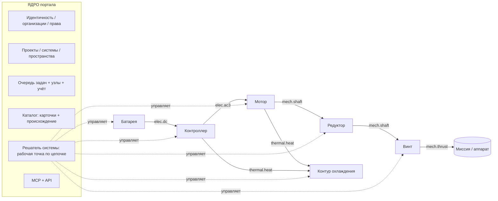

# Инженерный портал: ядро + модули с контрактом (архитектурное решение, 2026-09-29)

База: `motor_ai_sim`, ветка `origin/pre-migration-freeze-2026-09-15` (прод, 3d914fc). Документ; код не менялся.

Цель владельца: портал, к которому потом подключаются модули других производителей (шестерни/редукторы, CFD, пропеллеры, батареи, дроны). Сейчас закладываем основу на моторах и контроллерах так, чтобы потом не ломать систему.

**Конечная цель** (владелец, 2026-09-29): собрать *целую систему* — дрон, катер/АНПА, колёсный робот или машину, сустав робота, генератор — и смоделировать её **в движении/в рабочем цикле** с учётом всех блоков: энергия, приводы, тепло, пределы. Всё ниже подчинено этой цели. Полёт — один из примеров, не частный случай, прошитый в код.

Главная мысль: **ядро** (кто, где, чем считать, что лежит в каталоге, сколько стоит) + **модули**, которые говорят с ядром и между собой только через **контракт**: типизированные порты, карточки каталога и объявленные расчёты. Система — это граф модулей, соединённых портами. Ядро само ищет рабочую точку вдоль цепочки. Сегодняшняя жёстко прошитая связка мотор↔контроллер↔тепло становится первым частным случаем этого графа.

---

## 1. Что уже есть и что становится ядром

### 1.1 Карта «файл → служба ядра»

| Служба ядра | Что есть сейчас | Готовность | Чего не хватает |
|---|---|---|---|
| **Идентичность** | `users.py` (users.json, argon2id, тарифы `free/pro/team/admin`, токены 30 дн), `auth.py`, `oauth.py` (Google) | хорошо | **Нет организаций.** Вендору нужна «организация» с ролями (owner/engineer/viewer) и собственными карточками |
| **Права** | `motor_access.py`: видимость штампа `private/public/selected` + персональные гранты (`die_access.json`); `auth._GATED_PREFIX` | работает для штампов | Права привязаны к *штампу* (die). Нужны права на *объект любого вида*: карточку, модуль, систему, проект |
| **Рабочие пространства** | `workspace.py`: слои `workspace / published / shared`, надгробия (tombstones) удалённых общих штампов, `MAX_WORKSPACES=32` | хорошо | Пространство = пользователь. Нужно «пространство организации» и «проект» внутри него |
| **Очередь задач** | `jobs.py`: `Priority`, `register_handler(kind, fn)`, лимит на пользователя, `SB_FIELD_MAX_CONCURRENT`, отмена, владелец | хорошо, уже обобщённое | Задача запускается в процессе API. Для чужих модулей нужен **изолированный исполнитель** (контейнер/узел) |
| **Вычислительные узлы** | `cluster_monitor.py`: токены `mnode_`, метрики узлов, редактирование секретов в логах | мониторинг есть | Узлы только *наблюдаются*, задачи им не **назначаются** |
| **Учёт ресурсов** | `job_usage.py` (CPU·ч и RSS на задачу, узел, пользователь, клиент, SQLite), `usage_stats.py` (события, хранилище, помесячный отчёт в €, `KINDS`) | хорошо | В строке учёта нет полей `module_id / module_version / vendor_org` → нельзя делить выручку |
| **Каталог** | `catalog/envelope.py` (стадия 1: `id, kind, status draft/active/validated/deprecated, sources, prov по полю (datasheet/measured/estimate/derived), validation, revision`), адаптеры `bearings.py`, `devices.py`, `used_by.py`; `docs/CATALOG_STAGE1_2026-09-28.md` | **правильная основа** | `KINDS = bearing, lubricant, device`. Материалы, провод, батарея, моторы ещё не в конверте. Нет поля «владелец-организация» и «лицензия» |
| **Единицы** | `catalog_units:` на уровне файла; в коде единицы в именах полей (`_kn`, `_mm`, `_c`) | частично | Один реестр единиц для портов (СИ внутри, инженерные — в интерфейсе) |
| **Версии и происхождение** | история конфигов (`/api/family/history`), `revision` карточки, отпечаток геометрии + коммит решателя в записях прогонов, `contracts.Provenance` | хорошо для наших расчётов | Версия *модуля* в каждом результате; неизменяемые опубликованные версии |
| **Контракт модулей** | **Уже есть каркас:** `modules/base.py` (`ModuleManifest`: `capability`, `depends_on`, `inputs/outputs` по типам IR, `contracts_version`, `UIContribution`), `modules/registry.py`, `modules/kernel.py`, `contracts/` (`GeometryIR, MeshIR, MaterialIR, ResultIR, Excitation/ControlSignal/MachineState`, `CONTRACTS_VERSION="0.1.0"`, conformance-тесты), маршруты `/api/modules`, `/api/kernel` | **каркас, в проде почти не используется** (из `coupled.py` берётся только `_call_filtered`) | Это контракт *внутри* мотора (геометрия→сетка→решатель). Не хватает уровня **системы**: физических портов (вал, шина, тепло) и объявленных расчётов |
| **Связанный расчёт** | `routes/coupled.py` (7.7 тыс. строк): ЭМ↔тепло, `DEFAULT_TOL_K=2`, подшипник `BEARING_TOL_K=5`, `DEFAULT_MAX_ITER=6`, привод `current / pwm / inverter`; `inverter/coupling.py` (`fit_device_drop`, `InverterVoltageSource`) | зрелая физика | Связь прошита в коде: мотор, контроллер и тепло знают друг о друге напрямую |
| **Контроллер** | `inverter/` (devices, topology катушка→мост, losses, T_j, waveforms, spice), `routes/controller.py`, `docs/CONTROLLER_MODULE_2026-09-22.md` | хорошо | Живёт внутри конфигурации мотора (`PATCH …/controller`), а не как отдельный узел системы |
| **Модель данных** | `routes/family.py`: штамп (die) → конфигурация (cfg) → режим (duty); батарея, контроллер и подшипники хранятся *внутри* cfg | работает | Нет понятий **проект** и **система**; батарея вшита в cfg, а не ссылается на карточку |
| **MCP** | `mcp_app.py` (streamable HTTP, `McpGate`: ключ `emk_`, скоупы, квоты, аудит), `mcp_tools.py` (белый список полей, `GEOMETRY_DENYLIST`), `agent_designs.py` (черновики, песочница, `simulate`) | хорошо, **и это уже образец защиты IP** | Инструменты завязаны на мотор; нет `build_system` / `simulate_system` |
| **Цены** | `usage_stats` basis (€/сервер-месяц), тарифы | зачаток | Цена за расчёт модуля, доля вендора |

### 1.2 Вывод

Ядро на 60–70 % уже есть. Его надо **переименовать в голове**, а не переписывать. Три настоящих пробела:
1. **Организации и проекты** (сейчас пользователь → штамп).
2. **Физические порты и граф системы** (сейчас связь прошита в `coupled.py`).
3. **Изолированное исполнение чужого кода + учёт по модулю** (сейчас всё в процессе API).

Каркас `modules/` + `contracts/` не выбрасываем: он становится «внутренним» уровнем контракта (как модуль устроен изнутри). Уровень системы (порты между изделиями) добавляем над ним.

---

## 2. Контракт модуля

Модуль = **манифест** (что умею) + **карточки** (конкретные изделия) + **расчёты** (что посчитать по карточке и значениям на портах).

### 2.1 Порты

Порт — типизированная точка соединения. Внутри всё в СИ; в интерфейсе инженерные единицы.

| Тип порта | Переменные (СИ) | Знак | Пара «усилие / поток» |
|---|---|---|---|
| `mech.shaft` | T [Н·м], ω [рад/с] (в UI об/мин), J [кг·м²] (свойство), P = T·ω | T > 0 и P > 0 — мощность **выходит** из модуля через порт | T / ω |
| `elec.dc` | V [В], I [А], R_src [Ом] (свойство), C_link [Ф] | I > 0 — ток **выходит** из порта (источник отдаёт) | V / I |
| `elec.ac3` | V_ll_rms [В], I_rms [А], f_el [Гц], cos φ; опционально токи фаз `i_abc(t)` и `THD` | как у DC; схема звезда/треугольник — свойство | V / I |
| `thermal.heat` | Q [Вт], T [°C] | Q > 0 — тепло **выходит** из модуля | T / Q |
| `thermal.coolant` | ṁ [кг/с], T_in / T_out [°C], Δp [Па], `fluid` (ссылка на карточку) | поток по направлению стрелки | T / ṁ |
| `mech.linear` | F [Н], v [м/с], m_eff [кг] (свойство) — тяга винта, сила на ободе колеса, гусеница, водомёт, линейный привод | F·v > 0 — мощность выходит | F / v |
| `body.motion` (тело аппарата) | 6 DOF: сила F⃗ [Н] и момент M⃗ [Н·м] в точке крепления + состояние тела (положение, скорость, ориентация, угловая скорость) | силы в системе координат тела; точка крепления — свойство связи | F⃗,M⃗ / v⃗,ω⃗ |
| `env` (среда, не энергетический) | среда `air/water/ground`; ρ, T, p, вязкость; ветер/течение/волнение (вектор, порывы); уклон, коэффициент качения, сцепление, покрытие | — | задаётся модулем «Среда», читается всеми |
| `energy.store` (свойство + состояние источника на `elec.dc`) | SoC [–], запас энергии [Дж], H₂/топливо [кг], T [°C], здоровье SoH | — | батарея, топливный элемент, суперконденсатор, ДВС-генератор отдают это на `elec.dc` |
| `envelope` | габарит (OD, L, мм), масса [кг], J, центр масс, присоединение (фланец/вал: карточка интерфейса) | — | не энергетический: проверка совместимости, а не решение |
| `signal.cmd` | задание (момент/скорость/ток), ограничения | — | — |

**Правило одного знака:** положительная мощность на порту всегда означает «выходит из модуля». Тогда баланс любого узла графа — это сумма по портам = 0, а КПД модуля = выход / вход без условных «если генератор».

**Три формы значения на порту** (порт объявляет, какую форму он принимает и отдаёт):

| Форма | Пример | Когда |
|---|---|---|
| `scalar` | T = 120 Н·м при 3000 об/мин | рабочая точка |
| `map` | η(T, n), P_loss(T, n, V_dc), тяга C_T(J) | быстрый расчёт системы, чёрный ящик вендора |
| `series` | i_abc(t), T(t), профиль миссии | переходный процесс, цикл, ко-симуляция |

**Состояние** (state) — отдельное от формы понятие: модуль, у которого есть память (температуры тепловой сети, SoC батареи, положение/скорость тела, Br-«храповик» магнита), объявляет свои переменные состояния с единицами и начальными значениями. Ядро хранит состояние между шагами и передаёт его обратно. Модуль без состояния — чистая функция портов. Это главное условие, чтобы потом считать миссии (раздел 3А).

### 2.2 Виды карточек

Расширяем `catalog/envelope.py` без смены формата (`KINDS` + поля `owner_org`, `license`, `module`):

| kind | Кто владелец | Тело | Порты по умолчанию |
|---|---|---|---|
| `motor` (= опубликованная cfg) | MOTRES / клиент | геометрия (скрыта), обмотка, материалы, паспорт | `mech.shaft`, `elec.ac3`, `thermal.*`, `envelope` |
| `controller` | MOTRES | топология, ссылки на `device`, охлаждение | `elec.dc`, `elec.ac3`, `thermal.*`, `envelope` |
| `device`, `bearing`, `lubricant` | как сейчас | как сейчас | — (детали внутри модуля) |
| `battery_cell` / `battery_pack` | вендор / MOTRES | химия, NS/NP, OCV(SoC, T), R(SoC, T) | `elec.dc`, `thermal.heat`, `envelope` |
| `propeller` | вендор | D, шаг, C_T(J), C_P(J), таблицы по Re | `mech.shaft`, `mech.thrust`, `fluid.air`, `envelope` |
| `gearbox` | вендор | i, η(T, n, T_oil), J, люфт | 2× `mech.shaft`, `thermal.heat`, `envelope` |
| `wheel` / `track` / `waterjet` / `joint` | вендор | радиус, сопротивление качению, сцепление(скольжение); КПД водомёта; жёсткость/люфт сочленения | `mech.shaft`, `mech.linear` (или 2× `mech.shaft`), `env`, `envelope` |
| `fuel_cell`, `supercap`, `genset` | вендор | V(I), η, запас H₂/топлива; C, ESR | `elec.dc`, `thermal.heat`, `energy.store` |
| `vehicle` (динамика объекта) | MOTRES / вендор / пользователь | масса, J, геометрия крепления приводов; аэро/гидро/дорожные коэффициенты (C_x·S, присоединённые массы, f_r) | N× `body.motion`, `env`, `energy` сводка |
| `environment` | MOTRES | стандартная атмосфера ISA, вода (соленость, T), грунт/покрытия, модели ветра/волнения | `env` |
| `controller_logic` (полётный контроллер, распределение тяги, ABS, траектория робота) | MOTRES / вендор | алгоритм «требование → команды приводам» | `signal.cmd` ×N |
| `material`, `wire`, `coolant` | как в предложении по каталогам | — | — |

### 2.3 Расчёты (объявляются в манифесте)

| Расчёт | Вход | Выход | Кто обязан уметь |
|---|---|---|---|
| `operating_point` | значения на части портов (например ω и T на валу, V на шине) | остальные значения на портах + потери + температуры | **все модули** (минимум) |
| `efficiency_map` | сетка (T, n) или (J), V | `map` на портах | мотор, контроллер, редуктор, винт |
| `transient` | `series` на входе | `series` на выходе | по желанию (FMU, наш FEM) |
| `thermal_steady` / `duty_cycle` | тепло на портах, охлаждение, цикл S1/S2/S3 | температуры, время до предела | мотор, контроллер, батарея |
| `envelope_check` | соседний `envelope` | совместимость (посадка, фланец, масса) | все |

### 2.4 Манифест (декларация возможностей)

```yaml
module: aerostator.motor              # уникальное имя (org.module)
version: 2.3.0                        # semver; major = ломается контракт
contract: portal/1.0                  # версия контракта ядра
vendor_org: motres
card_kinds: [motor]
ports:
  shaft:   {type: mech.shaft,  forms: [scalar, map, series]}
  phases:  {type: elec.ac3,    forms: [scalar, series]}
  heat:    {type: thermal.heat, forms: [scalar]}
  coolant: {type: thermal.coolant, forms: [scalar], optional: true}
  body:    {type: envelope}
calculations:
  operating_point: {cost: "FEM 20–200 с", fidelity: fem_2d}
  efficiency_map:  {cost: "мин", fidelity: fem_2d}
  duty_cycle:      {fidelity: lumped}
execution: {kind: native}             # native | map | fmu | remote
exposes: [ratings, losses, temperatures, od_mm, length_mm, mass_kg]  # белый список (как в MCP)
validation: [{ref: ANSYS, case: L200, torque_delta_pct: 0.12}]
```

### 2.5 Версии и происхождение

- Опубликованная версия модуля и карточки **неизменяема**. Правка = новая `revision` (карточка) или новая `version` (модуль).
- Каждый результат несёт `{module@version, card@revision, contract, solver_commit, geometry_hash, mesh, materials, convergence}`. Наши записи прогонов это уже делают; к ним добавляется только `module@version`.
- Система закрепляет версии (как lock-файл). Обновление вендора не меняет старые результаты: пользователь видит «доступна v2.4» и перезапускает сам.

### 2.6 Примеры контрактов

| Модуль | Порты | Обязательный минимум | Исполнение |
|---|---|---|---|
| **Мотор** (наш) | shaft, phases, heat/coolant, body | operating_point (FEM), efficiency_map, duty_cycle | native (наш FEM) |
| **Контроллер** (наш) | dc_in, phases, heat/coldplate, body, cmd | operating_point: по V_dc и I/f на фазах → потери, T_j, η; series: ШИМ-напряжение `InverterVoltageSource` | native |
| **Винт** | shaft, thrust, air, body | operating_point: ω, V_inflow, ρ → T_shaft, F; карта C_T(J), C_P(J) | map (таблица вендора) |
| **Редуктор** | shaft_in, shaft_out, heat, body | T_out = i·η·T_in, ω_out = ω_in/i; η(T, n, T_oil) | map → позже FMU |
| **Батарея** | dc_out, heat, body | V = OCV(SoC, T) − I·R(SoC, T); потери I²R; SoC(t) для миссии | map/equivalent circuit (уже есть `simulation/battery.py`) |

---

## 3. Граф системы и расчёт

### 3.1 Схема



### 3.2 Как считается рабочая точка

1. **Задание** на одном конце (тяга винта при скорости полёта, или момент на валу, или профиль миссии).
2. **Проход «от нагрузки к источнику»** на картах: винт → (T, ω) на валу → редуктор → (T, ω) на моторе → мотор → (I, V, f) на фазах → контроллер → (I, V) на шине → батарея → V_bus(I, SoC). Это дёшево, миллисекунды на точку.
3. **Проверка напряжения:** если V_bus после просадки не хватает для требуемой ω → ослабление поля / ограничение. Второй проход, пока V_bus не сойдётся (обычно 2–4 итерации, допуск 0.5 %).
4. **Уточнение точными моделями:** только на сошедшейся точке запускается FEM мотора и потери контроллера (сегодняшний связанный цикл), результат заменяет карты в этой точке.
5. **Тепловой проход:** тепло всех модулей → контур охлаждения → температуры → пересчёт потерь (сопротивление меди, Br, R_DS(on)(T_j)). Сходимость как сейчас: 2 K по обмотке и магниту, 5 K по посадке подшипника, до 6 итераций.

Это **метод Гаусса–Зейделя по графу** (последовательная подстановка). Именно так уже работает `coupled.py`, только с тремя фиксированными участниками. Ньютон на весь граф не нужен до появления жёстких петель (например, две батареи параллельно).

### 3.3 Карты или ко-симуляция

| Режим | Когда | Цена | Что даёт |
|---|---|---|---|
| **Карты** (quasi-static) | подбор, миссия дрона, сравнение вариантов | мс/точка | КПД, потребление, масса, время полёта |
| **Уточнение в точке** (наш сегодняшний цикл) | паспорт, отчёт | минуты | FEM-точность в выбранных точках |
| **Ко-симуляция** (FMI 3.0 co-simulation, шаг ядра) | ШИМ-пульсации, переходные процессы, пуск, КЗ | часы | series на портах |

Ко-симуляция по FMI не нужна для первых двух шагов плана. Её закладываем только в контракт (`forms: [series]`, `execution: fmu`).

### 3.4 Куда встают сегодняшние проходы

| Сегодняшний механизм | Где в новой схеме |
|---|---|
| `drive: current` | мотор считается от задания тока, контроллер не участвует (порт `phases` задан идеально) |
| `drive: pwm` | идеальный мост как «встроенный контроллер по умолчанию» |
| `drive: inverter` (`InverterVoltageSource`, `fit_device_drop`) | связь `elec.ac3` между модулями «контроллер» и «мотор» в режиме `series`: контроллер отдаёт напряжение с мёртвым временем и падениями на ключах |
| Тепловой цикл ЭМ↔тепло, посадка подшипника | тепловой проход (шаг 5) |
| Моды и критические скорости | расчёт `mechanical_check` модуля «мотор»; вал к редуктору передаёт J и жёсткость |

---

## 3А. Моделирование миссии и движения (конечная цель)

### 3А.1 Общая схема: одинаково для воздуха, воды, земли и стационара

Миссия = **граф системы, прогоняемый во времени** под заданием. Никакой аэродинамики «в ядре»: всё, что зависит от среды и объекта, — это модули вида `environment`, `vehicle`, пропульсоры/колёса и `controller_logic` с тем же контрактом портов.

```
 Профиль миссии ──► controller_logic ──signal.cmd──► контроллеры ──elec.ac3──► моторы
 (скорость/высота/     (распределение                ▲ elec.dc                  │ mech.shaft
  глубина/уклон/        тяги, траектория)            │                          ▼
  сила/цикл S1–S9)            ▲                 energy.store              редуктор / вал
                              │ состояние тела   (батарея, ТЭ,                  │
                              │                   суперконденсатор)             ▼
                         vehicle (1…6 DOF) ◄──body.motion── пропульсор: винт в воздухе/воде,
                              ▲                              колесо, гусеница, водомёт, звено
                              └────────────── env (environment: ISA, вода, грунт, ветер, волны)
 Тепло всех блоков ──thermal.heat──► контур охлаждения (переходные тепловые сети)
```

**Профиль миссии** — универсальный: задание по времени или по пути любой из величин — скорость, высота, глубина, уклон, сила/момент, траектория точки; плюс внешние условия (ветер/течение/волнение, T и ρ среды, полезная нагрузка) и события (сброс груза, отказ ротора). Готовые библиотеки: полётные сегменты (взлёт, набор, висение, крейсер, манёвр, посадка), ездовые циклы WLTP/NEDC/UDDS, состояния моря, циклы S1–S9 по IEC 60034-1, траектории робота.

### 3А.2 Примеры: один контракт на всё

| Объект | Граф | Среда / задание | Что получаем |
|---|---|---|---|
| **Квадрокоптер** | батарея → 4× (контроллер → мотор → винт) → `vehicle` 3-DOF (точка-масса), затем 6-DOF; `controller_logic` = распределение тяги | ISA + ветер/порывы; взлёт–висение–крейсер–посадка; полезная нагрузка | время полёта/дальность, мощность(t), T обмотки/магнита/T_j/батареи(t), запасы, какой блок ограничивает |
| **Э-катер / АНПА** | батарея → контроллер → мотор → (редуктор) → гребной винт в **воде** (та же карточка `propeller`, `env.medium=water`, K_T/K_Q) → `vehicle` с сопротивлением корпуса и присоединёнными массами | вода, течение, волнение; профиль скорости/глубины | дальность, скорость, кавитационный запас, тепло при охлаждении забортной водой |
| **Колёсный робот / машина / AGV / э-велосипед** | батарея(+суперконденсатор) → контроллеры → моторы → редуктор → колесо (`wheel`: радиус, f_r, сцепление) → `vehicle` (продольная динамика, 1-DOF, затем 3-DOF) | уклон, покрытие, ветер; WLTP или маршрут AGV | запас хода, рекуперация, перегрев на подъёме, пробуксовка |
| **Сустав робота** | контроллер → мотор → редуктор (волновой/планетарный) → `joint` → звено (`vehicle` = манипулятор, 1…6 DOF) | траектория, полезная нагрузка, S3/S6 | пиковый/RMS момент, T обмотки по циклу, размагничивание в пике |
| **Генератор / насос** (стационар) | первичный двигатель/нагрузка (`mech.shaft`) → мотор-генератор → контроллер → шина/батарея | цикл нагрузки S1–S9 | КПД по циклу, тепловой запас, разгон/сброс нагрузки |

Порты покрывают: вращение (`mech.shaft`), поступательное движение (`mech.linear`), нагрузки от среды (`env` + `body.motion` через пропульсор/корпус), хранение энергии (`energy.store` на `elec.dc` — батарея, топливный элемент, суперконденсатор, генератор), тепло (`thermal.*`).

### 3А.3 Что считается в миссии

- **Динамика объекта:** начинаем с точки-массы (1-DOF для машины/сустава, 3-DOF для дрона и катера), 6-DOF — позже; тот же порт `body.motion`, меняется только модуль `vehicle`.
- **Нагрузки среды:** карты пропульсоров (C_T/C_P, K_T/K_Q), коэффициенты корпуса/планера (C_x·S), в будущем — коэффициенты из CFD-модулей (CFD считает таблицы заранее, в миссию идёт таблица).
- **Управление:** `controller_logic` переводит требование (тяга, скорость, траектория) в команды приводам; позже — вендорский полётный контроллер в виде FMU.
- **Энергия:** SoC, просадка V по R_int(SoC, T), температура батареи; топливный элемент — V(I) и расход H₂.
- **Тепловые переходные процессы** моторов, контроллеров, батарей вдоль миссии (тепловые сети, не установившийся режим).
- **Пределы и отказы** (проверяются на каждом шаге, первое нарушение фиксируется с временем и блоком): T обмотки/изоляции, T магнита и размагничивание (наше правило «худшего элемента»), T_j ключа, ток/напряжение, SoC_min, напряжения в роторе (SF по усреднённым напряжениям), ограничение скорости.
- **Результаты:** время работы / дальность; графики мощности, токов, температур, SoC; запасы по каждому пределу; **какой блок ограничивает** и когда.

### 3А.4 Лестница точности (fidelity ladder)

Каждый модуль предлагает несколько уровней точности одного и того же расчёта:

| Уровень | Мотор (наш) | Контроллер (наш) | Пропульсор / объект | Скорость |
|---|---|---|---|---|
| L0 — карты | η(T, n, V_dc, **T_обм, T_маг**), P_loss по видам, T_max(n) | P_loss(I, V, f_sw, T_j) | C_T/C_P, f_r, C_x·S | мкс/точка |
| L1 — редуцированная модель | тепловая сеть (lumped, как `thermal_duty_cycle.py`, `coupled_duty_cycle.py`), d-q модель с L_d/L_q(I) | тепловая Z_th(t) ключа | 3-DOF | мс/шаг |
| L2 — полная | связанный FEM ЭМ↔тепло (`coupled.py`), ШИМ через `InverterVoltageSource` | SPICE (`inverter/spice`) | 6-DOF, CFD | мин–часы |

**Миссия всегда идёт на L0/L1.** L2 нужен, чтобы **построить и проверить** L0/L1:
- наш связанный FEM прогоняется по сетке точек (T, n, V_dc, температура) — это уже умеют наши свипы и `continuous_rating` → получается карта с **происхождением** (`module@version`, geometry_hash, solver_commit, mesh, сетка точек);
- карта хранится как карточка-результат в каталоге (`kind: map`, ссылка на исходные прогоны);
- **точность отслеживается:** для каждой карты — контрольные точки, пересчитанные FEM вне сетки (ошибка интерполяции, %), и сверка с ANSYS/стендом там, где есть (L200 +0.12 % момента, L40 +3.6 %). Ошибка записывается в `validation` и выводится рядом с результатом миссии («±2 % по потерям мотора, ±5 % по винту: даташит»);
- в конце миссии ядро может **перепроверить самые напряжённые точки на L2** (обычно 3–5 точек: пик тепла, пик тока, минимум V) и показать расхождение — если оно больше допуска, карта уточняется в этой области.

### 3А.5 Интегрирование по времени и ко-симуляция

- **Жёсткость:** электрические процессы (мкс–мс) и механика (мс–с) против тепла (с–часы). Поэтому в миссии электрика **квазистатическая** (карта L0 на каждом шаге), механика и тепло — интегрируются. ШИМ-пульсации в миссию не входят; их вклад уже учтён в картах потерь (PWM-проход).
- **Шаги:** механика 1–10 мс (дрон) / 10–100 мс (машина, катер); тепло 0.1–1 с — **многоскоростное** интегрирование (тепло обновляется реже). Для своих модулей — переменный шаг (BDF/Radau из SciPy для тепловых сетей), для обмена с чужими — фиксированный макрошаг.
- **Мастер-алгоритм ко-симуляции (FMI 3.0):** ядро шагает макрошагом Δt, каждому FMU передаёт входы портов, `doStep(Δt)`, собирает выходы; для жёстких связей (тепло↔потери) — повтор шага с откатом состояния, если модуль поддерживает `getFMUState/setFMUState`, иначе — экстраполяция и уменьшение Δt. FMU в режиме model-exchange включаются в наш интегратор напрямую.
- **Быстро на нашем кластере:** одна миссия на картах — один процесс, секунды; **пакетные/параметрические миссии** (перебор мотор × винт × батарея × масса, Монте-Карло по ветру) и **оптимизация** («выбрать мотор+винт+батарею на максимум времени полёта») идут как задачи `jobs.py` вида `mission_batch` / `mission_opt`, распределяются по узлам `cluster_monitor`, учитываются в `job_usage` (CPU·ч, модуль@версия, вендор). Наш двухэтапный метод оптимизации (свободный поиск → локальное уточнение) переносится на уровень системы; L2-перепроверка — только для финалистов.

### 3А.6 Что это значит для контракта УЖЕ СЕЙЧАС

Чтобы потом не ломать:
1. **Состояние в контракте с первого дня** (M0): тепловое состояние мотора и контроллера, SoC/T батареи, состояние тела — объявленные переменные с единицами; ядро хранит и возвращает их. Модуль без состояния тоже допустим.
2. **Все энергетические порты допускают форму `series`** уже в `portal/1.0`, даже если первая реализация отдаёт только `scalar`.
3. **Время и среда — явные входы**: `t`, `Δt`, ссылка на `env`. Сегодняшний T окружающей среды/охлаждающей жидкости из Thermal-вкладки становится значением порта `env`/`thermal.coolant`, а не константой.
4. **Мотор обязан отдавать** (к концу шага 1 дорожной карты): карты η и потерь по видам (медь DC/AC, сталь, магниты, механика) **с зависимостью от температуры обмотки и магнита и от V_dc**; предел момента T_max(n, V_dc, T); тепловую сеть L1 (узлы: обмотка, магнит, статор, ротор, корпус, подшипник) с C и R из наших `thermal_capacities.py` / `thermal_heat_paths.py`; пороги размагничивания по T; J ротора.
5. **Контроллер обязан отдавать:** P_loss(I, V_dc, f_sw, T_j), Z_th(t) ключ→холодная плита, пределы I и T_j.
6. **Батарея** (сегодня `simulation/battery.py`) — сразу как модуль с состоянием SoC и T.
7. **Пределы — часть манифеста** (`limits:` с именем, единицей, значением и источником), чтобы ядро проверяло их одинаково для любого модуля.

---

## 4. Перенос мотора и контроллера без поломок

Принцип: **сначала обёртка, потом перенос.** Новый путь вызывает старый код и обязан давать **бит-в-бит** те же числа. Старые URL живут, пока не стали ненужными.

### 4.1 Этапы

| Этап | Что делаем | Приёмка |
|---|---|---|
| **M0. Контракт** (`contracts/ports.py`, `portal/1.0`) | Pydantic-типы портов, единицы, знаки, формы; манифест v2 (расширение `ModuleManifest`: `ports`, `calculations`, `execution`, `exposes`). Только код типов + conformance-тесты | тесты схемы; `CONTRACTS_VERSION` не ломается |
| **M1. Адаптер «мотор»** | `modules/motor_adapter.py`: `operating_point(ports) →` вызывает тот же код, что `/api/coupled/run` | **L155 motor, L180 gen, L13**: результаты адаптера == `/api/coupled/run` бит-в-бит (сравнение `repr` чисел, как в `tests/fixtures/catalog_golden/`); золотые файлы снимаются до начала работ |
| **M2. Адаптер «контроллер»** | `modules/controller_adapter.py` поверх `inverter/losses.py`, `coupling.py` | потери, T_j, η на L155 + IMCQ120R004M2H == `/api/controller/*` бит-в-бит |
| **M3. Решатель системы** (`portal/system_solver.py`) | граф из двух узлов (контроллер→мотор) + тепло; последовательная подстановка **вызывает** существующий цикл, а не копирует | система «L155 + контроллер» == `drive: inverter` на тех же L155/L180/L13 бит-в-бит; число итераций то же |
| **M4. Модель данных** | Добавляем `project` и `system` **рядом** со штампами: система = `{узлы: [ссылка на карточку@ревизию], связи: [порт→порт]}`. Каждая существующая cfg получает **неявную систему** «батарея(cfg.battery) → контроллер(cfg.controller) → мотор(cfg)» без переписывания файлов | `family.tree()` не меняется; неявная система считает то же, что cfg |
| **M5. Батарея — карточка** | `cfg.battery` → ссылка на карточку `battery_pack` (адаптер читает старое поле, если ссылки нет) | GF Myriad 200S3P 750 V на CILN28: те же V_min/nom/max |
| **M6. Новые маршруты** | `/api/v2/systems/*`, `/api/v2/modules/*`. Старые `/api/family/*`, `/api/coupled/*`, `/api/controller/*` остаются и становятся тонкими обёртками | старые web-тесты зелёные; web не трогаем до M7 |
| **M7. Отказ от старого** | Старые маршруты помечаются `Deprecation`-заголовком; через 2 релиза без вызовов (видно по `usage_stats.note_request`) — удаляются. MCP-инструменты не удаляются никогда без версии (`list_machines` остаётся) | журнал использования = 0 вызовов за 30 дней |

### 4.2 Что НЕ меняем

- Файлы `config/dies/<die>/<cfg>.yaml`, ключи штампов, URL `?mat=` для режимов.
- Имена MCP-инструментов и их выходной белый список (`GEOMETRY_DENYLIST`).
- Карточки `device/bearing/lubricant` (стадия 1 каталога уже неизменяема по телу).
- Никакого `git stash` в `motor_ai_sim`, никакого рефакторинга 7.7 тыс. строк `coupled.py` «заодно».

### 4.3 Соответствие старой и новой модели

| Сейчас | Потом |
|---|---|
| пользователь | пользователь ∈ организация (у каждого — личная организация по умолчанию) |
| штамп (die) | карточка-семейство `motor_family` (лист железа, пресс-форма) |
| конфигурация (cfg) | карточка `motor` (изделие) |
| режим (duty) | **сценарий** системы (рабочая точка / цикл) |
| cfg.controller / cfg.battery | узлы системы со ссылками на карточки |
| die_access grants | права на объект (любого вида) |

---

## 4А. Геометрия мотора: источники и типы машин

Решение владельца (29.09.2026): «Дать возможность импорта геометрии, назначения материалов и расчёта — пока самый простой вариант, его нужно предусмотреть, но это не главное. Со временем — редактор моторов step-by-step. Сейчас главное — заложить все эти возможности в структуру.» Заказчик должен иметь возможность строить **свою** геометрию мотора, а не только брать нашу.

Сегодня: одно параметрическое семейство (IPM, радиальный поток, 33 параметра) + импорт параметров из Fusion CSV; пользователи уже создают свои штампы (у одного заказчика — уже есть).

### 4А.1 Один контракт — много источников геометрии

Модуль «мотор» снаружи один (порты раздела 2). Внутри — **источники геометрии**, каждый выдаёт одно и то же **описание машины** (4А.2); решатели и порты читают только его.

| Источник | Что это | Когда |
|---|---|---|
| **1. Параметрические семейства (плагины-генераторы)** | сегодня IPM; потом SPM, внешний ротор (outrunner), аксиальный поток, асинхронный, синхронно-реактивный, с обмоткой возбуждения (EESM); распределённая и сосредоточенная обмотка. Каждое семейство — плагин `generate(params) → описание машины` | IPM — есть; новые — по одному, по спросу |
| **2. Импорт 2-D сечения** | DXF (STEP/эскиз — позже) → распознавание областей (сталь статора/ротора, магниты с направлением намагничивания, пазы/катушки, вал, воздух) → пользователь назначает материалы из каталога и обмотку (фазы/катушки, витки, параллельные ветви) → поиск симметрии/периодичности → громкая проверка → те же решатели | ранняя простая веха после M0/M1 |
| **3. Редактор step-by-step** | мастер: топология → размеры → обмотка → материалы → охлаждение → проверка → расчёт; пишет то же описание машины (под капотом вызывает генератор семейства или правит импортированное сечение) | позже |

### 4А.2 Описание машины (`machine/1.x`) — общий формат

| Поле | Содержание |
|---|---|
| `schema` | `machine/1.0`; minor — только добавление полей, major — параллельная поддержка + мигратор |
| `topology` | `radial_inner`, `radial_outer`, `axial`; тип: `ipm/spm/im/synrm/eesm`; полюса, пазы, длина пакета |
| `regions[]` | замкнутые контуры (мм, в плоскости сечения) с ролью: `stator_steel`, `rotor_steel`, `magnet`, `coil_side`, `shaft`, `sleeve`, `air`, `airgap` |
| `materials{}` | роль/область → ссылка на карточку каталога@ревизия (сталь, магнит с `<марка>_<T>C`, медь, изоляция) |
| `magnets[]` | область → направление намагничивания (угол или параллельно/радиально), полярность |
| `winding` | фазы, катушки → стороны в пазах (+/−), витки, параллельные ветви, Y/Δ, шаг, заполнение паза, модель жилы (strip/strand) |
| `symmetry` | период (число полюсов/пазов в модели), граничные условия (периодич./антипериодич.), проверена ли |
| `mesh_hints` | размер элемента в зазоре, скин-слой (правило «сетка следует физическим масштабам») |
| `provenance` | источник (`generator:ipm@ver` + параметры / `import:dxf` + хэш файла / `editor`), автор, дата, хэш геометрии |
| `owner`, `visibility` | организация-владелец; `private` по умолчанию; гранты |

Связь с сегодняшними данными: штамп (die) = семейство `motor_family` + общий лист (регионы стали, пазы, карманы); cfg = изделие (длина, магниты, обмотка, материалы). Для IPM описание машины **вычисляется** из yaml генератором — файлы не меняются; хэш геометрии бит-в-бит как сейчас (правило «геометрия строится аккуратно»).

### 4А.3 Проверка (одна для всех источников)

Замкнутость контуров; перекрытия и щели; «щепки» и тонкие элементы относительно шага сетки; у каждой области есть материал; у магнита — направление; сумма ампер-витков по фазам сбалансирована; симметрия совпадает с числом полюсов/пазов. Ошибка — громкая и с указанием области; невозможную машину не считаем (правило «клиентская валидация»).

### 4А.4 Владение и доступ

| Правило | Как |
|---|---|
| Геометрия заказчика | `private` по умолчанию, видна только его организации; делится грантом (как die_access) |
| MCP | никогда не выдаёт геометрию листа чужих машин (`GEOMETRY_DENYLIST`); своя — только владельцу |
| Экспорт своей геометрии | владелец может скачать своё (DXF/описание машины); наши семейства — только результаты и параметры, не контуры листа, если нет гранта |
| Вендоры других модулей | получают только значения портов, геометрию — никогда |

### 4А.5 Что заложить в структуру СЕЙЧАС

1. Схема `machine/1.0` + конвертер «IPM yaml → описание машины» с бит-в-бит проверкой на L155/L180/L13 (в M1).
2. Интерфейс плагина-генератора: `manifest` (параметры, пределы, топология) + `generate(params)`; IPM — первый плагин.
3. Решатели читают только описание машины (через адаптер), не параметры IPM напрямую — новые путь, старый код не трогаем.
4. Единый конвейер проверки (4А.3) — вызывают генератор, импорт и редактор.
5. UI назначения материалов и обмотки — один компонент для всех источников (повторно используется из вкладки Motors).
6. `owner/visibility/provenance` в описании машины с первого дня.

---

## 5. Сторонние модули

### 5.1 Подключение вендора

1. **Организация вендора** (роль `vendor`), договор (лицензия на данные, доля выручки).
2. **Карточки** в конверте каталога со статусом `draft`. Источник обязателен: даташит (PDF в хранилище), номер таблицы/рисунка, `basis: table|figure` — как уже сделано для MOSFET-карточек.
3. **Валидация против даташита:** ядро пересчитывает 3–5 опубликованных точек (например, C_T винта в 3 точках J, КПД редуктора в номинале) и записывает `validation` с отклонением. Порог → статус `active`.
4. **Проверка манифеста**: conformance-тесты контракта (порты, единицы, знаки, монотонность карт, закон сохранения энергии: выход ≤ вход на каждой точке).
5. **Публикация** → карточка видна в каталоге с бейджем качества.

### 5.2 Варианты исполнения

| Вариант | Что присылает вендор | Изоляция | Когда |
|---|---|---|---|
| **Карты** (таблицы) | CSV/YAML: η(T, n), C_T(J)… | не нужна (это данные, не код) | **Шаг 2**, большинство вендоров |
| **FMU** (FMI 2.0/3.0) | бинарный `.fmu` (скомпилированная модель, исходники скрыты) | контейнер без сети, лимиты CPU/RAM/времени, только чтение, отдельный узел | **Шаг 3b**; редукторы с тепловой моделью, батареи |
| **Удалённый сервис** | HTTPS-эндпойнт вендора, отвечающий по контракту | модель у вендора; мы шлём **только значения портов** | **Шаг 3c**; вендоры, которые не отдают модель (CFD) |

Замечание: собственный код Windows-станции владельца блокирует нативные `.pyd` (WDAC). Исполнение FMU поэтому только на Linux-узлах (Hetzner), не локально.

### 5.3 Безопасность и защита IP

- **Чужой код никогда не выполняется в процессе API.** Только отдельный исполнитель (контейнер: `--network none`, seccomp, лимиты, временная ФС), задача через `jobs.py`.
- **Минимум данных наружу:** модулю передаются только значения его портов. Геометрия нашего мотора к вендору винта не уходит никогда. Тот же принцип, что белый список MCP.
- **Защита IP вендора:** карты и FMU видны в UI только как результаты; скачать карточку целиком нельзя (поле `license: view_only | download`). Удалённый сервис — максимальная защита.
- **Аудит:** каждый вызов чужого модуля — строка журнала (как `config/mcp_audit.jsonl`): кто, какой модуль@версия, сколько секунд.
- **Удалённый сервис:** mTLS / подписанные запросы, тайм-аут, ретраи, кэш по хэшу входа.

### 5.4 Деньги и качество

- В строку `job_usage` добавить `module`, `module_version`, `vendor_org`. Тогда `usage_stats.monthly` сразу даёт CPU·ч и число расчётов по вендору → доля выручки.
- Модели: (а) вендор платит за размещение (лидогенерация); (б) пользователь платит за расчёт, доля вендору; (в) бесплатно для карт, платно для FMU/сервиса. Рекомендация — начать с (а): проще юридически.
- **Бейджи качества:** `datasheet` (сверено с даташитом), `measured` (есть измерение), `validated by MOTRES` (наш стенд/ANSYS), `estimate`. Бейдж вычисляется из `prov`/`validation`, а не ставится руками.

---

## 6. Интерфейс и агенты

### 6.1 Интерфейс

| Экран | Что там |
|---|---|
| **Проект** | системы, сценарии (режимы), результаты, участники |
| **Конструктор системы** | холст: перетащить модули из каталога, соединить порты; несовместимые порты не соединяются (тип + единицы); рядом — сводка рабочей точки на каждой связи (T, n, V, I, Q) |
| **Страница модуля** | манифест простыми словами, карточки, бейджи, валидация, цена расчёта |
| **Каталог** | единый поиск/фильтр/сравнение по всем видам карточек, источник у каждого числа |
| **Сегодняшние вкладки** (Motors, Simulation, Controller, Thermal) | остаются как «страница модуля мотора/контроллера» — глубокая настройка одного узла |

Правило «без стен текста» сохраняется: одна строка + подсказка.

### 6.2 MCP

Новые инструменты (скоупы по образцу `catalog:read`, `machines:read`):

| Инструмент | Скоуп | Что делает |
|---|---|---|
| `list_modules`, `search_catalog(kind, filters)` | `catalog:read` | модули и карточки любых видов |
| `build_system(nodes, links)` | `systems:write` | черновик системы (как `start_design` для мотора), проверка портов |
| `simulate_system(system_id, scenario)` | `systems:simulate` | ставит задачу в очередь, квоты как у `simulate` |
| `get_system_result(id)` | `systems:read` | значения на портах, потери, температуры через белый список |

Агент заказчика работает так: «нужен дрон 25 кг, 40 мин»: `search_catalog` винты/батареи → `build_system` → `simulate_system` на картах → выбирает 2–3 варианта → ставит точный расчёт. Всё идёт под ключом владельца с его правами, квотами и аудитом, как сейчас.

---

## 7. Риски, решения, дорожная карта

### 7.1 Риски

| Риск | Мера |
|---|---|
| Перенос ломает цифры L155/L180/L13 | бит-в-бит золотые тесты до начала работ; адаптер вызывает старый код |
| «Переархитектурили»: год на ядро, ноль модулей | строгий порядок: M0–M3 → винт на картах → только потом FMU |
| Контракт выбран неверно, вендоры уже подключены | `contract: portal/1.x`; major-версия = параллельная поддержка двух версий 12 мес. |
| Чужой код ломает/нагружает сервер | только изолированные узлы, лимиты, никогда в API-процессе и не на станции владельца |
| Утечка нашей геометрии вендору | модулю передаются только порты; белый список как у MCP |
| Плохие данные вендора портят репутацию | статус `draft` до валидации; бейджи; «модель вендора» подписано в отчёте |
| Одна система становится медленной (много FEM) | карты по умолчанию, FEM только в сошедшейся точке |

### 7.2 Решения, нужные от владельца

| № | Решение | Рекомендация |
|---|---|---|
| D1 | Строим уровень «система/порты» над существующими `modules/`+`contracts/` или заново? | **Над существующими**: расширить `ModuleManifest`, не выбрасывать каркас |
| D2 | Знак мощности на порту | **«Положительная = выходит из модуля»** для всех портов |
| D3 | Внутренние единицы | **СИ внутри**, инженерные (об/мин, мм, °C, кВт) только в UI/отчёте |
| D4 | Вводить «организации» сейчас или при первом вендоре? | **Сейчас, минимально**: личная организация у каждого пользователя, без UI |
| D5 | Штамп/cfg/режим → проект/система/сценарий: переименовывать данные? | **Нет.** Новые сущности рядом; cfg получает неявную систему; файлы не трогаем |
| D6 | Третий модуль для пилота | **Винт на картах** (C_T/C_P) — даёт первую систему «дрон»; редуктор вторым |
| D7 | Формат чужих моделей | **Карты → FMU 3.0 (co-sim) → удалённый сервис**, в этом порядке |
| D8 | Где исполнять чужой код | **Только отдельные Linux-узлы в контейнерах** (Hetzner), никогда в API и не локально |
| D9 | Бизнес-модель вендора на старте | **Плата за размещение/лиды**; доля за расчёт — когда будет учёт по модулю |
| D10 | Кто может смотреть/скачивать карточку вендора | по умолчанию **`view_only`** (только результаты), скачивание — по выбору вендора |
| D11 | Критерий «перенос готов» | **бит-в-бит L155 motor, L180 gen, L13** через новый путь; иначе не мёржим |
| D13 | Динамика объекта и среда — в ядре или модулями? | **Модулями** (`vehicle`, `environment`, пропульсоры) с тем же контрактом; ядро знает только время, состояние и порты |
| D14 | Состояние (SoC, тепловая сеть, тело) и форма `series` — закладывать в контракт сразу? | **Да, в M0**, даже если первая реализация скалярная |
| D15 | На какой точности считаются миссии | **L0/L1** (карты + тепловые сети); FEM — строит и проверяет карты, перепроверка 3–5 худших точек |
| D16 | Первая миссия | **Висение квадрокоптера** на наших картах мотора+контроллера + карта винта + батарея |
| D17 | Карты мотора: сетка точек | T × n × V_dc × (T_обм, T_маг) — ночные прогоны (правило «3-D и кампании ночью»), не днём на живом API |
| D18 | Где живёт конструктор систем: aerostator.com или emotres.com? | по стратегии доменов с 28.09.2026 — **aerostator.com = приложение/портал** (конструктор систем здесь), emotres.com = сайт и магазин; один API |
| D19 | Своя геометрия заказчика | **Да, заложить в структуру сейчас**: общий формат `machine/1.0`, в который пишут все источники (4А) |
| D20 | Импорт DXF + материалы + расчёт | **Ранняя простая веха после M0/M1**, но не первый приоритет |
| D21 | Редактор step-by-step | **Позже**, поверх того же описания машины и проверки |
| D22 | Новые топологии (SPM, outrunner, аксиальный, IM, SynRM, EESM) | **Плагины-генераторы**, по одному по спросу; ядро и решатели не меняются |
| D23 | Доступ к геометрии заказчика | **`private` по умолчанию**, гранты; MCP чужую геометрию не отдаёт; своё владелец экспортирует |

### 7.3 Дорожная карта (грубо, в неделях одного инженера-агента + проверка владельцем)

| Шаг | Содержание | Трудоёмкость |
|---|---|---|
| **1. Собственные модули на контракте** | M0 контракт портов (1 нед) · M1 адаптер мотора + золотые тесты (1–2 нед) · M2 контроллер (1 нед) · M3 решатель системы с вызовом старого цикла (2 нед) · M4–M5 проект/система рядом с cfg, батарея-карточка (2 нед) · M6 `/api/v2` (1 нед) · организации минимально (1 нед) · учёт `module@version` в `job_usage` (0.5 нед) | **~9–10 нед** |
| **1А. Своя геометрия (импорт)** | схема `machine/1.0` + IPM-плагин (в M1), затем импорт DXF → распознавание областей → назначение материалов/обмотки → проверка → расчёт | ~3–4 нед (после M1, не первым) |
| **2. Третий модуль (винт на картах)** | карточка `propeller`, карта C_T/C_P, валидация по даташиту, система «батарея→контроллер→мотор→винт», конструктор в UI (простой), MCP `build_system/simulate_system` | **~5–6 нед** |
| **3a. Внешние вендоры: карты** | онбординг организации вендора, draft→active, бейджи, `license` | ~3 нед |
| **3b. FMU** | изолированный исполнитель на узлах, назначение задач узлам через `jobs.py`, FMI 3.0 co-sim, лимиты | ~6 нед |
| **3c. Удалённый сервис** | протокол по контракту, mTLS, кэш, ретраи, доля выручки | ~4 нед |
| **4. Миссии (конечная цель)** | см. вехи ниже | ~14–20 нед суммарно |

**Вехи шага 4 — моделирование миссий/движения:**

| Веха | Содержание | Приёмка |
|---|---|---|
| **4.1 Висение квадрокоптера** | наши карты мотора L0 (из FEM, с T-зависимостью) + карты контроллера + карта винта + модель батареи; `vehicle` точка-масса; профиль «висение до SoC_min» | время висения; сверка с ручным расчётом по тем же картам ±1 %; L2-перепроверка 3 точек |
| **4.2 Тепловые переходы по миссии** | тепловые сети L1 мотора/контроллера/батареи; пределы и «какой блок ограничивает» | цикл S1/S3 мотора == `coupled_duty_cycle` на L155 в пределах допуска |
| **4.3 Полный профиль полёта 3-DOF** | взлёт–набор–крейсер–посадка, ветер/порывы, ISA; распределение тяги | энергетический баланс сходится (Σ по портам = 0 на каждом шаге) |
| **4.4 Земля и вода** | модули `wheel` + WLTP/маршрут AGV; гребной винт в воде + сопротивление корпуса | те же движки, другие модули — без изменений ядра (**проверка общности контракта**) |
| **4.5 Сустав робота и стационар** | `joint` + траектория, генератор по S1–S9 | пиковый/RMS момент, T обмотки по циклу |
| **4.6 Пакеты и оптимизация** | `mission_batch`, `mission_opt` на кластере, учёт по модулю | «лучший мотор+винт+батарея на время полёта» за ночь |
| **4.7 FMU и 6-DOF** | мастер FMI 3.0, вендорский полётный контроллер/редуктор как FMU, 6-DOF | кросс-проверка с эталонным FMU |
| **Геометрия, дальше** | редактор step-by-step; плагины SPM/outrunner/аксиальный/IM/SynRM/EESM; STEP-импорт | по спросу |
| **Потом** | CFD-модули как источники коэффициентов, Ньютон для жёстких петель | по спросу |

Шаг 1 не меняет ни одного числа и ни одного URL для пользователя: это можно делать параллельно с текущей работой над моторами.
