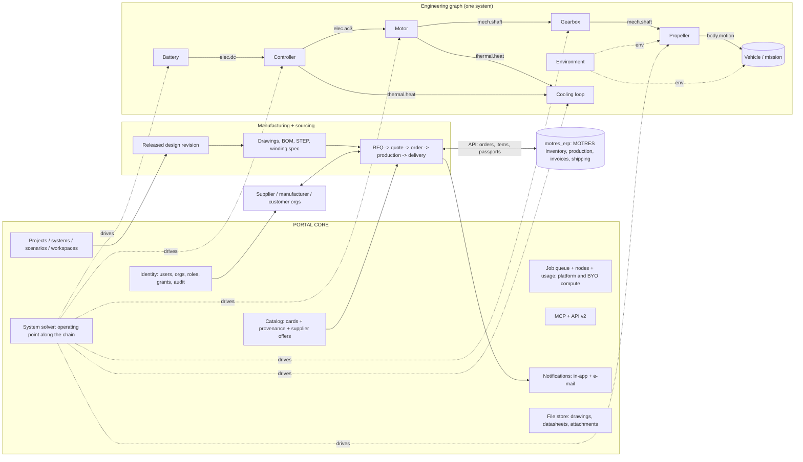

# Engineering portal: core + contracted modules (v3, 2026-09-29)

Base: `motor_ai_sim`, branch `origin/pre-migration-freeze-2026-09-15` (production, 3d914fc), plus the open PRs #40 (licence: AGPL-3.0-or-later + DCO), #41 (private split), #44 (bring-your-own compute, `docs/BYO_COMPUTE.md`) and the MCP stages (`docs/MCP_2026-09-28.md`). The separate ERP project `motres_erp` was read (not changed) to draw the integration boundary. This is a document; no code was changed.

## What changed from v2

| Area | v3 |
|---|---|
| Language | English only (owner rule: no Russian in the repository or in documents for others). |
| Commercial content | **Removed.** The project is non-commercial for now: pure AGPL-3.0-or-later + DCO, no pricing, no tiers (only `user` and `admin` roles), no billing, no revenue share, no listing fees, no paid features. Fair-use limits instead of plans; users may attach their own compute nodes (BYO compute). |
| Restructure | Owner decision: the whole project moves onto this architecture, stage by stage (M0…), never breaking results: bit-identical acceptance on L155 motor, L180 generator and L13. |
| New scope | Parties and organizations (section 6), manufacturing documentation (section 7), sourcing and orders (section 8): everything can be done in the portal "up to drawings and orders of finished products". Money and contracts stay outside the platform; it carries documents, statuses and communication. |
| Decisions | D1–D23 kept (D9 restated as non-commercial, D12 was never used); new D24–D37; D46–D56 on data protection and residency (section 10A). |
| Roadmap | New stages M8–M12 placed after the core restructure (M0–M3) and the data model (M4–M7). |

## Goal

The owner's goal: a portal to which modules from other makers are later attached (gears and gearboxes, CFD, propellers, batteries, drones). The foundation is laid now on motors and controllers so that the system does not have to be broken later.

**End goal** (owner, 2026-09-29): assemble a *whole system* (a drone, a boat or AUV, a wheeled robot or vehicle, a robot joint, a generator), simulate it **in motion / over its duty cycle** with every block taken into account (energy, drives, heat, limits), and then take it **all the way to manufacturing documents and orders**: drawings, BOM, RFQs to suppliers, purchase and production orders, order tracking. Flight is one example, not a special case hard-wired into code.

Main idea: a **core** (who, where, on what compute, what is in the catalog, who may see what) plus **modules** that talk to the core and to each other only through a **contract**: typed ports, catalog cards and declared calculations. A system is a graph of modules connected by ports. The core finds the operating point along the chain. Today's hard-wired motor ↔ controller ↔ thermal coupling becomes the first special case of that graph. On top of the engineering graph sit **parties** (organizations and their roles), **released design revisions** that generate **manufacturing documents**, and a **sourcing layer** (RFQ → quote → order → production → delivery) that links to MOTRES's own ERP instead of duplicating it.

---

## 1. What exists and what becomes the core

### 1.1 Map "file → core service"

| Core service | Exists today | Readiness | Missing |
|---|---|---|---|
| **Identity** | `users.py` (users.json, argon2id, 30-day tokens), `auth.py`, `oauth.py` (Google) | good | **No organizations.** The legacy plan names `free/pro/team` are retired: only roles `user` and `admin` remain (non-commercial). Organizations with member roles are needed (section 6). |
| **Permissions** | `motor_access.py`: die visibility `private/public/selected` + personal grants (`die_access.json`); `auth._GATED_PREFIX` | works for dies | Permissions are tied to a *die*. Needed: permissions on an object of *any kind* (card, module, system, project, design revision, document, RFQ). |
| **Workspaces** | `workspace.py`: layers `workspace / published / shared`, tombstones of deleted shared dies, `MAX_WORKSPACES=32` | good | Workspace = user. Needed: organization workspace and projects inside it. |
| **Job queue** | `jobs.py`: `Priority`, `register_handler(kind, fn)`, per-user limit, `SB_FIELD_MAX_CONCURRENT`, cancel, owner | good, already generic | Jobs run inside the API process. Third-party modules need an **isolated executor** (container / node). |
| **Compute nodes** | `cluster_monitor.py` (admin metrics tokens `mnode_`); **PR #44 BYO compute**: user-owned nodes, tokens `mcnode_`, pull model (heartbeat → lease → signed bundle → progress → complete), owner-only leasing, org sharing planned for its stage 3 | monitoring + BYO stage 1 | Platform nodes still only *observed*; the lease protocol of #44 becomes the one dispatch path for all nodes. |
| **Usage accounting** | `job_usage.py` (CPU·h and RSS per job, node, user, client; SQLite), `usage_stats.py` (events, storage, monthly report) | good | Row lacks `module / module_version / vendor_org / own_node` → needed for fair-use limits, capacity planning and per-module audit, **not** for billing. The monthly euro basis becomes an internal cost report only. |
| **Catalog** | `catalog/envelope.py` (stage 1: `id, kind, status draft/active/validated/deprecated, sources, per-field prov (datasheet/measured/estimate/derived), validation, revision`), adapters `bearings.py`, `devices.py`, `used_by.py`; `docs/CATALOG_STAGE1_2026-09-28.md` | **right foundation** | `KINDS = bearing, lubricant, device`. Materials, wire, battery, motors not in the envelope yet. No `owner_org`, `license`, `supplier_offers`. |
| **Units** | file-level `catalog_units:`; in code units live in field names (`_kn`, `_mm`, `_c`) | partial | One unit registry for ports (SI inside, engineering units in the UI). |
| **Versions and provenance** | config history (`/api/family/history`), card `revision`, geometry fingerprint + solver commit in run records, `contracts.Provenance` | good for our runs | Module version in every result; immutable published versions; **released design revisions** that documents and orders pin. |
| **Module contract** | **Skeleton exists:** `modules/base.py` (`ModuleManifest`: `capability`, `depends_on`, IR-typed `inputs/outputs`, `contracts_version`, `UIContribution`), `modules/registry.py`, `modules/kernel.py`, `contracts/` (`GeometryIR, MeshIR, MaterialIR, ResultIR, Excitation/ControlSignal/MachineState`, `CONTRACTS_VERSION="0.1.0"`, conformance tests), routes `/api/modules`, `/api/kernel` | **skeleton, barely used in production** (only `_call_filtered` is used from `coupled.py`) | This is the contract *inside* the motor (geometry → mesh → solver). Missing: the **system** level (physical ports: shaft, bus, heat) and declared calculations. |
| **Coupled calculation** | `routes/coupled.py` (7.7 k lines): EM ↔ thermal, `DEFAULT_TOL_K=2`, bearing seat `BEARING_TOL_K=5`, `DEFAULT_MAX_ITER=6`, drive `current / pwm / inverter`; `inverter/coupling.py` (`fit_device_drop`, `InverterVoltageSource`) | mature physics | Coupling is hard-wired: motor, controller and thermal know each other directly. |
| **Controller** | `inverter/` (devices, coil→bridge topology, losses, T_j, waveforms, spice), `routes/controller.py`, `docs/CONTROLLER_MODULE_2026-09-22.md` | good | Lives inside the motor configuration (`PATCH …/controller`), not as a separate system node. |
| **Data model** | `routes/family.py`: die → configuration (cfg) → duty; battery, controller and bearings stored *inside* cfg | works | No **project** or **system**; battery embedded in cfg instead of referencing a card. |
| **MCP** | `mcp_app.py` (streamable HTTP, `McpGate`: key `emk_`, scopes, quotas, audit), `mcp_tools.py` (field whitelist, `GEOMETRY_DENYLIST`), `agent_designs.py` (drafts, sandbox, `simulate`) | good, **already the IP-protection pattern** | Tools are motor-bound; no `build_system` / `simulate_system`, no catalog-sourcing or RFQ-draft tools. |
| **Notifications** | newsletter + in-app notices (PR #36), admin tab | works | Needed: per-event notifications for approvals, RFQs, quotes, order status (section 8.7). |
| **Fusion 360 sync** | `/api/fusion` six-column parameter CSV, in-Fusion script `scripts/fusion360_sync_params/` | works | Becomes one of the CAD sources for manufacturing documents (section 7.4). |
| **Licence and repo split** | PR #40: AGPL-3.0-or-later + DCO; PR #41: ANSYS cross-checks, customer case data and NDA material moved to a private repo | open PRs | Portal code is public AGPL; customer data, NDA material and supplier price data never enter the public repo. |

### 1.2 Conclusion

60–70 % of the core already exists. It must be **renamed in our heads**, not rewritten. The real gaps:

1. **Organizations and projects** (today: user → die), including cross-org grants.
2. **Physical ports and the system graph** (today: coupling hard-wired in `coupled.py`).
3. **Isolated execution of foreign code + per-module accounting** (today: everything in the API process), dispatched through the BYO-compute lease protocol.
4. **Released design revisions → manufacturing documents → sourcing and orders** (today: none in the portal; MOTRES's internal side exists in `motres_erp`).

The `modules/` + `contracts/` skeleton is kept: it becomes the "inner" contract level (how a module is built inside). The system level (ports between products) is added above it.

---

## 2. Module contract

Module = **manifest** (what I can do) + **cards** (concrete products) + **calculations** (what to compute for a card and the port values).

### 2.1 Ports

A port is a typed connection point. Everything is SI inside; engineering units in the UI.

| Port type | Variables (SI) | Sign | Effort / flow pair |
|---|---|---|---|
| `mech.shaft` | T [N·m], ω [rad/s] (rpm in the UI), J [kg·m²] (property), P = T·ω | T > 0 and P > 0: power **leaves** the module through the port | T / ω |
| `elec.dc` | V [V], I [A], R_src [Ω] (property), C_link [F] | I > 0: current **leaves** the port (source delivers) | V / I |
| `elec.ac3` | V_ll_rms [V], I_rms [A], f_el [Hz], cos φ; optional phase currents `i_abc(t)` and `THD` | as DC; star/delta is a property | V / I |
| `thermal.heat` | Q [W], T [°C] | Q > 0: heat **leaves** the module | T / Q |
| `thermal.coolant` | ṁ [kg/s], T_in / T_out [°C], Δp [Pa], `fluid` (card reference) | flow along the arrow | T / ṁ |
| `mech.linear` | F [N], v [m/s], m_eff [kg] (property): propeller thrust, wheel rim force, track, waterjet, linear actuator | F·v > 0: power leaves | F / v |
| `body.motion` (vehicle body) | 6 DOF: force F⃗ [N] and moment M⃗ [N·m] at the mount point + body state (position, velocity, attitude, angular rate) | body frame; mount point is a link property | F⃗,M⃗ / v⃗,ω⃗ |
| `env` (environment, non-energetic) | medium `air/water/ground`; ρ, T, p, viscosity; wind/current/waves (vector, gusts); slope, rolling coefficient, grip, surface | — | set by the Environment module, read by all |
| `energy.store` (property + state of the source on `elec.dc`) | SoC [–], stored energy [J], H₂/fuel [kg], T [°C], SoH | — | battery, fuel cell, supercap, engine-generator deliver it on `elec.dc` |
| `envelope` | outline (OD, L, mm), mass [kg], J, centre of mass, attachment (flange/shaft: interface card) | — | non-energetic: compatibility check, not solve |
| `signal.cmd` | setpoint (torque/speed/current), limits | — | — |

**Single sign rule:** positive power on a port always means "leaves the module". Then the balance of any graph node is the sum over ports = 0, and module efficiency = output / input without "if generator" special cases.

**Three value forms per port** (a port declares which forms it accepts and delivers):

| Form | Example | When |
|---|---|---|
| `scalar` | T = 120 N·m at 3000 rpm | operating point |
| `map` | η(T, n), P_loss(T, n, V_dc), thrust C_T(J) | fast system solve, vendor black box |
| `series` | i_abc(t), T(t), mission profile | transients, cycles, co-simulation |

**State** is separate from form: a module with memory (thermal network temperatures, battery SoC, body position/velocity, magnet Br ratchet) declares its state variables with units and initial values. The core stores state between steps and passes it back. A stateless module is a pure function of its ports. This is the precondition for missions (section 3A).

### 2.2 Card kinds

Extend `catalog/envelope.py` without changing the format (`KINDS` + fields `owner_org`, `license`, `module`, and in section 8 `supplier_offers`):

| kind | Owner | Body | Default ports |
|---|---|---|---|
| `motor` (= published cfg) | MOTRES / customer | geometry (hidden), winding, materials, passport | `mech.shaft`, `elec.ac3`, `thermal.*`, `envelope` |
| `controller` | MOTRES | topology, `device` references, cooling | `elec.dc`, `elec.ac3`, `thermal.*`, `envelope` |
| `device`, `bearing`, `lubricant` | as today | as today | — (parts inside a module) |
| `battery_cell` / `battery_pack` | vendor / MOTRES | chemistry, NS/NP, OCV(SoC, T), R(SoC, T) | `elec.dc`, `thermal.heat`, `envelope` |
| `propeller` | vendor | D, pitch, C_T(J), C_P(J), tables by Re | `mech.shaft`, `mech.linear`, `env`, `envelope` |
| `gearbox` | vendor | i, η(T, n, T_oil), J, backlash | 2× `mech.shaft`, `thermal.heat`, `envelope` |
| `wheel` / `track` / `waterjet` / `joint` | vendor | radius, rolling resistance, grip(slip); waterjet efficiency; joint stiffness/backlash | `mech.shaft`, `mech.linear` (or 2× `mech.shaft`), `env`, `envelope` |
| `fuel_cell`, `supercap`, `genset` | vendor | V(I), η, H₂/fuel store; C, ESR | `elec.dc`, `thermal.heat`, `energy.store` |
| `vehicle` (object dynamics) | MOTRES / vendor / user | mass, J, drive mount geometry; aero/hydro/road coefficients (C_x·S, added masses, f_r) | N× `body.motion`, `env`, energy summary |
| `environment` | MOTRES | ISA atmosphere, water (salinity, T), ground/surfaces, wind/wave models | `env` |
| `controller_logic` (flight controller, thrust allocation, ABS, robot trajectory) | MOTRES / vendor | algorithm "demand → drive commands" | `signal.cmd` ×N |
| `material`, `wire`, `coolant` | as in the catalog proposal | — | — |
| `map` (result card) | producing org | L0 map + provenance of the runs that built it | as the source module |

### 2.3 Calculations (declared in the manifest)

| Calculation | Input | Output | Who must support it |
|---|---|---|---|
| `operating_point` | values on some ports (e.g. ω and T on the shaft, V on the bus) | remaining port values + losses + temperatures | **every module** (minimum) |
| `efficiency_map` | grid (T, n) or (J), V | `map` on ports | motor, controller, gearbox, propeller |
| `transient` | `series` in | `series` out | optional (FMU, our FEM) |
| `thermal_steady` / `duty_cycle` | heat on ports, cooling, S1/S2/S3 cycle | temperatures, time to limit | motor, controller, battery |
| `envelope_check` | neighbouring `envelope` | compatibility (fit, flange, mass) | all |
| `manufacturing_docs` (new, optional) | released design revision | drawing set, BOM, STEP (section 7) | motor, controller; later any module that is manufactured |

### 2.4 Manifest (capability declaration)

```yaml
module: aerostator.motor              # unique name (org.module)
version: 2.3.0                        # semver; major = contract break
contract: portal/1.0                  # core contract version
vendor_org: motres
license: AGPL-3.0-or-later            # code licence; card data licence is per card
card_kinds: [motor]
ports:
  shaft:   {type: mech.shaft,  forms: [scalar, map, series]}
  phases:  {type: elec.ac3,    forms: [scalar, series]}
  heat:    {type: thermal.heat, forms: [scalar]}
  coolant: {type: thermal.coolant, forms: [scalar], optional: true}
  body:    {type: envelope}
state: [{name: T_winding, unit: degC, init: env}, {name: T_magnet, unit: degC, init: env}]
limits: [{name: T_winding_max, unit: degC, value: 180, source: insulation_class_H}]
calculations:
  operating_point:    {cost: "FEM 20-200 s", fidelity: fem_2d}
  efficiency_map:     {cost: "minutes", fidelity: fem_2d}
  duty_cycle:         {fidelity: lumped}
  manufacturing_docs: {outputs: [lamination_dxf, bom, winding_spec]}
execution: {kind: native}             # native | map | fmu | remote
exposes: [ratings, losses, temperatures, od_mm, length_mm, mass_kg]  # whitelist (as in MCP)
validation: [{ref: ANSYS, case: L200, torque_delta_pct: 0.12}]
```

`cost` is compute time for scheduling and fair use, never a price.

### 2.5 Versions and provenance

- A published module version and card revision is **immutable**. An edit = new `revision` (card) or new `version` (module).
- Every result carries `{module@version, card@revision, contract, solver_commit, geometry_hash, mesh, materials, convergence}`. Our run records already do this; only `module@version` is added.
- A system pins versions (like a lock file). A vendor update does not change old results: the user sees "v2.4 available" and re-runs himself.
- A **released design revision** (section 7.3) pins the system lock plus the machine description hash; every drawing, BOM, RFQ and order references that revision.

### 2.6 Contract examples

| Module | Ports | Required minimum | Execution |
|---|---|---|---|
| **Motor** (ours) | shaft, phases, heat/coolant, body | operating_point (FEM), efficiency_map, duty_cycle | native (our FEM) |
| **Controller** (ours) | dc_in, phases, heat/coldplate, body, cmd | operating_point: from V_dc and I/f on phases → losses, T_j, η; series: PWM voltage `InverterVoltageSource` | native |
| **Propeller** | shaft, thrust, air, body | operating_point: ω, V_inflow, ρ → T_shaft, F; map C_T(J), C_P(J) | map (vendor table) |
| **Gearbox** | shaft_in, shaft_out, heat, body | T_out = i·η·T_in, ω_out = ω_in/i; η(T, n, T_oil) | map → later FMU |
| **Battery** | dc_out, heat, body | V = OCV(SoC, T) − I·R(SoC, T); I²R losses; SoC(t) for missions | map / equivalent circuit (`simulation/battery.py` exists) |

---

## 3. System graph and solve

### 3.1 Architecture diagram



ASCII fallback (for readers without Mermaid):

```
 users + orgs (roles, grants, NDA policies, audit)
        |
 project -> system (graph of cards@rev) -> scenarios -> results (+provenance)
        |                                     |
        |                         jobs -> platform nodes / BYO nodes / isolated FMU nodes
        v
 released design revision --> drawings + BOM + STEP (+ approvals)
        v
 RFQ --> quotes --> PO / production order --> production --> delivery
   ^  suppliers, manufacturers, customers (other orgs)      |
   |                                                         v
 catalog cards + supplier offers          motres_erp (MOTRES system of record) via API
```

### 3.2 How the operating point is solved

1. **Demand** at one end (propeller thrust at flight speed, or shaft torque, or a mission profile).
2. **Pass "load → source"** on maps: propeller → (T, ω) on the shaft → gearbox → (T, ω) on the motor → motor → (I, V, f) on phases → controller → (I, V) on the bus → battery → V_bus(I, SoC). Cheap: milliseconds per point.
3. **Voltage check:** if V_bus after sag is insufficient for the required ω → field weakening / limiting. Another pass until V_bus converges (usually 2–4 iterations, 0.5 % tolerance).
4. **Refinement with exact models:** only at the converged point is the motor FEM and the controller loss model run (today's coupled loop); the result replaces the maps at that point.
5. **Thermal pass:** heat of all modules → cooling loop → temperatures → re-evaluated losses (copper resistance, Br, R_DS(on)(T_j)). Convergence as today: 2 K on winding and magnet, 5 K on the bearing seat, up to 6 iterations.

This is **Gauss–Seidel over the graph** (successive substitution): exactly how `coupled.py` already works, only with three fixed participants. A Newton solve over the whole graph is not needed until stiff loops appear (e.g. two batteries in parallel).

### 3.3 Maps or co-simulation

| Mode | When | Cost | Gives |
|---|---|---|---|
| **Maps** (quasi-static) | selection, drone mission, variant comparison | ms/point | efficiency, consumption, mass, endurance |
| **Point refinement** (today's loop) | passport, report | minutes | FEM accuracy at chosen points |
| **Co-simulation** (FMI 3.0 co-simulation, core step) | PWM ripple, transients, start-up, short circuit | hours | `series` on ports |

FMI co-simulation is not needed for the first two roadmap steps. It is only reserved in the contract (`forms: [series]`, `execution: fmu`).

### 3.4 Where today's passes go

| Today's mechanism | In the new scheme |
|---|---|
| `drive: current` | motor solved from a current setpoint; controller absent (port `phases` ideal) |
| `drive: pwm` | ideal bridge as the "built-in default controller" |
| `drive: inverter` (`InverterVoltageSource`, `fit_device_drop`) | `elec.ac3` link between controller and motor in `series` form: controller delivers voltage with dead time and switch drops |
| EM ↔ thermal loop, bearing seat | thermal pass (step 5) |
| Modes and critical speeds | `mechanical_check` of the motor module; the shaft passes J and stiffness to the gearbox |

---

## 3A. Mission and motion simulation (end goal)

### 3A.1 One scheme for air, water, ground and stationary

A mission = **the system graph run in time** under a demand. No aerodynamics "in the core": everything that depends on the medium and the object is a module of kind `environment`, `vehicle`, propulsor/wheel and `controller_logic`, with the same port contract.

```
 Mission profile --> controller_logic --signal.cmd--> controllers --elec.ac3--> motors
 (speed/altitude/      (thrust allocation,           ^ elec.dc                 | mech.shaft
  depth/slope/          trajectory)                  |                         v
  force/S1-S9 cycle)          ^                 energy.store              gearbox / shaft
                              | body state      (battery, fuel cell,           |
                              |                  supercap)                     v
                         vehicle (1..6 DOF) <--body.motion-- propulsor: propeller in air/water,
                              ^                              wheel, track, waterjet, link
                              +------------- env (environment: ISA, water, ground, wind, waves)
 Heat of all blocks --thermal.heat--> cooling loop (transient thermal networks)
```

**Mission profile** is universal: a demand over time or path of any quantity (speed, altitude, depth, slope, force/torque, point trajectory), plus external conditions (wind/current/waves, medium T and ρ, payload) and events (payload drop, rotor failure). Ready libraries: flight segments (take-off, climb, hover, cruise, manoeuvre, landing), drive cycles WLTP/NEDC/UDDS, sea states, duty cycles S1–S9 per IEC 60034-1, robot trajectories.

### 3A.2 Examples: one contract for all

| Object | Graph | Environment / demand | Output |
|---|---|---|---|
| **Quadcopter** | battery → 4× (controller → motor → propeller) → `vehicle` 3-DOF (point mass), then 6-DOF; `controller_logic` = thrust allocation | ISA + wind/gusts; take-off–hover–cruise–landing; payload | endurance/range, power(t), T of winding/magnet/T_j/battery(t), margins, which block limits |
| **E-boat / AUV** | battery → controller → motor → (gearbox) → marine propeller in **water** (same `propeller` card, `env.medium=water`, K_T/K_Q) → `vehicle` with hull drag and added masses | water, current, waves; speed/depth profile | range, speed, cavitation margin, heat with sea-water cooling |
| **Wheeled robot / car / AGV / e-bike** | battery (+supercap) → controllers → motors → gearbox → wheel (`wheel`: radius, f_r, grip) → `vehicle` (longitudinal dynamics 1-DOF, then 3-DOF) | slope, surface, wind; WLTP or AGV route | range, regeneration, overheating on climbs, wheel slip |
| **Robot joint** | controller → motor → gearbox (strain-wave/planetary) → `joint` → link (`vehicle` = manipulator, 1…6 DOF) | trajectory, payload, S3/S6 | peak/RMS torque, winding T over the cycle, demagnetization at peak |
| **Generator / pump** (stationary) | prime mover/load (`mech.shaft`) → motor-generator → controller → bus/battery | load cycle S1–S9 | cycle efficiency, thermal margin, run-up/load rejection |

Ports cover rotation (`mech.shaft`), translation (`mech.linear`), medium loads (`env` + `body.motion` via propulsor/hull), energy storage (`energy.store` on `elec.dc`: battery, fuel cell, supercap, generator) and heat (`thermal.*`).

### 3A.3 What a mission computes

- **Object dynamics:** start with a point mass (1-DOF for a car/joint, 3-DOF for a drone and boat), 6-DOF later; same `body.motion` port, only the `vehicle` module changes.
- **Medium loads:** propulsor maps (C_T/C_P, K_T/K_Q), hull/airframe coefficients (C_x·S); later coefficients from CFD modules (CFD computes tables ahead, the mission consumes the table).
- **Control:** `controller_logic` turns the demand (thrust, speed, trajectory) into drive commands; later a vendor flight controller as an FMU.
- **Energy:** SoC, voltage sag through R_int(SoC, T), battery temperature; fuel cell V(I) and H₂ consumption.
- **Thermal transients** of motors, controllers, batteries along the mission (thermal networks, not steady state).
- **Limits and failures** (checked every step; the first violation is recorded with time and block): winding/insulation T, magnet T and demagnetization (our worst-element rule), switch T_j, current/voltage, SoC_min, rotor stresses (SF on averaged stresses), speed limit.
- **Results:** run time / range; power, current, temperature, SoC plots; margins for every limit; **which block limits** and when.

### 3A.4 Fidelity ladder

Each module offers several fidelity levels of the same calculation:

| Level | Motor (ours) | Controller (ours) | Propulsor / object | Speed |
|---|---|---|---|---|
| L0: maps | η(T, n, V_dc, **T_winding, T_magnet**), P_loss by type, T_max(n) | P_loss(I, V, f_sw, T_j) | C_T/C_P, f_r, C_x·S | µs/point |
| L1: reduced model | thermal network (lumped, as `thermal_duty_cycle.py`, `coupled_duty_cycle.py`), d-q model with L_d/L_q(I) | switch Z_th(t) | 3-DOF | ms/step |
| L2: full | coupled EM ↔ thermal FEM (`coupled.py`), PWM through `InverterVoltageSource` | SPICE (`inverter/spice`) | 6-DOF, CFD | minutes–hours |

**Missions always run on L0/L1.** L2 is used to **build and check** L0/L1:

- our coupled FEM is run over a grid of points (T, n, V_dc, temperature), which our sweeps and `continuous_rating` already do → a map with **provenance** (`module@version`, geometry_hash, solver_commit, mesh, point grid);
- the map is stored as a result card in the catalog (`kind: map`, referencing its source runs);
- **accuracy is tracked:** for each map, control points re-computed by FEM off the grid (interpolation error, %), and comparison with ANSYS/bench where available (L200 +0.12 % torque, L40 +3.6 %). The error goes into `validation` and is shown next to the mission result ("±2 % on motor losses, ±5 % on propeller: datasheet");
- at the end of a mission the core can **re-check the most stressed points on L2** (usually 3–5 points: thermal peak, current peak, V minimum) and show the difference; if it exceeds tolerance the map is refined in that region.

### 3A.5 Time integration and co-simulation

- **Stiffness:** electrical processes (µs–ms) and mechanics (ms–s) versus heat (s–hours). In a mission, electrics are **quasi-static** (L0 map every step); mechanics and heat are integrated. PWM ripple is not part of a mission; its contribution is already inside the loss maps (PWM pass).
- **Steps:** mechanics 1–10 ms (drone) / 10–100 ms (car, boat); heat 0.1–1 s: **multirate** integration (heat updated less often). Our own modules: variable step (BDF/Radau from SciPy for thermal networks); exchange with foreign modules: fixed macro step.
- **Co-simulation master (FMI 3.0):** the core steps with macro step Δt, passes port inputs to each FMU, `doStep(Δt)`, collects outputs; for stiff couplings (heat ↔ losses) the step is repeated with state rollback if the module supports `getFMUState/setFMUState`, otherwise extrapolation and a smaller Δt. Model-exchange FMUs are integrated directly by our integrator.
- **Fast on our cluster and on BYO nodes:** one map-based mission = one process, seconds; **batch/parametric missions** (motor × propeller × battery × mass sweeps, Monte Carlo on wind) and **optimization** ("choose motor+propeller+battery for maximum endurance") run as `jobs.py` kinds `mission_batch` / `mission_opt`, leased to platform or user-owned nodes through the BYO-compute protocol, and accounted in `job_usage` (CPU·h, module@version, node owner) for fair use. Our two-stage optimization (free search → local refinement) moves to system level; L2 re-checks only for finalists.

### 3A.6 What this means for the contract NOW

To avoid breaking things later:

1. **State in the contract from day one** (M0): motor and controller thermal state, battery SoC/T, body state: declared variables with units; the core stores and returns them. Stateless modules remain allowed.
2. **Every energy port admits the `series` form** already in `portal/1.0`, even if the first implementation only delivers `scalar`.
3. **Time and environment are explicit inputs**: `t`, `Δt`, an `env` reference. Today's ambient/coolant T from the Thermal tab becomes a value of the `env` / `thermal.coolant` port, not a constant.
4. **The motor must deliver** (by the end of roadmap step 1): efficiency and loss-by-type maps (copper DC/AC, iron, magnets, mechanical) **dependent on winding and magnet temperature and on V_dc**; torque limit T_max(n, V_dc, T); an L1 thermal network (nodes: winding, magnet, stator, rotor, housing, bearing) with C and R from our `thermal_capacities.py` / `thermal_heat_paths.py`; demagnetization thresholds by T; rotor J.
5. **The controller must deliver:** P_loss(I, V_dc, f_sw, T_j), Z_th(t) switch → cold plate, I and T_j limits.
6. **The battery** (today `simulation/battery.py`) becomes a module with SoC and T state right away.
7. **Limits are part of the manifest** (`limits:` with name, unit, value and source) so the core checks them the same way for any module.

---

## 4. Moving motor and controller without breakage (full restructure)

Owner decision (2026-09-29): **the whole project is restructured onto the portal architecture**, step by step, without breaking results. Principle: **wrap first, then move.** The new path calls the old code and must produce **bit-identical** numbers. Old URLs live until they are no longer used.

### 4.1 Stages

| Stage | What | Acceptance |
|---|---|---|
| **M0. Contract** (`contracts/ports.py`, `portal/1.0`) | Pydantic port types, units, signs, forms, state, limits; manifest v2 (extend `ModuleManifest`: `ports`, `calculations`, `execution`, `exposes`, `state`, `limits`). Types + conformance tests only | schema tests; `CONTRACTS_VERSION` not broken |
| **M1. Motor adapter** | `modules/motor_adapter.py`: `operating_point(ports) →` calls the same code as `/api/coupled/run`; `machine/1.0` schema + IPM yaml → machine description converter | **L155 motor, L180 gen, L13**: adapter results == `/api/coupled/run` bit-identical (`repr` comparison, as in `tests/fixtures/catalog_golden/`); golden files captured before work starts; geometry hash unchanged |
| **M2. Controller adapter** | `modules/controller_adapter.py` over `inverter/losses.py`, `coupling.py` | losses, T_j, η on L155 + IMCQ120R004M2H == `/api/controller/*` bit-identical |
| **M3. System solver** (`portal/system_solver.py`) | two-node graph (controller → motor) + heat; successive substitution **calls** the existing loop, does not copy it | system "L155 + controller" == `drive: inverter` on L155/L180/L13 bit-identical; same iteration count |
| **M4. Data model** | `org`, `project` and `system` **beside** dies: system = `{nodes: [card@revision], links: [port → port]}`. Every existing cfg gets an **implicit system** "battery(cfg.battery) → controller(cfg.controller) → motor(cfg)" without rewriting files; every user gets a personal org | `family.tree()` unchanged; implicit system computes the same as cfg |
| **M5. Battery as a card** | `cfg.battery` → reference to a `battery_pack` card (adapter reads the old field if no reference) | GF Myriad 200S3P 750 V on CILN28: same V_min/nom/max |
| **M6. New routes** | `/api/v2/systems/*`, `/api/v2/modules/*`, `/api/v2/orgs/*`. Old `/api/family/*`, `/api/coupled/*`, `/api/controller/*` stay as thin wrappers | old web tests green; web untouched until M7 |
| **M7. Retire the old** | old routes get a `Deprecation` header; after 2 releases with no calls (seen in `usage_stats.note_request`) they are removed. MCP tools are never removed without a version bump (`list_machines` stays) | usage log = 0 calls in 30 days |

Stages M8–M12 (parties, documents, sourcing) follow in section 11.3.

### 4.2 What we do NOT change

- Files `config/dies/<die>/<cfg>.yaml`, die keys, `?mat=` URLs for duties.
- MCP tool names and their output whitelist (`GEOMETRY_DENYLIST`).
- Cards `device/bearing/lubricant` (catalog stage 1 bodies are already immutable).
- No `git stash` in `motor_ai_sim`, no "while we are at it" refactor of the 7.7 k lines of `coupled.py`.

### 4.3 Old → new model

| Today | Later |
|---|---|
| user | user ∈ organization (everyone has a personal default org) |
| die | family card `motor_family` (lamination, stamping die) |
| configuration (cfg) | `motor` card (product) |
| duty | system **scenario** (operating point / cycle) |
| cfg.controller / cfg.battery | system nodes referencing cards |
| die_access grants | object grants (any kind, any org) |
| saved cfg "for production" | **released design revision** (section 7.3) |

---

## 4A. Motor geometry: sources and machine types

Owner decision (2026-09-29): offer geometry import, material assignment and simulation (the simplest variant) now in the structure but not as the main priority; later a step-by-step motor editor; the key thing now is to lay all these capabilities into the structure. A customer must be able to build **their own** motor geometry, not only use ours.

Today: one parametric family (IPM, radial flux, 33 parameters) + parameter import from a Fusion CSV; users already create their own dies (one customer already has).

### 4A.1 One contract, many geometry sources

The motor module is one from the outside (section 2 ports). Inside are **geometry sources**, each producing the same **machine description** (4A.2); solvers and ports read only that.

| Source | What | When |
|---|---|---|
| **1. Parametric families (generator plugins)** | IPM today; later SPM, outer rotor (outrunner), axial flux, induction, synchronous reluctance, wound field (EESM); distributed and concentrated windings. Each family is a plugin `generate(params) → machine description` | IPM exists; new ones one at a time, on demand |
| **2. 2-D section import** | DXF (STEP/sketch later) → region recognition (stator/rotor steel, magnets with magnetization direction, slots/coils, shaft, air) → the user assigns catalog materials and winding (phases/coils, turns, parallel paths) → symmetry/periodicity detection → loud validation → the same solvers | early simple milestone after M0/M1 |
| **3. Step-by-step editor** | wizard: topology → dimensions → winding → materials → cooling → validation → solve; writes the same machine description (calls a family generator or edits an imported section) | later |

### 4A.2 Machine description (`machine/1.x`): the common format

| Field | Content |
|---|---|
| `schema` | `machine/1.0`; minor = fields added only, major = parallel support + migrator |
| `topology` | `radial_inner`, `radial_outer`, `axial`; type `ipm/spm/im/synrm/eesm`; poles, slots, stack length |
| `regions[]` | closed contours (mm, section plane) with a role: `stator_steel`, `rotor_steel`, `magnet`, `coil_side`, `shaft`, `sleeve`, `air`, `airgap` |
| `materials{}` | role/region → catalog card@revision (steel, magnet `<grade>_<T>C`, copper, insulation) |
| `magnets[]` | region → magnetization direction (angle or parallel/radial), polarity |
| `winding` | phases, coils → slot sides (+/−), turns, parallel paths, Y/Δ, pitch, slot fill, strand model (strip/strand) |
| `symmetry` | period (poles/slots in the model), boundary conditions (periodic/anti-periodic), verified flag |
| `mesh_hints` | airgap element size, skin depth ("mesh follows physical scales") |
| `mechanical` (v3) | axial data needed for drawings: stack length, lamination thickness and count, skew, shaft/housing/bearing seats with nominal sizes and tolerance classes (section 7) |
| `provenance` | source (`generator:ipm@ver` + parameters / `import:dxf` + file hash / `editor`), author, date, geometry hash |
| `owner`, `visibility` | owner org; `private` by default; grants |

Link to today's data: die = family `motor_family` + common lamination (steel regions, slots, pockets); cfg = product (length, magnets, winding, materials). For IPM the machine description is **computed** from yaml by the generator; files do not change; the geometry hash stays bit-identical ("geometry built carefully").

### 4A.3 Validation (one for all sources)

Closed contours; overlaps and gaps; slivers and thin features relative to mesh size; every region has a material; every magnet a direction; ampere-turns balanced over phases; symmetry matches pole/slot count. Errors are loud and name the region; an impossible machine is never solved (client-facing validation rule).

### 4A.4 Ownership and access

| Rule | How |
|---|---|
| Customer geometry | `private` by default, visible only to the owner org; shared by grant (like die_access) |
| MCP | never returns lamination geometry of someone else's machine (`GEOMETRY_DENYLIST`); own geometry only to the owner |
| Export of own geometry | the owner may download their own (DXF / machine description); for our families only results and parameters, not lamination contours, unless granted |
| Other module vendors | receive port values only, never geometry |
| Suppliers / manufacturers | receive only the **document package** released to them in an RFQ or order (section 8), never the live model |

### 4A.5 What to lay into the structure NOW

1. Schema `machine/1.0` + converter "IPM yaml → machine description" with bit-identical check on L155/L180/L13 (in M1).
2. Generator plugin interface: `manifest` (parameters, limits, topology) + `generate(params)`; IPM is the first plugin.
3. Solvers read only the machine description (through the adapter), never IPM parameters directly: new path, old code untouched.
4. One validation pipeline (4A.3) used by generator, import and editor.
5. One material/winding assignment UI component for every source (reused from the Motors tab).
6. `owner/visibility/provenance` in the machine description from day one.

---

## 5. Third-party modules (non-commercial)

### 5.1 Onboarding a module vendor

1. **Vendor organization** (role `module_vendor`, section 6) accepts the contributor terms: module **code** contributed to the platform is AGPL-3.0-or-later with a DCO sign-off; **data** (cards, maps) carries a per-card data licence chosen by the vendor (`view_only` or `download`). No contract with money, no revenue share.
2. **Cards** in the catalog envelope with status `draft`. A source is mandatory: datasheet (PDF in the file store), table/figure number, `basis: table|figure`, as already done for MOSFET cards.
3. **Validation against the datasheet:** the core recomputes 3–5 published points (e.g. propeller C_T at 3 J values, gearbox efficiency at rated point) and records `validation` with the deviation. Threshold → status `active`.
4. **Manifest check:** contract conformance tests (ports, units, signs, map monotonicity, energy conservation: output ≤ input at every point).
5. **Publication** → the card is visible in the catalog with a quality badge.

### 5.2 Execution options

| Option | Vendor provides | Isolation | When |
|---|---|---|---|
| **Maps** (tables) | CSV/YAML: η(T, n), C_T(J)… | none needed (data, not code) | **Step 2**, most vendors |
| **FMU** (FMI 2.0/3.0) | binary `.fmu` (compiled model, sources hidden) | container without network, CPU/RAM/time limits, read-only, separate node | **Step 3b**; gearboxes with thermal model, batteries |
| **Remote service** | vendor HTTPS endpoint answering per contract | model stays with the vendor; we send **only port values** | **Step 3c**; vendors that do not release a model (CFD) |

A binary FMU is not source code; accepting one does not conflict with the platform's own AGPL licence (it is data executed in a sandbox, like a user upload). The owner's Windows workstation blocks native `.pyd` (WDAC); FMU execution is therefore only on Linux nodes (Hetzner or BYO Linux nodes that opt in), never locally.

### 5.3 Security and IP protection

- **Foreign code never runs in the API process.** Only a separate executor (container: `--network none`, seccomp, limits, temporary FS), dispatched through `jobs.py` and the node lease protocol.
- **Minimum data out:** a module receives only its port values. Our motor geometry never goes to the propeller vendor. Same principle as the MCP whitelist.
- **Vendor IP protection:** maps and FMUs are visible in the UI only as results; a card cannot be downloaded as a whole unless `license: download`. A remote service gives maximum protection.
- **Audit:** every call to a foreign module is a log row (as `config/mcp_audit.jsonl`): who, which module@version, how many seconds.
- **Remote service:** mTLS / signed requests, time-out, retries, cache by input hash.

### 5.4 Quality and fair use (replaces "money and quality")

- Add `module`, `module_version`, `vendor_org`, `own_node` to the `job_usage` row. `usage_stats.monthly` then gives CPU·h and call counts per module: used for **fair-use limits, capacity planning and vendor feedback**, not for billing.
- **Fair use:** per-user concurrency and monthly CPU·h soft limits on platform nodes; jobs leased to the user's own nodes (BYO) do not count against them. Admins can raise limits per user. No paid tiers.
- **Quality badges:** `datasheet` (checked against the datasheet), `measured` (there is a measurement), `validated by MOTRES` (our bench/ANSYS), `estimate`. The badge is computed from `prov`/`validation`, never set by hand.

---

## 6. Parties and organizations

### 6.1 Why now

Suppliers, manufacturers and customers are other legal entities. RFQs, quotes, orders and NDAs are between **organizations**, not users. v2 already recommended a minimal org model (D4); v3 makes it the foundation of sections 7–8.

### 6.2 Organization roles

An organization can hold several roles at once (MOTRES is engineering team, manufacturer, supplier of motors and module vendor).

| Org role | Typical party | Can do |
|---|---|---|
| `engineering` | design team (MOTRES, a customer's R&D) | projects, systems, designs, simulations, releases, RFQs |
| `customer` | buyer of finished products | view shared designs/datasheets, request quotes, place and track orders for finished products |
| `supplier` | components, materials, equipment (steel, magnets, wire, bearings, power devices, controllers, gearboxes, propellers, batteries, test equipment) | maintain supplier offers on catalog cards, answer RFQs, confirm orders, update delivery status |
| `manufacturer` | contract fab (lamination stamping/laser/EDM, winding, machining, assembly, PCB) | receive document packages, quote, accept production orders, report production status, upload inspection reports |
| `module_vendor` | maker of simulation modules/cards | publish modules and cards (section 5) |
| `platform_admin` | platform operator | global moderation, fair-use limits, org verification |

User roles on the platform stay `user` and `admin`; everything else is an org membership role.

### 6.3 Memberships and permissions

| Member role (inside an org) | Rights |
|---|---|
| `owner` | everything, incl. members, grants, NDA policies, deleting the org |
| `approver` | approve design releases and outgoing RFQs/orders (section 7.5, 8.4) |
| `engineer` | create/edit projects, systems, designs, drafts of documents and RFQs |
| `buyer` | create and send RFQs/orders (after approval where required), manage quotes |
| `sales` | (supplier/manufacturer side) answer RFQs, send quotes, confirm orders, update statuses |
| `viewer` | read only |

A permission check is `(user, org membership role, object, action) → allow/deny`, with object grants layered on top. `motor_access.py` die grants become the first case of object grants.

### 6.4 Cross-org sharing

- Every object (project, system, design revision, document package, card, RFQ, order) has an **owner org** and `visibility: private | org | granted | public`.
- A **grant** = `{object, grantee_org (or user), actions [view, comment, download, quote], scope (this revision only / follow new revisions), expires_at, nda_policy}`. Grants are explicit, revocable and listed on the object.
- Sharing a design with a supplier inside an RFQ creates a **scoped grant on the released document package only** (drawings, BOM lines relevant to that supplier), not on the live model or the simulation.
- Customers see a released **product card** (datasheet, passport numbers through the MCP-style whitelist), never lamination geometry unless granted.

### 6.5 NDAs as data-access policies

The platform does not sign or enforce contracts; it enforces **data access**. An NDA is recorded as a policy object:

| Field | Meaning |
|---|---|
| `parties` | the orgs covered |
| `reference` | external NDA identifier + optional uploaded PDF (private file store; never in the public repo, per the private split of PR #41) |
| `valid_from / valid_to` | grants that reference the policy expire with it |
| `allows` | classes of data: `drawings`, `bom`, `step`, `simulation_results`, `geometry` |
| `watermark` | downloads stamped with recipient org, user and date |
| `download` | allowed / view-only |

A grant that needs a class not allowed by an active policy between the two orgs is refused with a clear message.

### 6.5A NDA workflow (automatic signing)

The platform provides the **mechanism** for generating and signing NDAs, not legal advice. Every template must be reviewed by the org's counsel; the owner must have the MOTRES templates checked by a lawyer before the flow goes live.

**Templates**

| Aspect | Rule |
|---|---|
| Kinds | `mutual` (default) and `one_way` (disclosing → receiving party) |
| Ownership | per organization; the MOTRES mutual template is the platform default until an org uploads its own |
| Versioning | immutable versions (`v1`, `v2`, …); an instance pins the template version; a new version never alters signed NDAs |
| Variables | parties (legal names, registry numbers, addresses), purpose, data classes (`drawings`, `bom`, `step`, `simulation_results`, `geometry`), term and survival period, governing law and jurisdiction, signatories |
| Status | `draft → counsel_reviewed → published`; only published templates can generate instances (the "counsel reviewed" flag is set by the org owner, the platform does not verify it) |

**Automatic flow**

1. Org A shares a project / design revision / document package marked `nda_required` with org B, or org B requests access to such an object.
2. If no active NDA policy between A and B covers the requested data classes, the platform **generates an NDA instance** from A's published template (or the mutual default), pre-filled from both org profiles and the requested data classes; the requested grant is created in state `pending_nda`.
3. The instance is sent to the **authorised signatories** of both orgs (member role `owner` or `approver` with the `sign_nda` flag). Notifications go in-app and by e-mail.
4. **Click-to-sign:** identity comes from the account (verified e-mail, verified org membership); re-authentication at signing, with 2FA when the user has it enabled (orgs may require 2FA for signatories). The signer sees the full rendered text and its SHA-256 before signing.
5. **The access grant activates only after all required signatures.** Until then the recipient sees only the object's title and owner.
6. The platform produces the **signed PDF** with an embedded audit trail page: names, member roles, orgs, timestamps (UTC), hashed IP address, document SHA-256, template id@version, signature method. The PDF is stored immutably (content-addressed object store, write-once) and e-mailed to both parties.
7. **Expiry or termination** (by either party per the terms, or by the term end date) → all grants referencing the policy are revoked automatically; both parties get notice (30 and 7 days before expiry, and on revocation). Survival obligations stay in the text; the platform only stops access.
8. **Alternative:** an existing NDA signed outside the platform is uploaded manually (PDF + parties + validity + data classes), confirmed by the owners of both orgs, and then acts as the same access policy.

**Legal level.** Default is an **eIDAS simple electronic signature (SES)**: click-to-sign with account identity and audit trail. Advanced (AdES) or qualified (QES) signatures come later through an external qualified trust-service provider via API (decision D39). The platform makes no claim about enforceability; the owner must have the templates checked by a lawyer for the governing laws in use.

**Data model**

| Entity | Key fields |
|---|---|
| `NdaTemplate` | owner_org, kind (`mutual`/`one_way`), version, body (with variable placeholders), variables schema, status, counsel_reviewed_by/at |
| `NdaInstance` | template@version, parties (orgs + legal data snapshot), purpose, data classes, term, governing law, rendered text SHA-256, state, requested grants, signed PDF file id, valid_from/to, terminated_at/by |
| `Signature` | instance, signer user, org, member role, method (`ses` / `ades` / `qes`), signed_at, ip_hash, auth factors used (password, 2FA), document SHA-256 signed, provider reference (for AdES/QES) |
| `AccessPolicy` link | the `nda_policy` of 6.5 references `NdaInstance` (or a manual upload); grants reference the policy |

**State machine**

```
 draft --send--> sent --first signature--> partially_signed --all signatures--> active
 draft | sent | partially_signed --> withdrawn | declined
 active --term end--> expired ; active --notice--> terminated
 expired | terminated --> grants revoked automatically (with notice)
```

**Notifications** reuse the in-app notices and e-mail infrastructure (section 8.7): signature requested, signed by the other party, active (with the PDF), expiring soon, expired/terminated and access revoked.

**MCP:** agents may call `propose_nda(object, counterparty_org, data_classes)` (scope `nda:draft`) to prepare an instance in state `draft` and `get_nda_status(id)` (`nda:read`). No tool can send or sign; only humans sign.

### 6.6 Audit

Every cross-org event is logged (append-only, same pattern as `config/mcp_audit.jsonl`): grant created/revoked, document viewed/downloaded (with watermark id), RFQ sent, quote received, order status changed, approval given. Each org sees the audit of its own objects; admins see all.

### 6.7 Org verification and trust

A new org is `unverified` (can use engineering features, cannot send RFQs to many suppliers). Verification = admin check of domain e-mail + company registry number. Suppliers/manufacturers show a verified badge. No fees.

---

## 7. Manufacturing documentation

### 7.1 Pipeline

```
 machine description (machine/1.x) + system lock + mechanical data
        |
        v
 released design revision (immutable, approved)
        |
        +--> generators: lamination DXF/PDF, stator/rotor/shaft/housing drawings,
        |                winding specification, BOM, STEP, inspection plan
        +--> uploads from CAD (Fusion 360 etc.): drawings/STEP of parts not generated
        v
 document package (per revision; each file versioned, hashed, watermark on download)
        v
 RFQ / order attachments (section 8)
```

The drawing generator reads only the machine description and the system (never IPM parameters directly), so every geometry source (family plugin, DXF import, editor) gets drawings.

### 7.2 Generated vs uploaded

| Document | Generated by the portal | Uploaded from CAD |
|---|---|---|
| **Lamination DXF** (stator and rotor, 1:1, closed polylines, layer per role) | **yes, first** (contours already exist in the machine description) | optional override |
| **Lamination drawing PDF** (dimensions, material, thickness, burr side, stacking factor, tolerance class) | yes | optional |
| **BOM** (multi-level: motor → stator pack, rotor pack, magnets, winding, shaft, housing, bearings, fasteners, insulation) | **yes, first** (from materials, winding, bearing and catalog cards) | merged with CAD BOM for bought/structural parts |
| **Winding specification** (scheme, turns, parallel paths, wire/strip card, Y/Δ, insulation class, test voltages) | yes | — |
| **Magnet drawing/spec** (grade card, dimensions, magnetization direction, coating, tolerances) | yes | — |
| **Stator/rotor pack drawings** (stack length, skew, weld/bond, balancing grade) | yes (simple 2-D views) | often from CAD |
| **Shaft, housing, end shields, cooling jacket** | only parametric simple forms later | **mostly uploaded** (Fusion 360 via the existing parameter sync; STEP + PDF) |
| **STEP 3-D** | yes for laminations/packs/magnets (extrusion of the 2-D section) | full assembly from CAD |
| **Controller** (PCB Gerbers, BOM, enclosure) | BOM from the controller card | Gerbers/enclosure uploaded (PCB work lives in `Projects/Controller_CIANO14_40_60V`) |
| **Inspection / test plan** (bench tests vs the simulated passport) | yes (from the passport: KV, R, L, no-load loss, EMF) | — |

### 7.3 Revisions

- A **design revision** (`A`, `B`, …) = immutable snapshot `{machine description hash, system lock, card@revisions, mechanical data, passport run ids}`.
- States: `draft → in_review → released → superseded | obsolete`. Only `released` revisions can be attached to an RFQ or order.
- Each document in a package has its own file revision and a hash; the package lists `design_revision`, `generator@version` and the source files, so a drawing is always traceable to the simulation that justified it.
- The ERP already models `item_revision` with `draft/released/obsolete` and BOM on the revision: the portal revision maps 1:1 to an ERP `item_revision` for MOTRES products (section 8.6).

### 7.4 CAD round trip

- **Fusion 360:** the existing `/api/fusion` parameter CSV sync stays; uploaded STEP/PDF drawings attach to a design revision with a declared role (`shaft_drawing`, `housing_step`, …). The portal checks that key interface dimensions in the upload match the machine description (bore, OD, stack length) and warns loudly on mismatch.
- Other CAD: STEP AP242 + PDF upload; DXF for 2-D.
- Generated STEP is exported for the user's CAD so that housings are designed around the true electromagnetic parts.

### 7.5 Approval workflow

| Step | Who | Effect |
|---|---|---|
| Submit for review | engineer | revision `in_review`, documents frozen |
| Automatic checks | core | validation pipeline (4A.3), BOM completeness (every line resolves to a card or an uploaded part), interface-dimension check, passport present for the revision |
| Approve / reject with comments | approver(s), configurable 1 or 2 signatures | `released` or back to `draft` |
| Supersede | engineer + approver | new revision released; open RFQs/orders on the old one are flagged, never silently switched |

Approvals are recorded (who, when, what hash). No electronic-signature legal claims; it is an engineering approval record.

### 7.6 Drawing standards (options per org)

| Option | Values |
|---|---|
| Drawing rules | ISO 128 (presentation), ISO 129-1 (dimensioning), ISO 7200 (title block) |
| General tolerances | ISO 2768-1 (m/f/c/v) and ISO 2768-2 (H/K/L) |
| GPS / geometric tolerances | ISO 1101, ISO 8015 (independence) |
| Fits | ISO 286 (e.g. bearing seats k5/j6, housing H7) |
| Surface texture | ISO 21920 (Ra/Rz) |
| Projection | first angle (ISO) or third angle (ASME Y14 as an option) |
| Units | mm (default), inch as an option |
| Title block | org logo, part number, revision, material card, scale, sheet, approver |

### 7.7 Export formats

DXF (R2013+) and PDF for 2-D, STEP AP242 for 3-D, BOM as CSV/XLSX and JSON (ERP import), winding spec as PDF + JSON, package as a ZIP with a manifest (`package.json`: files, hashes, revision, generator versions).

### 7.8 File storage

Drawings and attachments are binary, versioned and access-controlled: an **S3-compatible object store** per region (MinIO on the Hetzner server first, same pattern the ERP plans for Phase 2), content-addressed by sha256, with metadata and grants in the portal database. Never in git; never in the public repo.

---

## 8. Sourcing and orders

### 8.1 Scope and boundary

The portal carries **documents, statuses and communication** between organizations: RFQs, quotes, purchase and production orders, delivery tracking, customer orders for finished products. **Payments, contracts and invoices happen outside the platform**; no money flows through it. MOTRES's own inventory, production, invoicing and shipping stay in `motres_erp` (section 8.6).

### 8.2 Supplier catalogues linked to catalog cards

A catalog card describes **what a thing is** (physics: a magnet grade, a wire, a bearing, a device). A **supplier offer** describes **who can deliver it**:

| Entity | Fields |
|---|---|
| `supplier_offer` | card@revision (or card family), supplier_org, supplier part number, pack/MOQ, lead time (days), incoterms, country of origin, datasheet file, `valid_to`, optional indicative price (visible only to the supplier and orgs it chooses; never public, never used by the platform for any charge) |

Card kinds with offers: `material` (electrical steel, sleeve materials), `magnet` grades, `wire`, `bearing`, `lubricant`, `device` (power semiconductors), `controller`, `gearbox`, `propeller`, `battery_cell/pack`, `coolant`, plus `service` cards for manufacturers (lamination laser/stamping/EDM, winding, machining, assembly, testing) with capability fields (max OD, thickness range, tolerance class). A card can have many offers; the catalog shows "N suppliers" and, when the user is allowed, their lead times.

### 8.3 Data model (portal side)

| Entity | Key fields |
|---|---|
| `org` | name, roles[], country, registry_no, verified, contacts |
| `membership` | org, user, role |
| `grant` | object, grantee, actions, scope, expires_at, nda_policy |
| `nda_policy` | parties, reference, validity, allows, watermark, download |
| `design_revision` | project, system lock, machine hash, state, approvals |
| `document` / `document_package` | revision, role, file (sha256), generator@version, file revision |
| `supplier_offer` | as 8.2 |
| `rfq` | owner_org, design_revision (optional), state, due_date, recipients[], lines[], package grants |
| `rfq_line` | card@rev or BOM line or document ref, qty, unit, needed_by, notes |
| `quote` | rfq, supplier_org, state, valid_to, lines (qty, lead time, optional price text), attachments, revision |
| `order` | type `purchase` or `production` or `customer`, buyer_org, seller_org, quote (optional), design_revision, lines, state, requested/confirmed dates, external refs (ERP numbers, buyer PO number) |
| `order_event` | order, state change, who, when, note, attachments (inspection report, CoC, shipping docs, tracking number) |
| `thread` / `message` | attached to rfq/quote/order; author, body, attachments, read receipts |
| `notification` | user, event, channel (in-app/e-mail), delivered_at |

### 8.4 State machines

**RFQ** (buyer side):

```
 draft --(approval if org requires)--> approved --send (human)--> sent
 sent --> quoting (≥1 quote received) --> awarded | closed_no_award | cancelled
```

**Quote** (supplier side):

```
 requested --> draft --send--> submitted --> (revised --> submitted)* --> accepted | declined | expired
```

**Order** (purchase, production or customer order):

```
 draft --approve--> issued (human sends) --> acknowledged --> confirmed (seller dates)
   --> in_production --> ready --> shipped --> delivered --> closed
 any open state --> on_hold | cancelled ; delivered --> disputed --> closed
```

Every transition is an `order_event` with who/when; the seller updates production/shipping states, the buyer confirms delivery. Dates slip visibly (confirmed vs requested). An order always pins the released design revision; a superseded revision flags the order, never changes it.

### 8.5 Customers ordering finished products

- MOTRES (or any manufacturer org) publishes a **product** from a released design revision: product card = datasheet + passport numbers (whitelisted), available variants (winding/voltage/cooling), indicative lead time.
- A customer org requests a quote or places a **customer order** for N units of product@revision (optionally with a customer-specific variant, which creates a design revision in a shared project under NDA policy).
- The seller confirms, the order moves through production/shipping states; bench test results per serial (from the ERP's measured-vs-simulated passport) can be shared with the customer as order attachments.
- Price, payment terms and invoices are agreed and exchanged outside the platform (the order carries only an external reference).

### 8.6 Integration with `motres_erp` (API, no duplication)

`motres_erp` (FastAPI + PostgreSQL, per-region stacks, Firebase Auth, accounting in Minimax) is MOTRES's **system of record** for items and revisions, BOM and routing, the double-entry stock ledger, lots and serials, suppliers, RFQs and purchase orders, receipts, customers, sales orders, production orders, shipping (DHL/FedEx) and invoicing via Minimax, plus `sim_passport` (measured vs simulated per serial, keyed by the geometry and physics fingerprints). The portal does **not** re-implement any of that.

| Flow | Direction | What |
|---|---|---|
| Released design revision → ERP item revision | portal → ERP | item code, revision, BOM JSON, document package link, passport fingerprints (`sim_passport` key) |
| Portal RFQ to an external supplier awarded (MOTRES as buyer) | portal → ERP | creates/updates ERP `rfq`/`purchase_order` draft; ERP remains the place that posts receipts and stock |
| Customer order to MOTRES confirmed | portal → ERP | creates ERP `sales_order` draft (and `production_order` if make-to-order) with the external reference |
| Status back | ERP → portal | production order progress, shipment + tracking number, delivered; mapped to `order_event` |
| Measured vs simulated | ERP → portal | per-serial bench results attached to the customer order and to the design revision's validation |
| Inventory / invoices | stay in ERP / Minimax | the portal shows at most "in stock / lead time" flags if MOTRES chooses to expose them |

Mechanism: a service account on each side, signed webhooks + idempotent REST calls, one mapping table (`portal_id ↔ erp_id`). The ERP stays private (not part of the AGPL portal code); only the connector in the portal is public, and it is optional (other manufacturers can use the portal without any ERP). Other orgs may later connect their own ERPs through the same connector interface.

### 8.7 Messaging and notifications

- **In-app threads** on each RFQ/quote/order are the record (audited, attachments versioned, visible to the parties only).
- **E-mail** is a notification channel: "you have a new RFQ / quote / status change" with a link; reply-by-e-mail is not parsed in the first version. Reuses the newsletter/e-mail infrastructure of PR #36 and the in-app notices; per-user notification settings.
- Daily digest option; admins see delivery failures in the Admin tab.

### 8.8 MCP tools for agents

A human always sends and approves; agents only read and draft.

| Tool | Scope | Does |
|---|---|---|
| `search_catalog(kind, filters)` | `catalog:read` | cards of any kind (existing plan) |
| `list_supplier_offers(card_id)` | `sourcing:read` | offers visible to the caller (lead time, MOQ; price only if the supplier shared it with the caller's org) |
| `get_design_revision(id)` / `list_documents(revision)` | `designs:read` | revision metadata and document list (whitelisted; no foreign geometry) |
| `generate_documents(revision, kinds)` | `designs:write` | queues the drawing/BOM generator for a **draft** revision |
| `draft_rfq(revision, lines, suppliers)` | `rfq:draft` | creates an RFQ in state `draft`; cannot send |
| `compare_quotes(rfq_id)` | `rfq:read` | table of quotes (lead time, terms, deviations) |
| `get_order_status(order_id)` | `orders:read` | state + events |

No MCP tool can send an RFQ, accept a quote, issue an order, release a revision or create a grant. Those need a signed-in human with the right member role.

---

## 9. UI and agents

### 9.1 Screens

| Screen | Content |
|---|---|
| **Project** | systems, scenarios (duties), results, members, design revisions |
| **System builder** | canvas: drag modules from the catalog, connect ports; incompatible ports do not connect (type + units); operating-point summary on each link (T, n, V, I, Q) |
| **Module page** | manifest in plain words, cards, badges, validation, compute cost (time, not money) |
| **Catalog** | one search/filter/compare across all card kinds, source for every number, supplier offers |
| **Design revision** | document package, approvals, checks, "send RFQ" |
| **Sourcing** | RFQs, quotes, orders, threads, status timeline |
| **Organization** | members, roles, grants, NDA policies, audit, compute nodes |
| **Today's tabs** (Motors, Simulation, Controller, Thermal) | stay as the "module page" of motor/controller: deep configuration of one node |

The "no text walls" rule stays: one line + tooltip.

### 9.2 MCP (engineering tools)

| Tool | Scope | Does |
|---|---|---|
| `list_modules`, `search_catalog(kind, filters)` | `catalog:read` | modules and cards of any kind |
| `build_system(nodes, links)` | `systems:write` | draft system (like `start_design` for a motor), port checks |
| `simulate_system(system_id, scenario)` | `systems:simulate` | queues a job, fair-use quotas as `simulate` |
| `get_system_result(id)` | `systems:read` | port values, losses, temperatures through the whitelist |

A customer agent works like this: "need a 25 kg drone, 40 min": `search_catalog` propellers/batteries → `build_system` → `simulate_system` on maps → pick 2–3 variants → queue the exact solve → (after a human releases the design) `generate_documents` → `draft_rfq`. Everything runs under the owner's key with his rights, quotas and audit, as today.

---

## 10. Licence, compute and non-commercial operation

- **Licence:** platform code is AGPL-3.0-or-later; contributions under the DCO (`git commit -s`), no CLA (PR #40). Solver components with non-commercial licences are optional (e.g. `triangle` removed, `pypardiso` optional).
- **Private split (PR #41):** ANSYS cross-checks, customer case data and NDA material live in a private repository; the portal's runtime data (orgs, NDAs, drawings, RFQs) lives in the database and object store, never in git.
- **No money in the platform:** no pricing, tiers, billing, revenue share, listing fees or paid features. Roles are `user` and `admin`; limits are fair-use.
- **BYO compute (PR #44):** users attach their own Linux nodes (pull model, `mcnode_` tokens, owner-only leasing, signed job bundles, same solver code, results with provenance, `own_node` flag in usage). Stage 3 of that plan adds org-shared nodes, which fits section 6 directly (a node owned by an org leases jobs of its members). FMU/foreign code runs only on nodes that opt into the sandbox profile.
- **AGPL and network use:** because the portal is offered over a network, users are entitled to the source of the running version; the footer links the exact commit.

---

## 10A. Customer data protection and data residency

Owner (2026-09-29): customer data must be stored with great care, and it must be possible to separate it by country in the future. This section sets the rules now so that organizations (M8), the object store (D30) and BYO compute do not have to be retrofitted later. The current state was audited the same day (read-only; `data_protection_audit_2026-09-29.md`); its findings drive the "NOW" list in 10A.10.

### 10A.1 Data classification

Every stored object carries one class. Class decides encryption, who may see it, whether it may leave its region and how long it is kept.

| Class | Examples | Rules |
|---|---|---|
| `public` | published catalog cards, marketing site, AGPL source | may be cached anywhere (CDN) |
| `internal` | platform logs without PII, metrics, shared materials library | platform staff only; region-pinned where it contains customer references |
| `customer-confidential` (default for customer objects) | geometry, machine descriptions, duties, results, fields, reports, drawings, BOMs, RFQs | org members with grants only; encrypted at rest with the org key; never leaves the org's region without a policy |
| `nda-restricted` | anything shared under an NDA policy (6.5) | as confidential + NDA gating, watermark, download rules, full access audit |
| `personal` (GDPR Art. 4) | account e-mail, name, sessions (IP, user agent), auth events, newsletter consent, support tickets and chats, MCP audit, usage stats | minimised, purpose-bound, retention schedule, subject rights automated; IPs stored hashed with a rotating salt or truncated |

Export-controlled technical data (see 10A.4) is a **flag** on top of the class (`export_control: none | eu_dual_use | ear | itar_suspected`), set by the owning org, never inferred by the platform.

### 10A.2 Tenancy and region as first-class attributes

- **Tenant = organization** (D24). Every object has `org_id` and `region`; personal data of a user belongs to the user's home region.
- **`region`** is set when an org is created (`eu` first, the current Hetzner FSN1 server; later e.g. `us`, `apac`, `cn`), is immutable except through a documented migration job, and is copied onto every object, job, file, backup and log line that references customer data.
- **Region-pinned storage, compute and backups:** each region has its own database, object store bucket (MinIO, D30), job queue, solver nodes, backup repository and key hierarchy. No shared database across regions; the global layer holds only the org directory (`org_id → region`, display name) and public catalog data.
- **Region router in the API:** the global entry point (aerostator.com) authenticates, looks up the caller's org region and routes (or redirects) to the regional API (`eu1.…`, `us1.…`). A request that would read an object of another region fails closed unless a cross-region grant exists. In the single-region phase the router is a no-op check (`region == "eu"`) that is already present in every store call, so the second region is configuration, not a rewrite.
- **Cross-region transfer only by explicit policy:** a `transfer_policy` object (source region, destination region, data classes, legal basis, approver, expiry) must exist and be approved by the data owner's org owner; every transfer is audited.

### 10A.3 Legal frame per region (awareness, not legal advice)

- **EU/EEA (GDPR):** MOTRES d.o.o. is controller for accounts and platform data, processor for customer engineering data. Transfers out of the EEA need Chapter V basis: adequacy decision (e.g. EU–US Data Privacy Framework for certified recipients) or Standard Contractual Clauses plus a transfer impact assessment.
- **China (PIPL, Data Security Law):** personal information and "important data" of Chinese users should stay in a `cn` region operated with a local partner; export needs a security assessment, certification or the standard contract. A `cn` region is a separate deployment, not a bucket in the EU.
- **US / export control:** motor, drive and drone propulsion technology can fall under EU Dual-Use Regulation 2021/821, US EAR (ECCN) and in edge cases ITAR. The platform does not classify; it lets an org flag objects, blocks sharing flagged objects to orgs in embargoed countries or on sanctions lists, and records who accessed what. A US region may be needed for customers who require US-person-only storage.
- Counsel reviews the DPA, the SCCs and the export-control wording before the first external customer org and before any second region.

### 10A.4 Encryption

- **In transit:** TLS 1.2/1.3 only, HSTS with `includeSubDomains` on every portal host (already on emotres.com), internal traffic between regional services on a private network or mTLS; BYO nodes and remote modules use mTLS (3c).
- **At rest, layer 1 (disk):** LUKS full-disk encryption on every server that holds customer data (today the EU server has **none**, see audit). Remote unlock (dropbear-initramfs or Tang/Clevis) so reboots stay unattended.
- **At rest, layer 2 (per-org envelope keys):** each org has a data key (DEK) that encrypts its objects in the object store and its confidential DB columns; DEKs are wrapped by a regional key-encryption key (KEK). First implementation: KEK in a root-only file on the regional host, separate from backups; later a KMS (HashiCorp Vault/OpenBao on a separate host, or a cloud KMS in that region). Deleting an org's DEK = crypto-shredding its data, including copies inside backups.
- **Key rotation:** KEK yearly and on staff change; DEKs re-wrapped (not re-encrypted) on KEK rotation; `AUTH_SECRET`/session signing keys with a key id (`kid`) so rotation does not sign everyone out; SMTP, LLM and backup credentials rotated at least yearly and on suspicion.

### 10A.5 Backups

- **Per region, never across regions**; the EU backup target is a Hetzner Storage Box in the EU (the backup unit is written for it but currently points at a local repository on the same disk).
- **Encrypted** (restic repository key, stored outside the backed-up host as well, in the owner's password manager), **off-site** (different machine, ideally different Hetzner location), hourly/daily/monthly retention as today (24/30/12).
- **Restore tested:** quarterly restore rehearsal into a scratch VM, with a written result; automated weekly `restic check --read-data-subset`.
- **Deletion and backups:** an erasure request is honoured in live data at once; backup copies age out within the retention window (12 months max) and are never restored for the deleted subject (a restore replays the deletion log). With per-org keys, deleting the DEK makes backup copies unreadable immediately.

### 10A.6 GDPR operations

- **Records of processing (Art. 30):** one maintained register (purpose, data, subjects, recipients, retention, transfers) in the private repository; updated with every new feature that stores personal data.
- **DPA template** for customer orgs (Art. 28), with the sub-processor list as an annex and 30-day notice of changes.
- **Sub-processor list (current):** Hetzner (hosting, backups; DE), Google Workspace (SMTP mail, Google sign-in; US parent, DPF/SCCs), Cloudflare (DNS; US parent), Firebase/Google (marketing site hosting), GitHub (source code; no customer data), Anthropic and Google Gemini (support assistant, if customer text is sent). Each needs a signed DPA and a transfer basis; LLM calls must not carry customer-confidential data unless the org opts in.
- **Data subject rights automated:** `GET /api/account/export` (ZIP of account record, sessions, events, tickets, workspace) and `DELETE /api/account` (account, sessions, workspace, published items or their transfer, tickets, newsletter consent, pseudonymised audit entries), both logged; admin tool for requests received by e-mail. Answer within one month.
- **Retention schedule:** sessions 30 days after expiry; auth events 12 months; API access logs 30 days (no bodies, no tokens); MCP audit and admin audit 24 months; support tickets 24 months after closure; newsletter consent until withdrawal plus proof for 3 years; usage stats aggregated after 90 days; deleted accounts purged from live data in 30 days, from backups by retention.
- **Breach process:** detection → owner notified at once → assessment → supervisory authority (Slovenia: Information Commissioner) within 72 h if a risk to persons exists → affected customers/subjects without undue delay; written runbook and an incident log.

### 10A.7 Admin access

- Least privilege: platform `admin` sees account metadata and can manage grants, but **does not read customer-confidential content by default**. Reading a customer workspace needs a **break-glass** action: reason, time-boxed (e.g. 1 h), optional customer consent, logged to an append-only audit and shown to the org owner.
- Every admin action (tier/role change, grant, invite, delete, session revoke, support read) goes to the admin audit with actor, target, time and reason.
- Server access: named SSH keys per person (no shared root key), `root` login disabled in favour of a named sudo user, SSH from allow-listed addresses or a VPN, fail2ban, hardware-key (FIDO) SSH keys for the owner. Users in the `docker` group are root-equivalent and count as admins.

### 10A.8 BYO compute, vendor modules, MCP and agents

- **Data minimisation:** a job bundle carries only what the solve needs (machine description, duty, materials used); no account data, no other objects; results come back signed; the node deletes the bundle after the job (policy + attestation in the lease protocol).
- **Region rule:** a platform node belongs to one region; a BYO node declares its country; the scheduler never sends a job of a region-pinned object to a node outside the allowed countries unless the owning org's `transfer_policy` allows it. Export-flagged objects never go to foreign vendor modules.
- **Vendor modules** receive port values only (D23, 5.3), never geometry.
- **MCP/agents** act with the calling user's grants and region, never the platform's; tools cannot cross orgs or regions; MCP audit stays in the region.

### 10A.9 Logging without secrets or PII

- Structured logs; a redaction filter drops `Authorization`, cookies, tokens, passwords, API keys and form bodies; e-mails in logs are replaced by `user_id`; IPs hashed or truncated in application logs (raw IPs only in the web server log, 14 days, for abuse handling).
- Logs are region-pinned and follow the retention schedule; log files are not world-readable.

### 10A.10 Roadmap placement

| When | What |
|---|---|
| **NOW (before more external customers)** | point backups to the off-site Storage Box and test a restore; LUKS on the EU server at the next maintenance window (or a second server with LUKS and migrate); tighten file modes (identity, logs, backups 600/700); account deletion that removes workspace, sessions, tickets, newsletter entry; account export; admin action audit; retention jobs (sessions, logs, auth events); privacy notice + sub-processor list + DPAs signed with Hetzner, Google, Cloudflare; breach runbook; remove the `erp` user from the `docker` group or treat it as admin; named SSH keys, root login off; `region="eu"` field on users/workspaces/jobs from now on |
| **With M4/M8 (organizations)** | `org_id` + `region` + `class` on every object; per-org DEKs in the object store; region check in every store call (single-region router); break-glass admin access; DPA template for customer orgs; transfer_policy object; export-control flag; BYO/job scheduler honouring region and flags |
| **Later (second region)** | global org directory + region router; regional deployments (DB, MinIO, queue, nodes, backups, keys); KMS; region migration job; SCC/TIA package; `cn` only with a local partner and a separate deployment |

### 10A.11 Risks added

| Risk | Mitigation |
|---|---|
| Server theft/decommissioned disk exposes all customer data | LUKS, per-org keys, Hetzner disk wipe on cancel |
| Backup on the same disk: one failure loses data and backups together | off-site Storage Box, restore rehearsals |
| Customer data crosses a border without basis | region attribute everywhere, router, transfer_policy, node country check |
| An admin or agent reads customer designs silently | break-glass with audit visible to the org owner; MCP with caller's grants only |
| Export-controlled design shared to a sanctioned party | export-control flag, country checks on sharing and on BYO nodes |

---

## 11. Risks, decisions, roadmap

### 11.1 Risks

| Risk | Mitigation |
|---|---|
| The restructure breaks L155/L180/L13 numbers | bit-identical golden tests before work starts; adapters call old code |
| Over-architecture: a year on the core, zero modules | strict order: M0–M3 → propeller on maps → only then FMU; M8+ only after M3 is accepted |
| Wrong contract chosen after vendors join | `contract: portal/1.x`; a major version = parallel support of two versions for 12 months |
| Foreign code breaks/loads the server | isolated nodes only, limits, never in the API process, never on the owner's workstation |
| Our geometry leaks to a vendor or supplier | modules get ports only; suppliers get released packages only through scoped grants, watermarks, audit |
| Bad vendor data hurts reputation | `draft` until validated; badges; "vendor model" labelled in reports |
| One system becomes slow (many FEM runs) | maps by default, FEM only at the converged point |
| Sourcing duplicates the ERP and the two drift | ERP is the system of record for MOTRES; portal stores only cross-org documents/statuses + external refs; one mapping table |
| A drawing does not match the simulated machine | generator reads the same machine description; package pins the revision hash; interface check on CAD uploads |
| An agent sends something on its own | MCP tools stop at `draft`; send/accept/issue/release need a human member role |
| Legal exposure from documents (NDA, drawings) | NDA-policy gating, watermarking, audit, private file store; platform makes no contract claims |
| Non-commercial load grows beyond hardware | fair-use limits + BYO compute |

### 11.2 Decisions for the owner

D1–D23 from v2 (D9 restated; D12 was never assigned):

| # | Decision | Recommendation |
|---|---|---|
| D1 | Build the system/port level on top of `modules/` + `contracts/` or from scratch? | **On top**: extend `ModuleManifest`, keep the skeleton |
| D2 | Power sign on ports | **"Positive = leaves the module"** for every port |
| D3 | Internal units | **SI inside**, engineering units (rpm, mm, °C, kW) only in UI/reports |
| D4 | Organizations now or at the first vendor? | **Now, minimal** (see D24) |
| D5 | Die/cfg/duty → project/system/scenario: rename data? | **No.** New entities beside; cfg gets an implicit system; files untouched |
| D6 | Third module for the pilot | **Propeller on maps** (C_T/C_P): first "drone" system; gearbox second |
| D7 | Foreign model format | **Maps → FMU 3.0 (co-sim) → remote service**, in that order |
| D8 | Where foreign code runs | **Only separate Linux nodes in containers** (Hetzner or opted-in BYO), never in the API, never locally |
| D9 | Vendor model at start (restated) | **Non-commercial:** vendors publish modules/cards for free under AGPL (code) and a per-card data licence; no listing fees, no revenue share |
| D10 | Who may view/download a vendor card | default **`view_only`** (results only); download at the vendor's choice |
| D11 | "Migration done" criterion | **bit-identical L155 motor, L180 gen, L13** through the new path; otherwise no merge |
| D13 | Object dynamics and environment: core or modules? | **Modules** (`vehicle`, `environment`, propulsors) with the same contract; the core knows only time, state and ports |
| D14 | State (SoC, thermal network, body) and `series` form in the contract now? | **Yes, in M0**, even if the first implementation is scalar |
| D15 | Mission fidelity | **L0/L1** (maps + thermal networks); FEM builds and checks maps, re-check of 3–5 worst points |
| D16 | First mission | **Quadcopter hover** on our motor+controller maps + propeller map + battery |
| D17 | Motor map grid | T × n × V_dc × (T_winding, T_magnet): night runs (night-campaign rule), never by day on the live API |
| D18 | Where the system builder lives: aerostator.com or emotres.com? | per the 2026-09-28 domain strategy: **aerostator.com = application/portal** (system builder here), emotres.com = site and shop; one API |
| D19 | Customer's own geometry | **Yes, in the structure now**: common `machine/1.0` written by every source (4A) |
| D20 | DXF import + materials + solve | **Early simple milestone after M0/M1**, not the first priority |
| D21 | Step-by-step editor | **Later**, on the same machine description and validation |
| D22 | New topologies (SPM, outrunner, axial, IM, SynRM, EESM) | **Generator plugins**, one at a time on demand; core and solvers unchanged |
| D23 | Access to customer geometry | **`private` by default**, grants; MCP never returns foreign geometry; owners export their own |

**New decisions (v3):**

| # | Decision | Recommendation |
|---|---|---|
| D24 | Org model: now or later? | **Now, in M4**: `org`, `membership`, `grant` tables; every user gets a personal org; multi-role orgs; UI only for members and grants at first. Retrofitting orgs after RFQs exist would mean migrating every object's owner |
| D25 | User roles vs org roles | Platform roles only **`user` / `admin`**; everything else is an org membership role (`owner/approver/engineer/buyer/sales/viewer`); legacy `free/pro/team` removed |
| D26 | First scope of the drawing generator | **Lamination DXF + PDF and the multi-level BOM first** (M9), then winding spec and magnet spec; shaft/housing drawings stay CAD uploads; STEP of laminations/packs after |
| D27 | Drawing standards default | **ISO** (ISO 128/129/7200, ISO 2768-mK, ISO 286 fits, first-angle, mm), per-org switchable to ASME/third-angle |
| D28 | ERP integration boundary | **ERP = MOTRES's system of record** (items, BOM, stock, lots/serials, POs, receipts, sales/production orders, shipping, invoices via Minimax). Portal = cross-org documents, statuses, messages; syncs by API with external refs; never stores stock or invoices |
| D29 | Messaging: e-mail or in-app? | **In-app threads are the record; e-mail only notifies** (link back). No reply-by-e-mail parsing in v1 |
| D30 | File storage for drawings and attachments | **S3-compatible object store per region (MinIO on Hetzner)**, content-addressed (sha256), metadata + grants in the DB; never git |
| D31 | Who may send RFQs/orders and release designs | **Humans only**, with `buyer`/`approver` roles; configurable two-signature release; MCP tools stop at `draft` |
| D32 | NDAs | **Data-access policies** (parties, validity, data classes, watermark, download) that gate grants; the platform stores the reference/PDF privately and makes no legal claims |
| D33 | Supplier prices | **Optional free text visible only to the parties** the supplier chooses; the platform never computes, aggregates or charges on prices |
| D34 | Revision model | **Design revision A/B/… = immutable snapshot**; only `released` revisions go to RFQs/orders; supersede flags open orders, never switches them; maps 1:1 to ERP `item_revision` for MOTRES products |
| D35 | Supplier/manufacturer onboarding | **Verified orgs** (admin check of domain + registry no.); unverified orgs can engineer but not broadcast RFQs |
| D36 | Customer orders of finished products | From a **released product card** only; price/payment/contract outside; order carries external refs; per-serial bench results can be shared as attachments |
| D37 | Order of the new stages | **After M0–M3 are accepted bit-identical** and M4 (orgs) is in: M8 parties UI → M9 drawings + BOM → M10 sourcing → M11 ERP connector → M12 customer orders; engineering steps 2–4 continue in parallel |
| D38 | Automatic NDA signing | **Yes, in M8**: generated from org templates, signed in the portal; the platform supplies the mechanism, not legal advice; templates reviewed by counsel before use |
| D39 | Signature level | **eIDAS SES now** (click-to-sign, account identity, re-auth/2FA, audit trail); **AdES/QES later** through an external qualified trust-service provider API, only when a party requires it |
| D40 | Default template | **Mutual NDA** (MOTRES template, lawyer-checked) as the platform default; one-way and org-specific templates optional, versioned |
| D41 | When access starts | **Only after all required signatures**; before that the recipient sees title and owner only |
| D42 | Expiry and termination | **Auto-revoke all grants** on expiry/termination, notices at 30 and 7 days and on revocation |
| D43 | 2FA at signing | **Re-authentication always; 2FA when enabled**, and an org may make 2FA mandatory for its signatories |
| D44 | Agents and NDAs | Agents may **propose drafts only** (`nda:draft`); sending and signing are human-only |
| D45 | Existing paper NDAs | **Manual upload** accepted as an equivalent access policy after both org owners confirm |
| D46 | Tenancy and region | **Organization is the tenant; `region` is a first-class, immutable attribute of every org and every stored object**; EU (Hetzner FSN1) is the only region now |
| D47 | Region isolation | **Separate regional deployments** (DB, object store, queue, nodes, backups, keys); global layer only for the org directory and public catalog; a region check in every store call from M4 on |
| D48 | Cross-region transfer | **Only through an approved `transfer_policy`** (classes, legal basis, approver, expiry), audited; default deny |
| D49 | Encryption at rest | **LUKS on every data server now; per-org envelope keys (DEK/KEK) with M8**; KMS when the second region starts; crypto-shredding on org deletion |
| D50 | Backups | **Per region, encrypted, off-site, restore rehearsed quarterly**; retention 24 h / 30 d / 12 mo; deletions replayed after any restore |
| D51 | Data subject rights | **Self-service export and delete** in the account page before more external users; admin tool for e-mailed requests |
| D52 | Retention | **Adopt the schedule in 10A.6** and enforce it with daily jobs |
| D53 | Admin access to customer content | **Break-glass only** (reason, time-box, append-only audit visible to the org owner) |
| D54 | LLM support assistant | **No customer-confidential data to external LLMs unless the org opts in**; LLM vendors listed as sub-processors |
| D55 | Export control | **Org-set flag per object**; platform blocks sharing/compute to disallowed countries, makes no classification itself |
| D56 | China | **Separate `cn` deployment with a local partner**, only when there is demand; never a bucket in the EU region |

### 11.3 Roadmap (rough, weeks of one engineering agent + owner review)

| Step | Content | Effort |
|---|---|---|
| **NOW. Data protection baseline** | off-site backups + restore test, LUKS, file modes, account export/delete, retention jobs, admin audit, privacy notice + DPAs, breach runbook, SSH hardening, `region` field (10A.10) | ~2–3 wk, before more external customers |
| **1. Core restructure: own modules on the contract** | M0 port contract (1 wk) · M1 motor adapter + `machine/1.0` + golden tests (1–2 wk) · M2 controller (1 wk) · M3 system solver calling the old loop (2 wk) · M4–M5 org/project/system beside cfg, battery card (2 wk) · M6 `/api/v2` (1 wk) · `module@version`/`own_node` in `job_usage` (0.5 wk); M7 retirement runs in the background | **~9–10 wk** |
| **1A. Own geometry (import)** | `machine/1.0` + IPM plugin (in M1), then DXF import → region recognition → material/winding assignment → validation → solve | ~3–4 wk (after M1, not first) |
| **M8. Parties and organizations** | org UI, memberships and roles, object grants generalizing die_access, NDA policies, audit view, org verification; BYO org-shared nodes; **NDA workflow** (6.5A): templates, generation, SES click-to-sign with re-auth/2FA, signed PDF with audit trail, grant activation after signatures, auto-revoke on expiry, manual upload | ~5 wk (3 + 2 for NDA) |
| **M9. Manufacturing documents v1** | design revisions + approval workflow; object store; generators: lamination DXF/PDF, multi-level BOM, winding spec; package ZIP; Fusion/STEP uploads with interface check | ~5–6 wk |
| **2. Third module (propeller on maps)** | `propeller` card, C_T/C_P map, datasheet validation, system "battery→controller→motor→propeller", simple builder UI, MCP `build_system/simulate_system` | **~5–6 wk** (can run parallel to M8–M9) |
| **M10. Sourcing** | supplier offers on cards, RFQ → quote → order state machines, threads, attachments, notifications (in-app + e-mail), MCP read/draft tools | ~5 wk |
| **M11. ERP connector** | revision → item revision/BOM; awarded RFQ → ERP PO draft; customer order → ERP sales/production order; status and tracking back; measured-vs-simulated back | ~3 wk |
| **M12. Customer orders of finished products** | product cards from released revisions, customer RFQ/order flow, per-serial results sharing | ~2–3 wk |
| **M9b. Documents v2** | magnet spec, pack drawings, STEP of laminations/packs, inspection plan from the passport, controller BOM | ~3 wk |
| **3a. External vendors: maps** | vendor org onboarding, draft→active, badges, `license` | ~3 wk |
| **3b. FMU** | isolated executor on nodes, dispatch through the lease protocol, FMI 3.0 co-sim, limits | ~6 wk |
| **3c. Remote service** | contract protocol, mTLS, cache, retries | ~4 wk |
| **4. Missions (end goal)** | milestones below | ~14–20 wk total |

**Step 4 milestones: mission and motion simulation**

| Milestone | Content | Acceptance |
|---|---|---|
| **4.1 Quadcopter hover** | our L0 motor maps (from FEM, T-dependent) + controller maps + propeller map + battery model; point-mass `vehicle`; profile "hover to SoC_min" | hover time; hand calculation on the same maps ±1 %; L2 re-check of 3 points |
| **4.2 Thermal transients along the mission** | L1 thermal networks of motor/controller/battery; limits and "which block limits" | motor S1/S3 cycle == `coupled_duty_cycle` on L155 within tolerance |
| **4.3 Full 3-DOF flight profile** | take-off–climb–cruise–landing, wind/gusts, ISA; thrust allocation | energy balance closes (Σ over ports = 0 every step) |
| **4.4 Ground and water** | `wheel` + WLTP/AGV route; marine propeller in water + hull drag | same engines, different modules, no core change (**contract generality check**) |
| **4.5 Robot joint and stationary** | `joint` + trajectory, generator on S1–S9 | peak/RMS torque, winding T over the cycle |
| **4.6 Batches and optimization** | `mission_batch`, `mission_opt` on platform + BYO nodes, per-module accounting | "best motor+propeller+battery for endurance" overnight |
| **4.7 FMU and 6-DOF** | FMI 3.0 master, vendor flight controller/gearbox as FMU, 6-DOF | cross-check with a reference FMU |
| **Geometry, further** | step-by-step editor; SPM/outrunner/axial/IM/SynRM/EESM plugins; STEP import | on demand |
| **Later** | CFD modules as coefficient sources, Newton for stiff loops, reply-by-e-mail, third-party ERP connectors | on demand |

Suggested order: **NOW (data protection) → 1 → (1A, 2, M8 in parallel) → M9 → M10 → M11 → M12 → 3a → 4.1–4.3 → 3b/3c → 4.4–4.7**. Step 1 changes no number and no URL for users; it runs in parallel with ongoing motor work.
