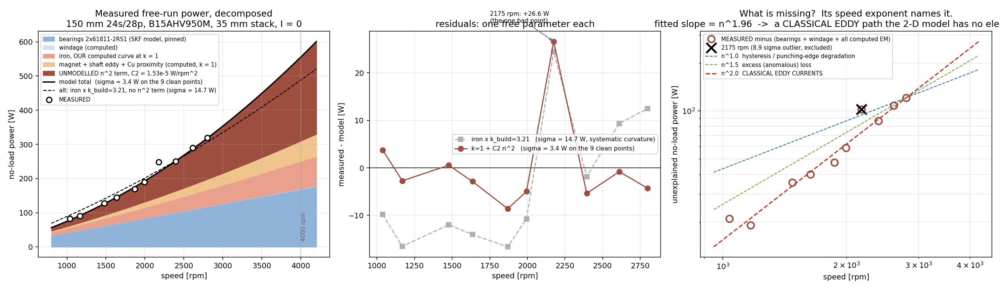

# Measured free-run losses of the real 150 mm 24s/28p — decomposition

*2026-08-04. Machine: the ACTIVE config (`config/motor_config.yaml`) — 150 mm OD,
24 slots / 28 poles, 35 mm stack, 0.5 mm air gap, stator + rotor B15AHV950M
(0.15 mm NGO, k_f = 0.92), magnets F45SH_120C, aluminium shaft.
Bearings: 2 × SKF 61811-2RS1 (55 × 72 × 9, contact rubber seals both sides).*

**Evidence base only.** Nothing in the solver, the loss model or the UI is
changed by this document. It exists to answer one question — *how much of the
measured no-load power is iron, and by how much does the real build exceed our
computed iron loss* — before deciding whether to model build degradation at all.

Scripts (committed): `scratch_perf/noload_geom_masses.py` (mass + lamination
edges), `scratch_perf/noload_fe_sweep.py` (the I = 0 solves),
`scratch_perf/noload_decompose.py` (the fit + the figure).
Raw solver output: `scratch_perf/noload_fe_sweep_72.json`, `_36.json`.
Fit output: `scratch_perf/noload_decomposition_72.json`.



---

## 1. The headline

The measured free-run curve is explained, to **σ = 3.4 W across 83–319 W**, by

```
P_noload(n) = P_bearing(n)          SKF model, 2 × 61811-2RS1, NOTHING fitted
            + P_windage(n)          Couette gap + 2 rotor faces, NOTHING fitted
            + P_fe(n)               OUR computed no-load iron loss, k = 1
            + P_magnet+shaft+Cu(n)  OUR computed rotor eddy + Cu proximity, k = 1
            + C₂ · n²               ONE free parameter
```

with **C₂ = 1.534 × 10⁻⁵ ± 0.025 × 10⁻⁵ W/rpm²** (9 clean points, 2175 rpm
excluded — see §5).

Two facts fall out and they are the whole story:

1. **The missing loss goes as n^1.96.** Fitting a free exponent to
   *measured − (bearings + windage + everything we compute)* gives **1.96**.
   That is a **classical eddy-current** signature. Punching-edge hysteresis
   degradation is n^1.0; excess/anomalous loss is n^1.5; PWM ripple is flat or
   *falling* with speed. None of them is n².
2. **Our n-linear physics is already right.** Let the bearing torque float
   alongside C₂ (n and n² are well separated, so this fit is conditioned):
   the data returns **M_bearing = 0.387 ± 0.025 N·m**, against the SKF
   prediction of **0.400 N·m** — agreement to 3 %, well inside 1σ. There is no
   room left for a large extra n-linear term, which caps any punching-driven
   hysteresis degradation at **k_hyst ≤ 1.28 (2σ)**.

So the machine does **not** have a uniform "build factor" on its iron loss.
It has an **extra classical-eddy path that our 2-D sinusoidal model has no
element for**, worth **245 W at 4000 rpm**.

---

## 2. The measurement, decomposed

Model = bearings (SKF, pinned) + windage + all computed EM at k = 1 + C₂n².

| n [rpm] | P meas [W] | P model [W] | resid [W] | resid % | bearings [W] | windage [W] | iron (computed) [W] | mag+shaft+Cu (computed) [W] | **missing n² [W]** |
|--:|--:|--:|--:|--:|--:|--:|--:|--:|--:|
| 1037 | 83 | 78.5 | +4.5 | +5.4 | 43.3 | 0.03 | 13.9 | 4.8 | 16.5 |
| 1168 | 90 | 91.8 | −1.8 | −2.0 | 48.8 | 0.05 | 16.1 | 5.9 | 20.9 |
| 1477 | 128 | 126.0 | +2.0 | +1.6 | 61.8 | 0.08 | 21.5 | 9.2 | 33.5 |
| 1635 | 144 | 145.0 | −1.0 | −0.7 | 68.4 | 0.10 | 24.4 | 11.1 | 41.0 |
| 1869 | 169 | 175.2 | −6.2 | −3.7 | 78.3 | 0.14 | 28.9 | 14.2 | 53.6 |
| 1994 | 190 | 192.2 | −2.2 | −1.2 | 83.6 | 0.17 | 31.4 | 16.0 | 61.0 |
| **2175** | **248** | **218.2** | **+29.8** | **+12.0** | 91.3 | 0.21 | 35.2 | 18.9 | 72.6 |
| 2395 | 250 | 251.5 | −1.5 | −0.6 | 100.6 | 0.27 | 39.9 | 22.6 | 88.0 |
| 2611 | 290 | 286.1 | +3.9 | +1.3 | 109.8 | 0.33 | 44.8 | 26.6 | 104.6 |
| 2799 | 319 | 317.9 | +1.1 | +0.3 | 117.8 | 0.40 | 49.2 | 30.4 | 120.2 |

(Iron / rotor-eddy at the measured speeds are log-log interpolations of the
seven solved points in §3. The 2175 rpm row is **excluded from the fit**.)

### 2.1 Model comparison — same data, parameter count in brackets

| model | σ [W] | verdict |
|---|--:|---|
| **all computed at k = 1 + C₂n²** [1] | **3.4** | **fits; the excess is n^1.96** |
| all computed at k = 1 + C₂n² + flat offset [2] | 3.6 | offset = −0.5 ± 2.4 W → **no PWM/inverter offset** |
| bearing torque AND C₂ both free [2] | 3.5 | bearing lands on SKF (0.967 ± 0.063 ×) |
| one k on ALL computed EM loss [1] | 12.4 | k_em = 2.44 ± 0.08, systematic curvature |
| k_build on iron only, bearings pinned [1] | 14.7 | k_build = 3.21 ± 0.14, systematic curvature |
| k_hyst+exc and k_eddy separately [2] | 10.5 | k_hyst+exc = 1.09 ± 0.69, k_eddy = 11.2 ± 2.6 (corr −0.98) |
| bearing torque AND k_build both free [2] | 10.5 | **degenerate** (corr −0.998, negative bearing torque) — unusable |

The two-parameter (k_hyst+exc, k_eddy) fit is ill-conditioned, but it points
the same way as the exponent: the hysteresis side is already right (k ≈ 1) and
the classical-eddy side is short by roughly an order of magnitude.

---

## 3. Our computed no-load curve (the shape everything is measured against)

P2 sliding-band transient, **I_phase = 0**, 72 steps/electrical period,
1 period, mesh 4.0 mm / min 0.3 mm, 3 gap layers, 4 sectors, geo_mesh +
iron_template, rotor_eddy on, Picard/Newton converged on every frame
(`picard_resid_max ≈ 1e-7`).

| n [rpm] | f_el [Hz] | P_fe [W] | hyst+excess frac | eddy frac | P_magnet [W] | P_shaft [W] | P_Cu prox [W] | Σ EM [W] | V̂_phase [V] |
|--:|--:|--:|--:|--:|--:|--:|--:|--:|--:|
| 1000 | 233.3 | 13.33 | 0.886 | 0.114 | 2.79 | 0.68 | 0.99 | 17.79 | 18.20 |
| 1500 | 350.0 | 21.88 | 0.844 | 0.156 | 6.26 | 0.96 | 2.22 | 31.31 | 27.30 |
| 2000 | 466.7 | 31.53 | 0.808 | 0.192 | 11.03 | 1.17 | 3.94 | 47.67 | 36.40 |
| 2500 | 583.3 | 42.24 | 0.776 | 0.224 | 17.04 | 1.34 | 6.16 | 66.78 | 45.50 |
| 3000 | 700.0 | 53.97 | 0.747 | 0.253 | 24.22 | 1.49 | 8.87 | 88.56 | 54.59 |
| 3500 | 816.7 | 66.70 | 0.722 | 0.278 | 32.51 | 1.63 | 12.07 | 112.91 | 63.69 |
| 4000 | 933.3 | **80.41** | 0.698 | 0.302 | 41.83 | 1.75 | 15.77 | **139.76** | 72.79 |

Log-log slopes: iron n^1.30, all EM n^1.49.

**Step convergence** (unlike the loaded case, where 24 → 72 steps moved P_fe by
+34 %, the no-load curve is converged): 36 vs 72 steps gives 13.24/13.33 W at
1000 rpm (−0.6 %), 31.23/31.53 W at 2000 rpm (−1.0 %), 79.27/80.41 W at 4000 rpm
(−1.4 %). **The computed shape is not a step-count artefact.**

Note `V̂_phase = 18.20 V` per phase peak at 1000 rpm (72.8 V at 4000). This is a
cheap, decisive cross-check on the flux level — see question 7 in §8.

---

## 4. Bearings and windage — pinned, not fitted

### 4.1 Bearings, SKF model, 2 × 61811-2RS1

Source: SKF, *The SKF model for calculating the frictional moment*
(`cdn.skfmediahub.skf.com/api/public/0901d1968065e9e7`), tables 2 and 3.
M = M_rr + M_sl + M_seal (M_drag = 0, grease).

* **Seals** — table 3, RS1 on deep groove ball bearings, 62 < D ≤ 80 mm:
  β = 2.25, K_S1 = 0.018, K_S2 = 20, `M_seal = K_S1·d_s^β + K_S2` [N·mm] for
  **both** seals of one bearing. d_s (seal counterface diameter) is not
  published for 61811; taken as d + 0.25(D − d) = **59.5 mm** (±2 mm is ±8 % on
  M_seal, carried in the error budget).
  → **M_seal = 197.0 N·mm = 0.1970 N·m per bearing.**
* **Rolling** — table 2, series 617/618/628/637/638: R₁ = 4.7e-7,
  `G_rr = R₁·d_m^1.96·F_r^0.54`, `M_rr = G_rr·(n·ν)^0.6`, d_m = 63.5 mm,
  ν = 30 mm²/s. → **0.0032 N·m per bearing at 2000 rpm** (1.6 % of the total).
* **Sliding** — S₁ = 6.50e-3, `G_sl = S₁·d_m^-0.26·F_r^{5/3}`, μ_sl = 0.05.
  → **2.5e-6 N·m.** Negligible.
* **Load** — rotor weight only. `masses.compute_masses` on the CAD polygons of
  this config: rotor iron 0.538 kg + magnets 0.722 kg + shaft 0.067 kg =
  **1.328 kg rotating**, so F_r = 6.51 N per bearing. Because M_rr ∝ F_r^0.54
  and the seal term is load-independent, tripling the rotating mass (real end
  plates, hub, shaft extension — all outside the 2-D CAD) moves the bearing
  torque by **< 1 %**.

**Total pair: 0.4005 N·m at 2000 rpm, 0.4038 N·m at 4000 rpm** — 98 % of it
seal drag, hence essentially speed-independent torque and **P_bearing ∝ n**,
exactly as the task expected.

Independent confirmation: let the measurement choose the bearing torque
(§2.1, row 3) and it returns **0.387 ± 0.025 N·m**. The residual scatter is
also *minimised* at exactly 1.00 × the SKF value (σ = 3.4 W, against 5.4 W at
0.75 × and 6.5 W at 1.25 ×). The SKF number is not an assumption here — the
data reproduces it.

### 4.2 Windage — small, and shown to be small

Gap δ = 0.5 mm (the config's value; the task's 0.2 mm is not this build),
r_rotor = 56.3 mm, L = 35 mm. Laminar concentric-cylinder torque
`M = 4πμω r_i²r_o²L/(r_o²−r_i²)`, with a (Ta/Ta_c)^0.5 Taylor-vortex
enhancement above Ta_c = 1700, plus two rotor end faces as enclosed rotating
discs, `M = ½C_M ρ ω² r⁵`, `C_M = 0.146 Re^-0.2` (free-disc turbulent — an
upper bound for an enclosed face).

**0.03 W at 1037 rpm, 0.40 W at 2799 rpm, 1.12 W at 4000 rpm.** Under
0.4 % of the total everywhere. It cannot hide anything.

---

## 5. Data quality — the 2175 rpm point

(2175, 248) is bad, and provably so.

* It **exceeds its own successor**: 248 W at 2175 rpm against 250 W at 2395 rpm.
  A no-load loss curve is monotone in speed, so one of the two is wrong; the
  residuals say it is 2175 (+29.8 W against −1.5 W).
* Against the clean 9-point fit (σ = 3.37 W) its residual is **+29.8 W = 8.9 σ**.
* It is **not** a leverage artefact: leverage 0.12 in a mid-range position
  (the end points carry 0.02 and 0.23). Cook's D = 0.42 — the largest, but it
  is an *outlier*, not an *influential design point*.
* Dropping it moves C₂ by only −4.3 % (1.603e-5 → 1.534e-5) and collapses σ
  from 9.9 W to 3.4 W. **The conclusion does not depend on it; the precision
  does.**

Everything above uses the 9-point fit. Recommend re-measuring 2175 rpm, and in
general re-taking the 2175/2395 pair — a +12 % single-point error suggests a
settling or torque-reading issue at that step rather than noise (the other nine
points scatter by ±5 %).

---

## 6. THE ANSWER at 4000 rpm

| component | P at 4000 rpm [W] | law used to extrapolate | basis |
|---|--:|---|---|
| **Bearings** (2 × 61811-2RS1) | **169.2** | M ≈ const (seal) + M_rr ∝ n^0.6 → P ∝ n | SKF model, pinned; confirmed by the fit to 3 % |
| **Windage** | **1.1** | laminar gap ∝ n², disc faces ∝ n³ | real dimensions, no free constant |
| **Iron, our computed model** | **80.4** | *solved at 4000 rpm* — not extrapolated | P2 transient, I = 0, 72 steps |
| **Magnet + shaft eddy + Cu proximity, computed** | **59.3** | *solved at 4000 rpm* | same run, rotor_eddy on |
| **Missing classical-eddy term** | **245.4** (95 % CI 238–253 stat.) | C₂ n², exponent measured as 1.96 | the one fitted parameter |
| **TOTAL** | **555.5** | | |

Sanity check: a bare, physics-free `a·n + b·n²` regression on the ten raw
points extrapolates to **566 W** at 4000 rpm. The physics-structured model lands
1.9 % away from it while also saying *what each watt is*.

### k_build

Taking the task's definition, `k_build = P_fe,measured / P_fe,computed`, and
attributing the whole n² excess to the iron:

| n [rpm] | P_fe computed [W] | missing n² [W] | **k_build(n)** |
|--:|--:|--:|--:|
| 1000 | 13.33 | 15.3 | **2.15** |
| 1500 | 21.88 | 34.5 | **2.58** |
| 2000 | 31.53 | 61.4 | **2.95** |
| 2500 | 42.24 | 95.9 | **3.27** |
| 3000 | 53.97 | 138.1 | **3.56** |
| 3500 | 66.70 | 187.9 | **3.82** |
| **4000** | **80.41** | **245.4** | **4.05** |

**k_build is not a constant. It rises from 2.15 at 1000 rpm to 4.05 at
4000 rpm** — because the thing that is missing is n², and our iron loss is
n^1.30. Forcing a single number over the measured band gives **k_build =
3.21 ± 0.14 (1σ), 95 % CI [2.93, 3.49]**, but that model has three times the
residual scatter and a visible systematic curvature (fig., middle panel), so
the constant is a summary, not a description.

**P_fe,measured(4000 rpm) = 326 W**, with an uncertainty band of
**254 – 397 W**. The band is dominated not by statistics (±8 W at 95 %) but by
the bearing model: the same fit with the bearing torque at 0.75 × / 1.25 × SKF
gives 397 W / 254 W. Everything else (step count ±1.4 %, seal counterface
diameter ±8 %, rotating mass ×3) is inside that.

Note for context: the customer's ANSYS model carries `$CoreLossCoff = 2`. That
is about right at 1000 rpm and **half** of what this machine needs at 4000 rpm.

---

## 7. Attribution — what makes k_build > 1 here

### 7.1 Punching-edge degradation — real, but bounded at ~1.2, and NOT the cause

Cut-edge damage degrades a fixed depth *d* inward from every punched edge, so
the degraded **area** fraction of a lamination is ≈ (perimeter × d)/area.
Measured on the actual CadQuery polygons of this lamination:

| part | perimeter [mm] | area [mm²] | P/A [1/mm] | hydraulic width 2A/P [mm] | degraded area at d = 0.2 mm | at d = 0.5 mm |
|---|--:|--:|--:|--:|--:|--:|
| **stator** | 1717.4 | 4934.4 | 0.348 | 5.75 | 7.0 % | 17.4 % |
| **rotor** | 1658.5 | 2199.5 | 0.754 | 2.65 | 15.1 % | 37.7 % |

Narrow features make this large: the tooth is 9.2 mm at the OD but the neck
(`tooth2_width`) is **5.5 mm**, so 0.5 mm of damage on each flank degrades
**18 % of the neck**. The rotor is worse still — a hydraulic width of 2.65 mm
means the 28-pole magnet-holder webs are barely wider than two damage zones.

With the usual literature factor of 1.5–3 × loss inside the degraded zone, this
predicts a stator iron loss increase of **1.1–1.35 ×**. And this measurement
**independently bounds it**: punching damage raises hysteresis (n^1), and the
free bearing/C₂ fit leaves at most **0.037 N·m (2σ)** of unexplained n-linear
torque = 15.5 W at 4000 rpm against 56.2 W of computed hyst+excess, i.e.
**k_hyst ≤ 1.28 at 2σ**. Consistent with the geometry — and far too small to
be the story.

### 7.2 The n² term — a classical eddy path, and there are four candidates

Our computed *classical eddy* iron loss at 4000 rpm is **24.3 W** (30.2 % of
80.4 W). Supplying an extra 245 W through that term requires it to be
**11.1 × larger**, i.e. an **effective lamination thickness of 0.50 mm against
the 0.15 mm on the datasheet** (eddy loss ∝ d²).

In descending order of how well they fit and how cheap they are to check:

1. **The stack is not 0.15 mm steel.** (0.50/0.15)² = **11.1**, against the
   required 11.1 and the (degenerate) two-k fit's k_eddy = 11.2 ± 2.6. If the
   built machine uses 0.5 mm — or 0.35 mm, (0.35/0.15)² = 5.4, which is inside
   the CI — the entire excess is explained with no degradation at all, and our
   model is simply being run with the wrong material record. **Check this
   first: it is a caliper and a datasheet.**
2. **Inter-laminar shorting — OD welding, interlock cleats, burrs.** Shorting
   groups of ~3 laminations reproduces the same 11 ×. A 150 mm OD on a **35 mm**
   stack is an extreme aspect ratio: axial weld beads close a large-area eddy
   loop over a very short axial path. This is the classic reason a short,
   large-diameter stack over-reads, and it is exactly n².
3. **Conductive structure in the 3-D end region** — end plates, clamping rings,
   the housing, solid rotor discs. A 150 mm / 35 mm pancake has severe axial
   fringing, and our 2-D model has no element for any of it. Exactly n². This
   is the same gap that motivated the staged 3-D static end-effect programme.
4. **A conductive retaining sleeve / can over the magnets.** Exactly n², and
   invisible to the 2-D cross-section if it is not in the CAD.

**Ruled out as the sole cause:** under-computed magnet eddy. Our 2-D figure
(41.8 W at 4000 rpm) is already the conservative-high, resistance-limited,
axially-unsegmented one; supplying 245 W would mean ~290 W in 0.72 kg of NdFeB,
which would thermally run away and demagnetise the rotor long before 4000 rpm.

### 7.3 PWM — asked of the data, and the data says no

If the free run was driven by the machine's own inverter rather than spun
externally, PWM ripple loss is in the measurement and not in our sinusoidal
model. **The data can distinguish this, and it excludes it:**

* PWM ripple flux over a switching sub-period is ≈ V_dc·D(1−D)·T_s, and
  D(1−D) *shrinks* as the modulation index rises with speed. PWM iron loss at a
  no-load speed sweep is therefore **flat or falling**, never n². Inverter
  conduction + switching loss (if P was measured at the DC bus) is likewise a
  roughly flat term.
* Adding a free speed-independent offset to the winning model gives
  **C = −0.5 ± 2.4 W (t = −0.23)** — statistically zero, with a 95 % bound of
  |C| ≤ 4.7 W. There is no flat term in this data.
* And the direction matters: any *positive* PWM/inverter offset that does exist
  would have to be taken out of the n-linear budget, forcing the true bearing
  torque *down* and C₂ (hence k_build) **up**. So the k_build > 1 conclusion is
  robust to the drive method; only its magnitude would move, and only upward.

---

## 8. What to ask the user

Ordered by how much the answer moves the split.

1. **Is the stator stack really 0.15 mm B15AHV950M?** Measure the sheet with a
   caliper over a known lamination count, or get the coil certificate. A
   0.35 mm or 0.5 mm build explains the whole 245 W with **no degradation
   model at all**. This is the single highest-value question.
2. **How is the stack held together?** OD welds (how many beads?), interlock
   cleats, bonding, or a shrink-fit housing? Is the OD in contact with a
   conductive housing over the full 35 mm?
3. **Drive method.** Spun externally (dyno / drill) or by its own inverter?
   If the inverter: **was P_noload measured at the DC bus (inverter losses
   included) or at the machine terminals with a 3-phase power analyser**, and
   what are **V_dc and f_sw**? Also the measured phase current per point.
   (Per §7.3 this cannot explain the n², but it decides whether the 169 W
   bearing figure absorbs an inverter offset.)
4. **A coast-down run.** Spin to 3000 rpm, cut the drive, log n(t): the
   deceleration torque separates mechanical from electromagnetic directly, with
   no power measurement at all. Best value per hour of bench time in this whole
   list. A second coast-down with the **rotor out of the stator** would isolate
   the bearings outright.
5. **Bearing state.** New or run-in? Grease type and fill ratio? How long did it
   run before each reading, and how hot did it get? Any axial preload (wave
   spring)? Any *third* seal, brake, encoder or coupling on the shaft? A single
   radial lip seal would blow this entire budget.
6. **Rotor construction.** Are the end plates / magnet holder solid steel or
   aluminium? Is there a retaining sleeve or can over the magnets? Are the
   magnets axially segmented, and into how many pieces?
7. **Measured back-EMF.** Our computed open-circuit phase voltage is
   **18.2 V peak at 1000 rpm (72.8 V at 4000)**. If the bench reads materially
   different, the flux level is off and the iron loss scales roughly with its
   square — a 10 % flux error is ~20 % on the iron.
8. **Temperature** at each reading (magnet Br falls with temperature → less
   flux → less iron loss; also thins the grease → less seal drag).
9. **Re-measure 2175 rpm** (§5).

---

## 9. What this does NOT license

* It does **not** license a global "×3.2 build factor" on iron loss. The
  measurement says our n-linear iron physics is right (k_hyst ≤ 1.28) and one
  classical-eddy path is missing. A flat multiplier would over-predict at low
  speed and under-predict at high speed — it is the wrong shape.
* It does **not** yet identify *which* eddy path. Question 1 of §8 can turn the
  whole finding from "build degradation" into "wrong material record", which is
  a data fix, not a model change.
* Anything to do with attributing the excess to the iron specifically is
  conditional: a free-run test cannot tell iron from magnets from end
  structure. What it measures cleanly is **C₂ = 1.534e-5 W/rpm² of unmodelled
  classical eddy loss** and **k = 1 on everything we already compute**.

## Resolution (user's answers, 2026-08-04)

The stack is genuine 0.15 mm B15AHV950M, GLUED (no welds/interlocks), profile cut
by wire EDM from the glued block, and the free-run was driven by an external
motor (PWM ruled out in hardware, matching the statistical rejection above).

That identifies the missing 245 W: the EDM recast ("white") layer is conductive
and bridges the laminations along EVERY cut edge — and this profile is all cut
edge (P/A: stator 0.348 /mm, rotor 0.754 /mm). Inter-laminar shorting at the
edges is exactly the classical-eddy n^2 signature and the effective-thickness
x3.3 the fit demands. It is a property of THIS prototype's manufacturing route,
not of the steel or the loss model.

Actions available: acid-etch the cut surfaces (removes the recast layer; the
standard remedy for EDM-cut cores), verify with an ohmmeter across adjacent
laminations on a cut face (healthy: MOhm; shorted: Ohm), and expect a punched
or laser+etch series stack to sit near the computed curve. The Ansys-practice
x2 coefficient under-reads this prototype above ~2000 rpm: the measured factor
is 2.15 at 1000 rpm rising to 4.05 at 4000, because the mechanism is n^2, not
a constant multiplier.
